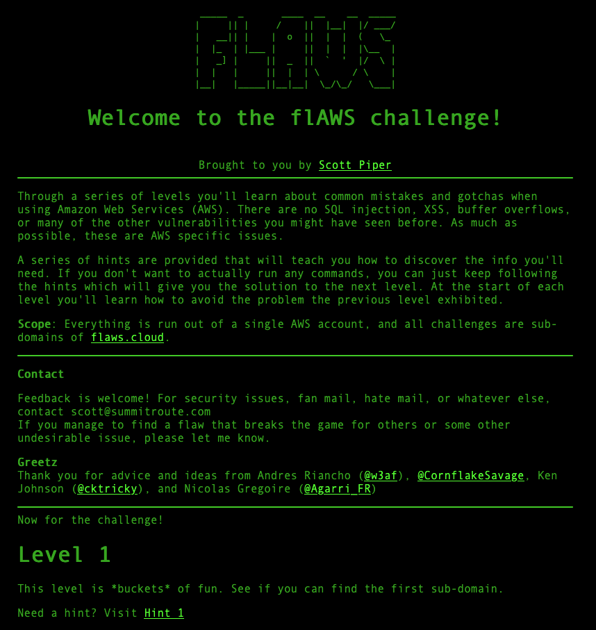
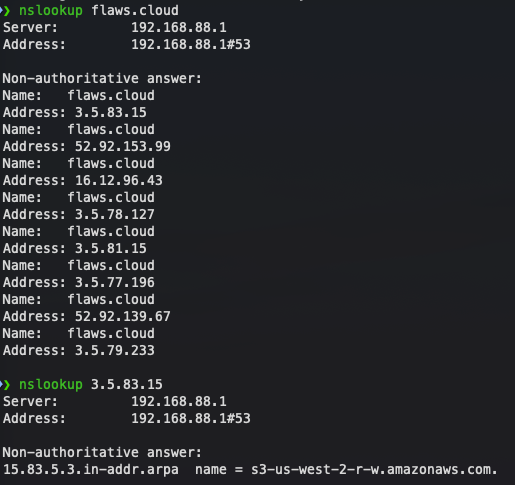
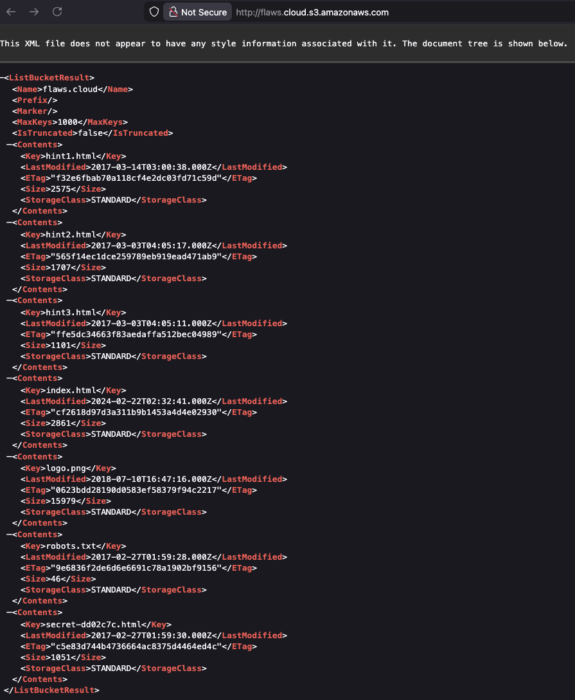
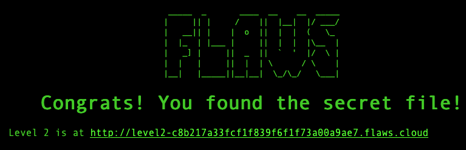
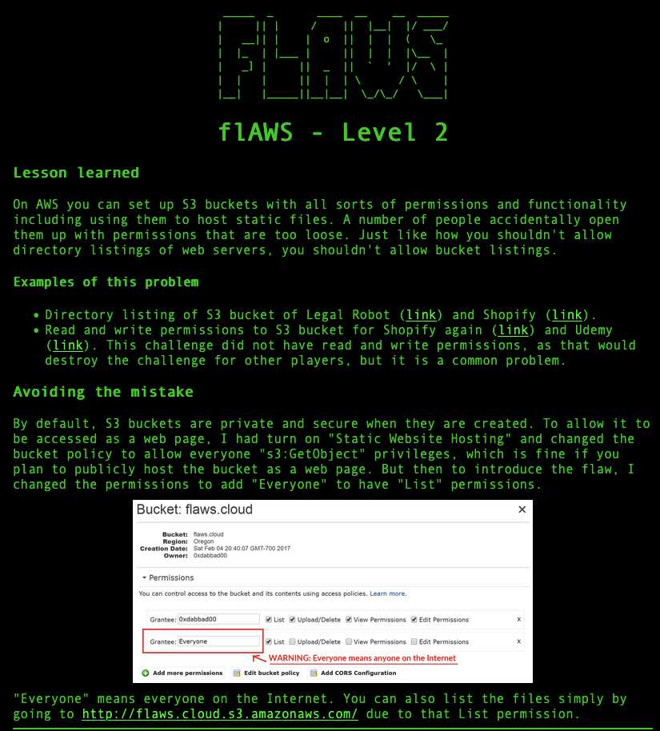

# flAWS - Level 1

---

## Vulnerability Overview

AWS S3 buckets can be configured with public read access, meaning anyone on the internet can list and download the bucket's contents. When a website is hosted on S3, its domain name often directly maps to the bucket name — discoverable via DNS and reverse DNS lookups.

Even if no direct link to a sensitive file exists, **directory listing** (bucket enumeration) exposes every object in the bucket. Security through obscurity (using random filenames) is not a substitute for proper access controls.

---

## Steps to Solve the Lab

**Step 1: Initial Reconnaissance — DNS Lookup**

The challenge page explains the goal: find the first sub-domain of flaws.cloud.

Perform a DNS lookup on the target domain: `nslookup flaws.cloud`

Then perform a reverse DNS lookup on one of the returned IPs: `nslookup 3.5.83.15`

This reveals the underlying S3 regional endpoint: `s3-us-west-2-r-w.amazonaws.com` — confirming the site is hosted on an S3 bucket in `us-west-2`.

**Step 2: Accessing the S3 Bucket**

Navigate to `http://flaws.cloud.s3.amazonaws.com/` (or the S3 regional URL). Because the bucket has public listing enabled, the browser returns the full XML directory listing.

The bucket contains several files, including:

- `hint1.html`
- `hint2.html`
- `hint3.html`
- `index.html`
- `logo.png`
- `robots.txt`
- `secret-dd02c7c.html`

### Key Finding
The **secret-dd02c7c.html** file represents the hidden flag. The filename pattern suggests this is a deliberately obfuscated secret file placed within the publicly accessible S3 bucket.

### Solution
Navigate to `http://flaws.cloud/secret-dd02c7c.html` — the challenge congratulates you on finding it and reveals the URL to Level 2.

---

## Key Takeaway

The file `secret-dd02c7c.html` had no links pointing to it and was intended to be "hidden." But because the bucket allowed public listing, every object was visible — making the obscure filename irrelevant.

## Remediation

- **Disable public access** on S3 buckets unless the bucket is intentionally serving a public website.
- **Enable S3 Block Public Access** at the account level as a guardrail against future misconfigurations.
- **Don't rely on obscure filenames** — treat every object in a public bucket as publicly accessible.
- **Use signed URLs** for time-limited, controlled access to private objects.

