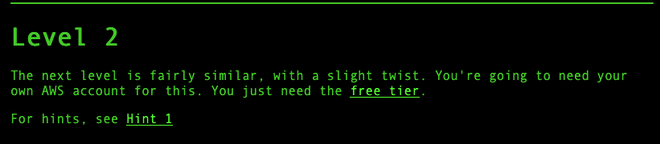
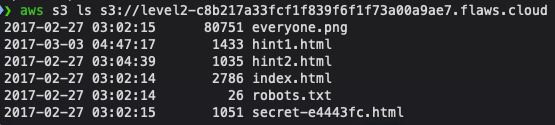
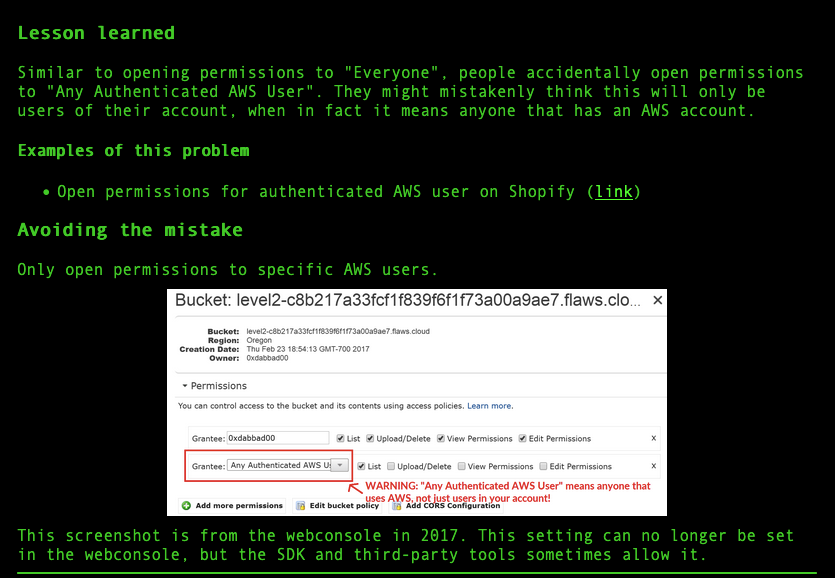

# flAWS - Level 2

---

## Vulnerability Overview

AWS S3 offers three levels of access: **private** (owner only), **public** (anyone on the internet), and **authenticated AWS users** (any user with a valid AWS account — even a free tier one). This third option is widely misunderstood. Setting a bucket to allow "Any Authenticated AWS User" does **not** restrict access to users within your own account — it grants read access to all ~300 million AWS accounts globally.

This level demonstrates that misconfigured bucket ACLs can expose data to any AWS user, not just the bucket owner.

---

## Steps to Solve the Lab

**Step 1: Understanding the Challenge**

The Level 2 challenge page states: *"The next level is fairly similar, with a slight twist. You're going to need your own AWS account for this."*

This is the key difference from Level 1: the bucket is not open to the public internet, but it is accessible to **any authenticated AWS user** — including a free-tier account you created yourself.



**Step 2: Enumerating the S3 Bucket with AWS CLI**

With any valid AWS credentials configured (`aws configure`), run:

```bash
aws s3 ls s3://level2-c8b217a33fcf1f839f6f1f73a00a9ae7.flaws.cloud
```

This succeeds and reveals the following files in the bucket:

```bash
2017-02-27 03:02:15  80751 everyone.png
2017-03-03 04:47:17   1433 hint1.html
2017-02-27 03:04:39   1635 hint2.html
2017-02-27 03:02:14   2786 index.html
2017-02-27 03:02:14     26 robots.txt
2017-02-27 03:02:15   1051 secret-e4443fc.html
```



### Solution

Navigate to the secret file to complete the challenge:
`http://level2-c8b217a33fcf1f839f6f1f73a00a9ae7.flaws.cloud/secret-e4443fc.html`

---

## Key Takeaway

The bucket ACL was set to grant access to **All Authenticated Users** — an AWS-managed group representing every valid AWS user worldwide. The bucket owner intended "my team" but the setting actually means "everyone with an AWS account."

This is a subtle but critical distinction. Buckets should default to **private**, with access granted via IAM policies scoped to specific account IDs.

## Remediation

- **Never use the "All Authenticated Users" ACL** — it is almost never what you intend.
- **Disable ACLs entirely** on new buckets and use S3 bucket policies with explicit AWS account IDs instead.
- **Enable S3 Block Public Access** at the account level to prevent future ACL misconfigurations.
- **Audit regularly**: `aws s3api get-bucket-acl --bucket <name>` reveals the current grants.


