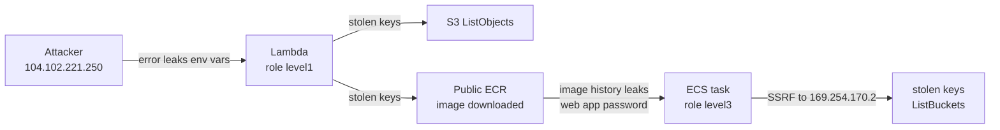

# flAWS 2 - AWS Incident Investigation (Defender Track)

Investigation of a compromised AWS serverless + container app using **CloudTrail logs, AWS CLI and `jq`**.
Lab: [flaws2.cloud](http://flaws2.cloud/) by Scott Piper (Summit Route).

---

## TL;DR

An attacker (**104.102.221.250**) stole temporary credentials from a **Lambda function** (role `level1`) and an **ECS task** (role `level3`). They then used them **from outside AWS** to enumerate S3 and download a container image from a publicly readable ECR repository.

**Detection logic:** credentials issued to an AWS workload should only be used from AWS IP space. **5 of 37 events** break that rule: every use of the stolen keys. The attacker's other events are anonymous browsing of the lab's public websites.

---

## Key events (UTC, 2018-11-28)

| Time | Identity | Source IP | Event | Assessment |
|---|---|---|---|---|
| 22:31:59 | `ecs-tasks.amazonaws.com` | AWS service | `AssumeRole` -> `level3` (key `...BSJS`) | normal |
| 23:03:12 | `lambda.amazonaws.com` | AWS service | `AssumeRole` -> `level1` (key `...XVVG`) | normal |
| **23:04:54** | `level1` | **104.102.221.250** | `ListObjects` | stolen Lambda keys |
| **23:05:53-23:06:33** | `level1` | **104.102.221.250** | `ListImages` -> `BatchGetImage` -> `GetDownloadUrlForLayer` | image downloaded via AWS CLI |
| **23:09:28** | `level3` | **104.102.221.250** | `ListBuckets` | stolen ECS keys |

Full timeline and noise analysis: [03-cloudtrail-analysis-jq](03-cloudtrail-analysis-jq/).

---

## How I proved it

- **Wrong place:** 104.102.221.250 is not in any prefix of AWS's current [`ip-ranges.json`](https://ip-ranges.amazonaws.com/ip-ranges.json).
- **Same key, two places:** Lambda key `...XVVG` was used from AWS (34.234.236.212) *and* from the attacker IP.
- **Key traced to its source:** key `...BSJS` was issued by `AssumeRole` to ECS, and only ECS may assume `level3`.
- **One actor:** same IP and same CLI user agent (`aws-cli/1.16.19 ... Darwin`) for both roles.
- **Limit:** CloudTrail doesn't show *how* the keys leaked (no app logs). That part comes from the lab's Attacker path.

---

## Write-ups

| # | Topic | |
|---|---|---|
| 1 | Acquiring CloudTrail logs | [Open](01-cloudtrail-log-acquisition/) |
| 2 | Cross-account investigation access | [Open](02-cross-account-access/) |
| 3 | Log analysis with `jq` | [Open](03-cloudtrail-analysis-jq/) |
| 4 | Credential theft detection | [Open](04-credential-theft-detection/) |
| 5 | Public ECR repository | [Open](05-public-ecr-repository/) |

---

## Root causes and fixes

| Problem | Fix |
|---|---|
| Lambda error response exposes env vars (incl. AWS keys) | Server-side validation, generic errors |
| Container proxy reaches the credentials endpoint (SSRF) | Block `169.254.0.0/16`, allow-list destinations |
| ECR policy `Principal: "*"` | Restrict to accounts / `aws:PrincipalOrgID` |
| Over-privileged workload roles | Least privilege |
| No alert on stolen workload keys | GuardDuty `ResourceCredentialExfiltration.OutsideAWS` |

**MITRE ATT&CK:** [T1190](https://attack.mitre.org/techniques/T1190/) initial access | [T1552](https://attack.mitre.org/techniques/T1552/) / [T1552.005](https://attack.mitre.org/techniques/T1552/005/) credential theft | [T1078.004](https://attack.mitre.org/techniques/T1078/004/) use of stolen cloud credentials | [T1619](https://attack.mitre.org/techniques/T1619/) / [T1580](https://attack.mitre.org/techniques/T1580/) / [T1613](https://attack.mitre.org/techniques/T1613/) discovery

---

## Takeaways

- **`sourceIPAddress` + `userIdentity`** is the key pivot: a service-only role should never appear from an external IP.
- **`accessKeyId`** links a stolen key back to the workload it was issued to.
- **CloudTrail shows API calls, not the exploit.** Initial access needs application logs.

**Not done yet:** Objective 6 (Athena).

---

*All work was done in the lab's intentionally vulnerable environment. Keys on screenshots are redacted. The attacker IP in the logs was substituted by the lab author to hide their home IP.*
