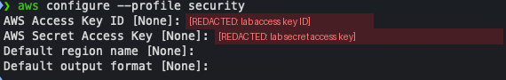
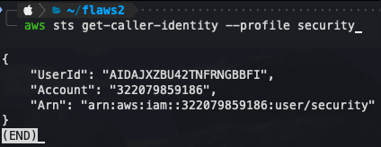
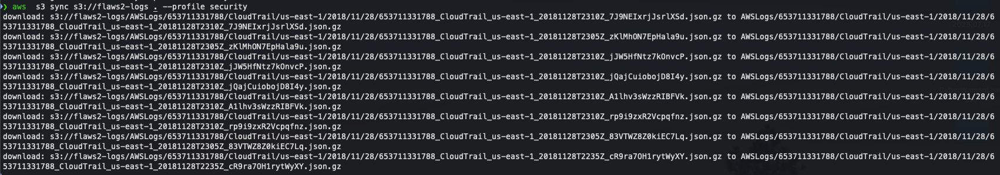

# Level 1 - CloudTrail Log Acquisition

[Back to investigation summary](../README.md) | Lab page: [Objective 1](http://flaws2.cloud/defender.htm)

**Question:** Where is the evidence of the incident, and how do I collect it without touching the compromised account?

---

## Context

The environment follows a common AWS pattern:

| Account | ID | Role in the scenario |
|---|---|---|
| Security account | `322079859186` | Holds the CloudTrail logs; the investigator (IAM user `security`) works from here |
| Target account | `653711331788` | Runs the compromised application (Lambda, ECS, S3, ECR) |

The target account's CloudTrail logs are delivered to the `flaws2-logs` bucket, so the investigation starts from logs rather than from the victim's live resources.

---

## Evidence

**1. Configure a named CLI profile for the security account.** The keys are provided by the lab and redacted below.



**2. Confirm which identity and account I'm operating as.** I do this before running any other command.

```bash
aws sts get-caller-identity --profile security
```



`Account: 322079859186` and `user/security` confirm I'm in the security account, not the target.

**3. Download the logs**

```bash
aws s3 ls --profile security                       # shows the flaws2-logs bucket
aws s3 sync s3://flaws2-logs . --profile security
```



Result: 8 gzip-compressed files under:

```
AWSLogs/653711331788/CloudTrail/us-east-1/2018/11/28/
653711331788_CloudTrail_us-east-1_20181128T2310Z_<random>.json.gz
```

The file name contains the account ID, the region and the delivery time.

---

## Analysis

- **The path structure is itself metadata.** It encodes the *target* account ID (653711331788, not the security account that stores the logs), the region and the date. That makes scoping easy: here there is one account, one region and one day.
- **CloudTrail delivers events in batches.** The file names carry delivery timestamps from `2235Z` to `2310Z`, which already bounds the incident window before opening any file.
- **Data events were enabled.** The logs later contain S3 `GetObject` calls. Those are CloudTrail *data events*, which are not recorded by default (only management events are), so this trail was explicitly configured to capture them. Without that, the attacker's browsing of the S3-hosted sites would be invisible.

---

## Security notes

- `aws configure` stores keys in plaintext in `~/.aws/credentials`. The lab recommends [aws-vault](https://github.com/99designs/aws-vault), which keeps them in the OS keychain. For real investigations I'd use short-lived credentials (SSO / aws-vault) instead of long-lived access keys.
- The `flaws2-logs` bucket is public **on purpose**, so that Athena can read it in Objective 6. In production, a log archive bucket should be the opposite: tightly restricted, write-once (e.g. S3 Object Lock) and readable only by the security team. An attacker who can read or delete logs can study or erase the evidence.
- Investigation credentials should be read-only and scoped to the logs they need.

---

**Next:** [Level 2 - Cross-account access](../level2/)
