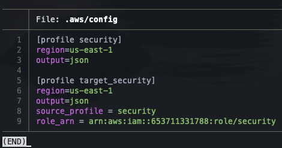
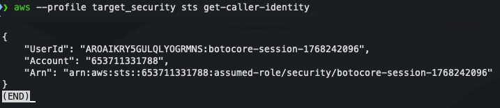
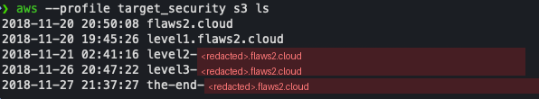

# Level 2 - Cross-Account Access

[Back to investigation summary](../README.md) | Lab page: [Objective 2](http://flaws2.cloud/defender2.htm)

**Question:** How does a central security account get read access into the compromised account, and what does that access look like in the logs?

---

## Context

In a multi-account setup, the security team does not hold users in every account. Instead, each workload account has an IAM role (here named `security`) that trusts the security account. The investigator assumes that role with `sts:AssumeRole` and receives temporary credentials for the target account.

This is the **investigator's legitimate access**, not attacker activity. It still produces `AssumeRole` records and assumed-role sessions in the target account, so during an investigation I have to be able to tell my own activity apart from the attacker's.

---

## Evidence

**1. Add a profile that assumes the role.** The interactive `aws configure` wizard doesn't ask for `role_arn` / `source_profile`, so I edited `~/.aws/config` by hand:



```ini
[profile target_security]
region=us-east-1
output=json
source_profile = security
role_arn = arn:aws:iam::653711331788:role/security
```

With this profile, the CLI calls `sts:AssumeRole` automatically using the `security` profile's keys and caches the temporary credentials.

**2. Verify the new identity**

```bash
aws --profile target_security sts get-caller-identity
```



**3. Confirm access by listing the target account's buckets**

```bash
aws --profile target_security s3 ls
```



The buckets host the sites of the lab's Attacker path: `flaws2.cloud`, `level1.flaws2.cloud`, and hidden `level2-...`, `level3-...` and `the-end-...` buckets. Their names are shortened here to avoid spoilers.

---

## Analysis

How to read the assumed-role identity:

| Field | Value | Meaning |
|---|---|---|
| `Account` | `653711331788` | I'm now operating **in the target account** |
| `Arn` | `arn:aws:sts::653711331788:assumed-role/security/botocore-session-1768242096` | Format: `assumed-role/<role>/<session name>` |
| `UserId` | `AROA...:botocore-session-1768242096` | Role ID + session name |

- The session name `botocore-session-<epoch>` is set automatically by the AWS CLI/botocore. `1768242096` is the Unix time when I assumed the role (2026-01-12), so the session name alone tells me which tool created the session and when.
- The same `assumed-role/<role>/<session>` pattern appears in the attack logs, for `level1/level1` (Lambda) and `level3/d190d14a-...` (ECS task ID). Reading that ARN correctly is the basis of Levels 4 and 5.
- The investigator's own session names and source IP are known, which makes it easy to exclude them when filtering for attacker activity.

---

## Security notes

- The `security` role's trust policy should trust **only** the security account, ideally with conditions (e.g. MFA, or a specific principal instead of the whole account).
- Its permissions should be **read-only** (e.g. the AWS-managed `SecurityAudit` / `ReadOnlyAccess` policies). An investigation role with write access becomes a high-value target.
- Cross-account role assumptions should be monitored. An `AssumeRole` into the security role from an unexpected principal is an alert.

---

**Previous:** [Level 1 - Log acquisition](../level1/) | **Next:** [Level 3 - Log analysis with jq](../level3/)
