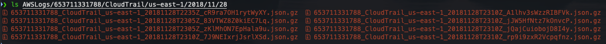
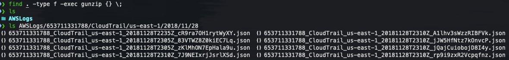
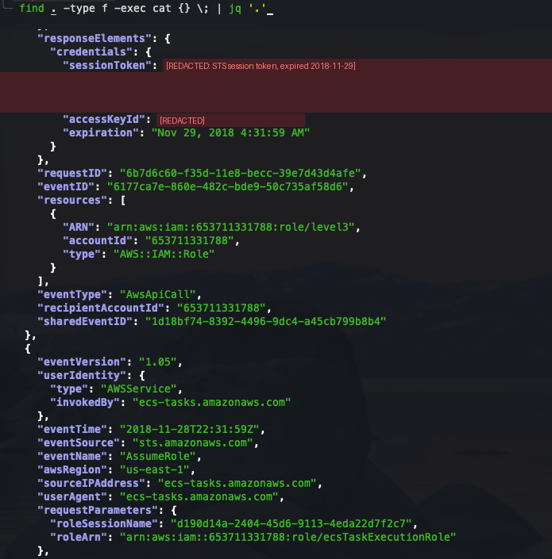
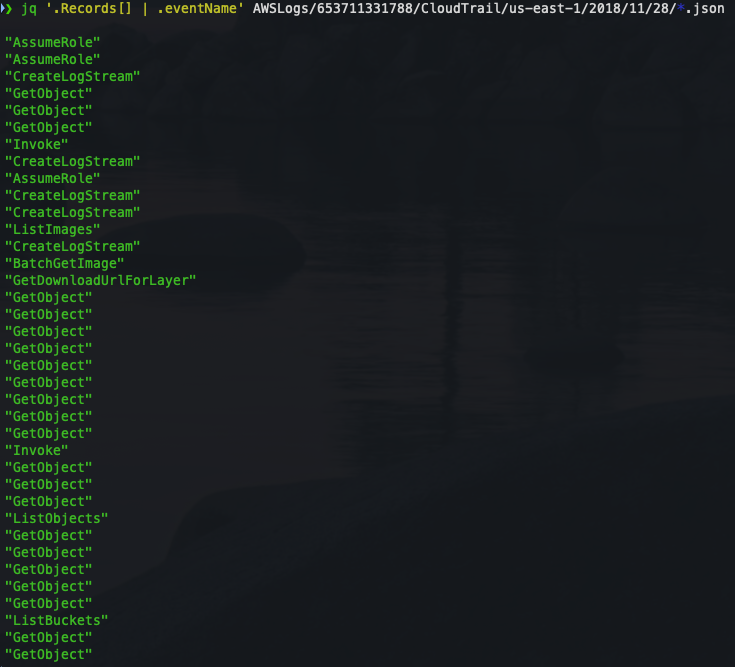
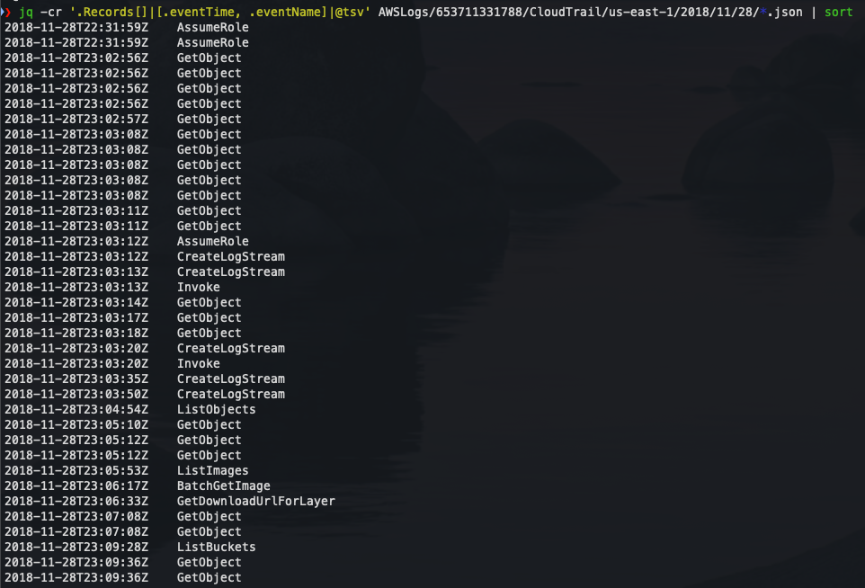
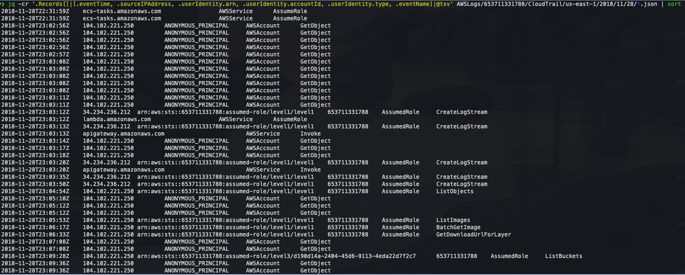

# Level 3 - CloudTrail Analysis with jq

[Back to investigation summary](../README.md) | Lab page: [Objective 3](http://flaws2.cloud/defender3.htm)

**Question:** What happened in the target account, in what order, and which events are the attack rather than background noise?

---

## Evidence

**1. Prepare the files.** Decompress every downloaded log file in place:



```bash
find . -type f -exec gunzip {} \;
```



**2. Look at raw records first.** Before filtering, I read the raw JSON to learn the structure:

```bash
find . -type f -exec cat {} \; | jq '.'
```



This view already shows two important `AssumeRole` events. `ecs-tasks.amazonaws.com` assumes `level3` and `ecsTaskExecutionRole`, and the response contains the temporary credentials (redacted) issued to the ECS task.

**3. List event names**

```bash
jq '.Records[] | .eventName' AWSLogs/653711331788/CloudTrail/us-east-1/2018/11/28/*.json
```



**4. Sort by time**

```bash
jq -cr '.Records[] | [.eventTime, .eventName] | @tsv' AWSLogs/.../*.json | sort
```



**5. Add who and from where.** This is the view that solves the case:

```bash
jq -cr '.Records[] | [.eventTime, .sourceIPAddress, .userIdentity.arn,
        .userIdentity.accountId, .userIdentity.type, .eventName] | @tsv' AWSLogs/.../*.json | sort
```



---

## Analysis

### Separating noise from signal

`userIdentity.type` sorts all 37 events into three groups:

| `userIdentity.type` | Count | What it is | Verdict |
|---|---|---|---|
| `AWSAccount` with `ANONYMOUS_PRINCIPAL` | 22 | Unauthenticated `GetObject` on S3-hosted websites. The user agent is Chrome on macOS, not the CLI | Normal web traffic, but all from **104.102.221.250**, so it shows the attacker's browsing path |
| `AWSService` | 5 | AWS acting on its own behalf: ECS and Lambda assuming their roles (`AssumeRole`), API Gateway invoking Lambda (`Invoke`) | Expected platform behaviour |
| `AssumedRole` | 10 | API calls made with role credentials | **Needs a closer look** |

The 10 `AssumedRole` events split cleanly on `sourceIPAddress`:

| Role | Source IP | Events | Inside AWS? |
|---|---|---|---|
| `level1` | 34.234.236.212 | 5x `CreateLogStream` (all **AccessDenied**) | Yes, EC2 range us-east-1 (the Lambda runtime) |
| `level1` | 104.102.221.250 | `ListObjects`, `ListImages`, `BatchGetImage`, `GetDownloadUrlForLayer` | **No** |
| `level3` | 104.102.221.250 | `ListBuckets` | **No** |

I checked both IPs against AWS's published [`ip-ranges.json`](https://ip-ranges.amazonaws.com/ip-ranges.json):

- `34.234.236.212` is in `34.224.0.0/12` (EC2, us-east-1), i.e. inside AWS.
- `104.102.221.250` is not in any AWS prefix.

### Findings

1. **Stolen Lambda credentials.** The same `level1` session is used from AWS (the Lambda itself) and from an external IP. A Lambda function doesn't run on someone's laptop, so the credentials were copied out.
2. **Stolen ECS credentials.** `level3` is an ECS task role, yet it calls `ListBuckets` from the same external IP. This is investigated in [Level 4](../level4/).
3. **Container image pulled.** `level1` credentials were used to list and pull images from ECR repository `level2`. This is investigated in [Level 5](../level5/).
4. **Attacker's path through the S3 data.** `ListObjects` on `level1.flaws2.cloud` (23:04:54) is followed 16 seconds later by a browser request to a hidden `secret-....html` file in that bucket. Listing the bucket is how the attacker found it.
5. **Visibility gap.** The Lambda's 5 `CreateLogStream` calls all fail with `AccessDenied`, so the function had no CloudWatch logs. The exact input that crashed it can't be recovered.

The full timeline is in [screenshot 6](06-timeline-identity-ip.png), and the key events are summarised in the [investigation summary](../README.md#key-events-utc-2018-11-28).

---

## jq queries I'd reuse

```bash
# Volume by identity type: the first triage step
jq -r '.Records[] | .userIdentity.type' *.json | sort | uniq -c | sort -rn

# Who did what from where, aggregated
jq -r '.Records[] | [(.userIdentity.arn // .userIdentity.invokedBy // .userIdentity.accountId),
                     .sourceIPAddress, .eventName] | @tsv' *.json | sort | uniq -c | sort -rn

# Role credentials used from a real IP (drops AWS-service callers like "lambda.amazonaws.com")
jq -r '.Records[] | select(.userIdentity.type == "AssumedRole" and (.sourceIPAddress | test("^[0-9.]+$")))
       | [.eventTime, .userIdentity.arn, .sourceIPAddress, .eventName] | @tsv' *.json | sort

# Failed calls: permission errors often mean probing, or broken logging
jq -r '.Records[] | select(.errorCode) | [.eventTime, .eventName, .errorCode, .sourceIPAddress] | @tsv' *.json | sort

# Which service received which temporary key (links misuse back to the workload)
jq -r '.Records[] | select(.eventName == "AssumeRole")
       | [.eventTime, .userIdentity.invokedBy, .requestParameters.roleArn,
          .responseElements.credentials.accessKeyId] | @tsv' *.json
```

---

## Lessons

- **Start wide, then filter.** Reading one raw record before writing filters shows which fields exist (`userIdentity.type`, `invokedBy`, `sessionIssuer`, `responseElements.credentials`).
- **Don't jump from "many `GetObject` events" to "data theft".** Here they are anonymous website hits. What matters is who made them and from where.
- **Errors are evidence too.** `AccessDenied` pointed to the missing Lambda logs, and in other incidents a burst of errors is typical of an attacker probing permissions.
- `jq` scales to a few files. For months of logs I'd use Athena or CloudTrail Lake (SQL) or a SIEM with the same logic.

---

**Previous:** [Level 2 - Cross-account access](../level2/) | **Next:** [Level 4 - Credential theft detection](../level4/)
