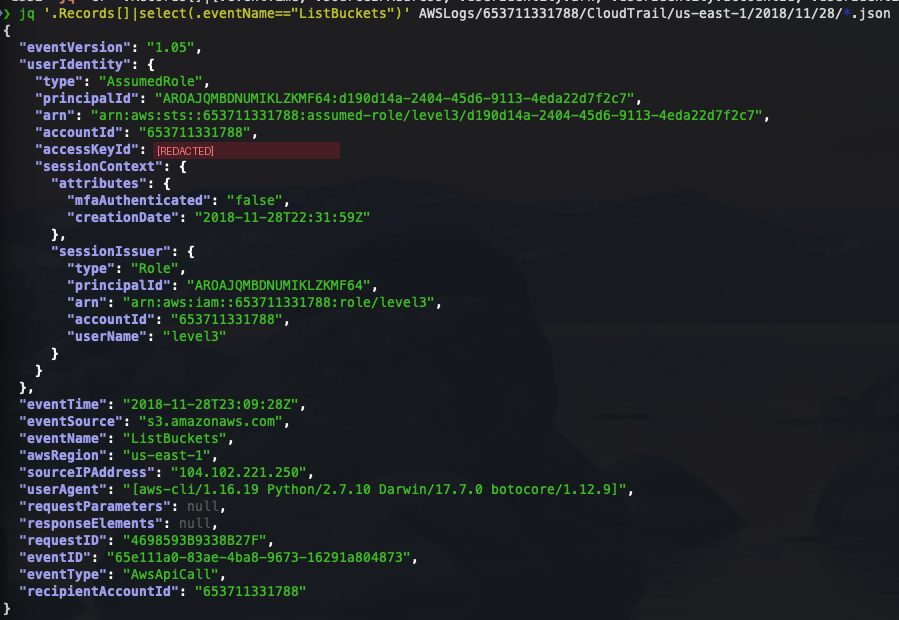
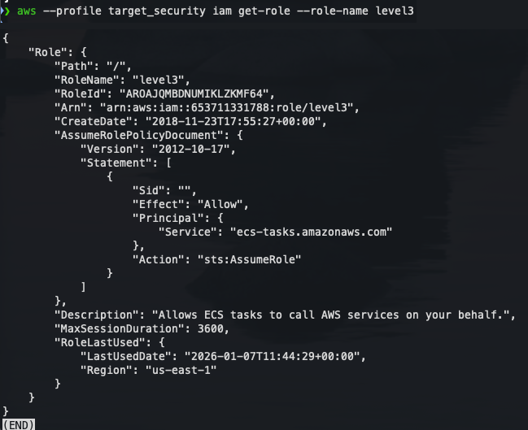

# Level 4 - Credential Theft Detection (ECS task role)

[Back to investigation summary](../README.md) | Lab page: [Objective 4](http://flaws2.cloud/defender4.htm)

**Question:** The `ListBuckets` call came from role `level3`. Was it the application itself, or were the role's credentials stolen?

---

## Evidence

**1. Isolate the suspicious event**

```bash
jq '.Records[] | select(.eventName == "ListBuckets")' AWSLogs/.../*.json
```



| Field | Value | Why it matters |
|---|---|---|
| `userIdentity.arn` | `assumed-role/level3/d190d14a-2404-45d6-9113-4eda22d7f2c7` | Role `level3`; the session name is an ECS task ID |
| `userIdentity.accessKeyId` | `ASIA...BSJS` | Temporary key, used to trace issuance below |
| `sessionContext.creationDate` | `2018-11-28T22:31:59Z` | Session created ~37 minutes before this call |
| `sourceIPAddress` | **`104.102.221.250`** | **Not an AWS IP** |
| `userAgent` | `aws-cli/1.16.19 Python/2.7.10 Darwin/17.7.0` | AWS CLI on macOS, not an application SDK inside a container |

**2. Check who is supposed to use this role**

```bash
aws --profile target_security iam get-role --role-name level3
```



```json
"Principal": { "Service": "ecs-tasks.amazonaws.com" },
"Action": "sts:AssumeRole"
```

**3. Trace where the key came from.** In the `AssumeRole` event at 22:31:59 ([level 3, screenshot 3](../level3/03-raw-cloudtrail-records.png)), `ecs-tasks.amazonaws.com` assumes `level3` for task session `d190d14a-...` and receives the key ending **`BSJS`**. That is the same key used for `ListBuckets`.

---

## Analysis

The reasoning chain:

1. The trust policy allows **only the ECS service** to assume `level3`. No human and no other account can obtain these credentials directly.
2. The key used for `ListBuckets` was issued by exactly that mechanism, to a specific ECS task (`d190d14a-...`).
3. A Fargate task calls AWS APIs from AWS network space. The call instead came from `104.102.221.250`, which is **not in AWS's published IP ranges**, using a desktop AWS CLI on macOS.
4. **Conclusion: the ECS task's credentials were exfiltrated and used from the attacker's machine.** The same IP and the same CLI user agent were used with the stolen Lambda credentials minutes earlier ([Level 5](../level5/)), which ties both thefts to one actor.

### What is *not* the problem

- **The trust policy is correct.** A service principal (`ecs-tasks.amazonaws.com`) lets only that AWS service assume the role, and it's the standard configuration for a task role. The weakness is in what happened *after* the credentials reached the container.
- **`MaxSessionDuration` is the default 3600 s (1 h)** and plays no role here. ECS rotates task credentials by itself.

### What the logs can't show

How the credentials left the container. There are no web server logs, and requests to the app are not AWS API calls. Per the lab's Attacker path, the container's web app exposed a proxy that could reach the ECS credentials endpoint (`169.254.170.2/v2/credentials/<id>`), a classic SSRF.

This matches the detection idea from Will Bengtson's talk *Detecting Credential Compromise in AWS*, referenced by the lab: compare where a workload's credentials are *normally* used with where they are used *now*.

---

## Detection & response

- **Detection:** role session whose issuer is an AWS service (ECS/Lambda/EC2) + `sourceIPAddress` outside AWS -> high-severity alert. GuardDuty provides this as `UnauthorizedAccess:IAMUser/ResourceCredentialExfiltration.OutsideAWS` (for Lambda/ECS) and `...InstanceCredentialExfiltration.OutsideAWS` (for EC2).
- **Containment:** revoke active sessions for `level3` and stop or redeploy the task (new credentials).
- **Scoping:** search all events with `accessKeyId = ASIA...BSJS` and `sourceIPAddress = 104.102.221.250` to see everything the attacker did. In this log set, that is `ListBuckets` only.
- **Prevention:** fix the SSRF (allow-list proxy destinations, block `169.254.0.0/16`), and review whether the task role needs `s3:ListAllMyBuckets` at all.

---

**Previous:** [Level 3 - Log analysis](../level3/) | **Next:** [Level 5 - Public ECR repository](../level5/)
