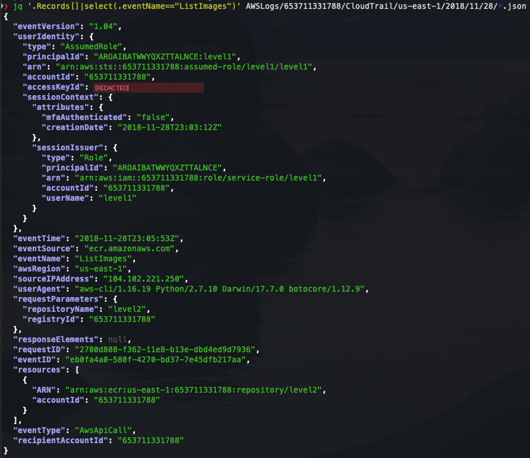
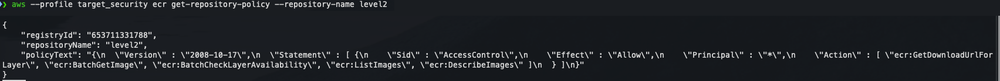
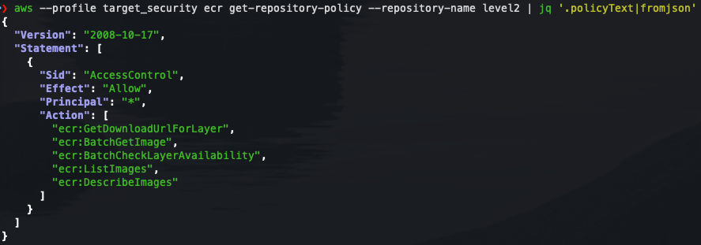

# Level 5 - Public ECR Repository

[Back to investigation summary](../README.md) | Lab page: [Objective 5](http://flaws2.cloud/defender5.htm)

**Question:** What did the attacker do with the stolen Lambda credentials, and which misconfiguration made it possible?

---

## Evidence

**1. The ECR activity**

```bash
jq '.Records[] | select(.eventName == "ListImages")' AWSLogs/.../*.json
```



| Field | Value |
|---|---|
| `userIdentity.arn` | `assumed-role/level1/level1`: the **Lambda function's** role (`role/service-role/level1`) |
| `accessKeyId` | `ASIA...XVVG`, the same key the Lambda runtime used from 34.234.236.212 (AWS) |
| `sourceIPAddress` | **`104.102.221.250`** (not AWS) |
| `userAgent` | `aws-cli/1.16.19 Python/2.7.10 Darwin/17.7.0` |
| `requestParameters` | `repositoryName: level2`, `registryId: 653711331788` |

The complete sequence from the same key and IP:

| Time | Event | Meaning |
|---|---|---|
| 23:05:53 | `ListImages` | Enumerate tags in repository `level2` |
| 23:06:17 | `BatchGetImage` (`imageTag: latest`) | Fetch the image manifest |
| 23:06:33 | `GetDownloadUrlForLayer` | Get a download URL for an image layer |

`ListImages` enumerates the tags. `BatchGetImage` + `GetDownloadUrlForLayer` are the two events AWS documents for an image pull, done here directly with the AWS CLI (see the user agent). The image contents should be considered **disclosed**.

**2. Why was it allowed? The repository policy**

```bash
aws --profile target_security ecr get-repository-policy --repository-name level2
```



The policy is returned as an escaped JSON string, and `fromjson` makes it readable:

```bash
aws --profile target_security ecr get-repository-policy --repository-name level2 \
  | jq '.policyText | fromjson'
```



```json
{
  "Sid": "AccessControl",
  "Effect": "Allow",
  "Principal": "*",
  "Action": [
    "ecr:GetDownloadUrlForLayer",
    "ecr:BatchGetImage",
    "ecr:BatchCheckLayerAvailability",
    "ecr:ListImages",
    "ecr:DescribeImages"
  ]
}
```

---

## Analysis

- **`"Principal": "*"` on a private ECR repository means any authenticated AWS principal, in any AWS account.** ECR API calls still need AWS credentials, so it isn't anonymous like a public S3 website. In practice it's still public, because anyone can create an AWS account. The lab confirms that the listing works "from any AWS account from a user that has ECR privileges".
- **In this incident, two problems overlap.** The attacker didn't need their own account: they used the stolen `level1` keys, and the lab author gave the Lambda role ECR permissions. So the pull would have worked even with a correct repository policy. The Lambda role's excess permissions are a separate finding.
- **Why an image matters:** image layers can contain application code, configuration and build-time secrets. Per the lab's Attacker path, the image's build history contained the password for the container web app (`htpasswd` in a `RUN` command). That is how the attacker got into the app compromised in [Level 4](../level4/).
- **Order of events:** discovery through ECR happened *before* the ECS credential theft (23:06 vs 23:09). The attacker used each compromised resource to find the next one.

---

## Detection & prevention

- **Find public resource policies before an attacker does.** The lab suggests CloudMapper. IAM Access Analyzer reports resource policies that grant access outside the account or organization.
- **Correct policy shape:** grant pull actions to specific accounts or to the organization, never `*`:

  ```json
  {
    "Effect": "Allow",
    "Principal": "*",
    "Action": ["ecr:BatchGetImage", "ecr:GetDownloadUrlForLayer", "ecr:BatchCheckLayerAvailability"],
    "Condition": { "StringEquals": { "aws:PrincipalOrgID": "o-exampleorgid" } }
  }
  ```

  Here `Principal: "*"` is acceptable only *because* the condition restricts it to one AWS Organization. Alternatively, list account or role ARNs explicitly in `Principal`.
- **Least privilege for workloads:** a form-validation Lambda has no reason to hold ECR or `s3:ListBucket` permissions.
- **Detection:** ECR pull API calls (`BatchGetImage`, `GetDownloadUrlForLayer`) from a principal that never pulled images before, or from outside AWS / outside CI, should alert.
- **Image hygiene:** no secrets in layers (use Secrets Manager / SSM at runtime), and review `docker history` before pushing. Enable ECR image scanning for known CVEs.

---

**Previous:** [Level 4 - Credential theft detection](../level4/) | [Back to summary](../README.md)
