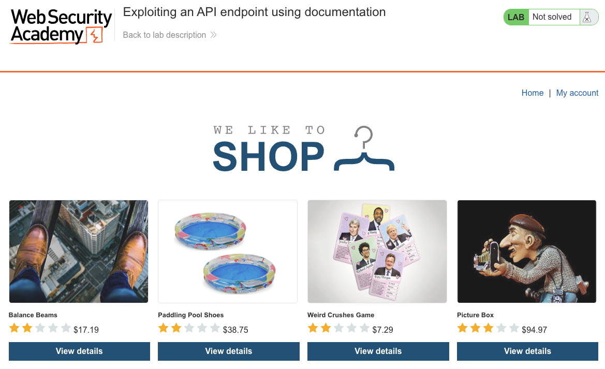
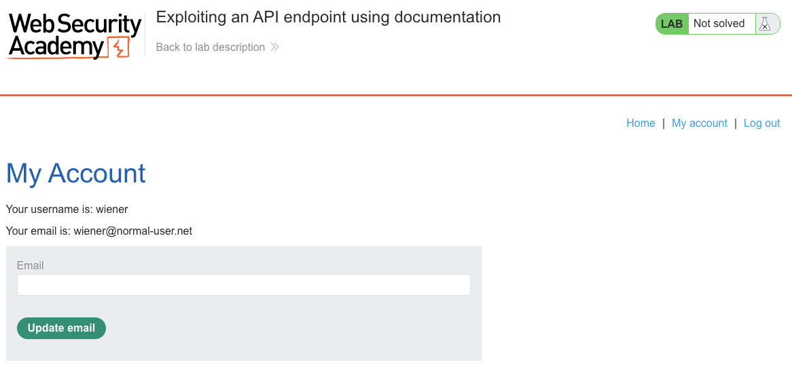
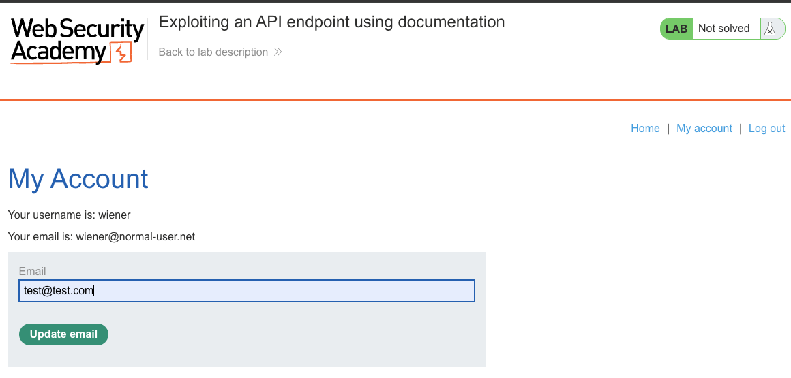
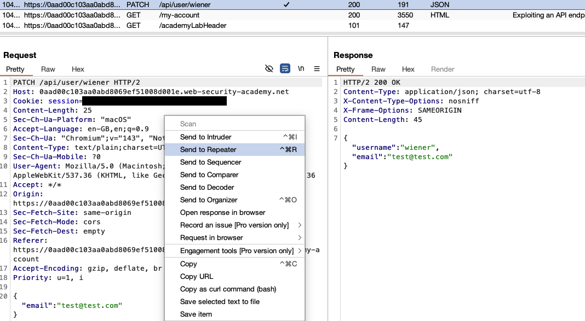
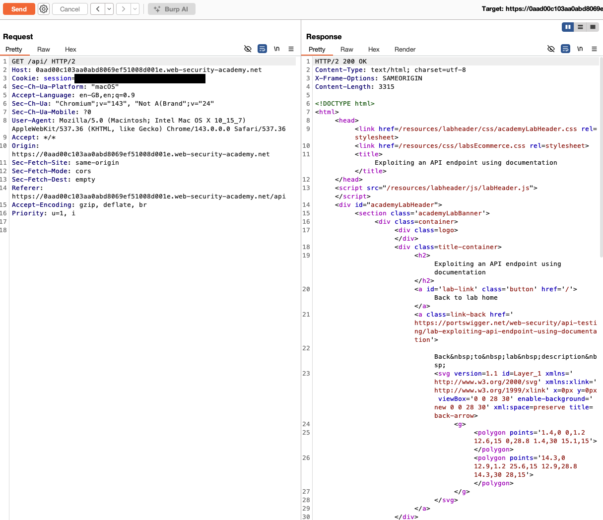
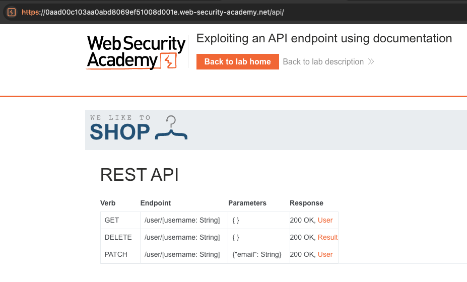
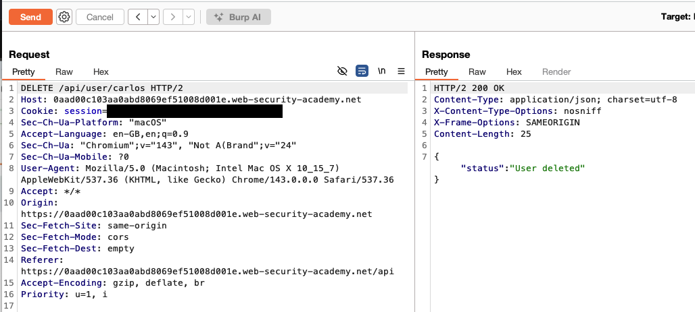
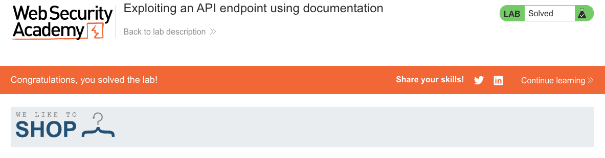

# API Testing
**Lab: Exploiting an API endpoint using documentation (Web Security Academy)**

**Level: Apprentice**

---

## Vulnerability Overview

Exposed API documentation (Swagger UI, OpenAPI specs, custom docs) gives attackers a complete map of an API's endpoints, methods, and parameters. In this lab, the API documentation reveals a `DELETE /api/user/{username}` endpoint that is not used by the official frontend — and that endpoint requires no authentication. An attacker who finds the docs can call any documented endpoint directly.

This is an **unauthenticated endpoint exposed via documentation discovery** — a combination of excessive documentation exposure and missing access control.

---

## Steps to Solve the Lab

### 1. Log in and browse the application
Log in as `wiener` and use the application normally. In Burp, observe the API calls being made in the background.



### 2. Trigger an API call from the UI
Open **My account** and submit the email-update form to generate API traffic.




In the Burp proxy history, the form triggers a `PATCH /api/user/wiener` request. This reveals the API base path `/api/user/{username}` and confirms the response format.



### 3. Discover the API documentation
Try common documentation paths (`/api`, `/api/docs`, `/api/swagger`, `/openapi.json`). Navigating to `/api` returns an interactive REST API documentation page.




The documentation lists three operations on `/user/[username: String]`:

| Verb | Endpoint | Parameters | Response |
|--------|--------------------------|--------------------|----------------|
| GET | `/user/[username: String]` | `{}` | `200 OK, User` |
| DELETE | `/user/[username: String]` | `{}` | `200 OK, Result` |
| PATCH | `/user/[username: String]` | `{"email": String}` | `200 OK, User` |

### 4. Identify the unauthenticated DELETE endpoint
The documentation shows `DELETE /api/user/{username}` with no authentication requirement noted, and the frontend never calls it — it is not part of any UI flow.

### 5. Call the DELETE endpoint directly
In Burp Repeater, send a `DELETE` request for `carlos`:

```http
DELETE /api/user/carlos HTTP/2
Host: <lab-id>.web-security-academy.net
```

The server responds with `{"status":"User deleted"}` — the user is deleted successfully. The documentation lists no authentication requirement for this endpoint, and the call completes without any authorization check.



### 6. Result
The lab banner changes to **"Congratulations, you solved the lab!"**.



---

## Why This Works

The API documentation exposed every endpoint, including ones not reachable through the UI. The `DELETE` endpoint was implemented but never wired into any UI flow — the developer likely assumed that an endpoint no UI calls would never be found. The documentation contradicted this assumption by listing it explicitly.

The endpoint itself had no authentication middleware applied — another oversight that's easy to make when endpoints are built incrementally.

---

## Remediation

- **Restrict access to API documentation** — in production, require authentication to view API docs. Better still: disable auto-generated docs entirely unless there is a specific business need for external API access.
- **Apply authentication to all endpoints by default** — use a "deny by default" middleware approach where authentication is required unless explicitly opted out.
- **Test all documented endpoints** — automated API security testing should cover every endpoint in the spec, not just those used by the frontend. Tools like OWASP ZAP, Postman, or Burp can do this systematically.
- **Audit endpoints against the UI** — any endpoint not reachable through the normal application flow should be explicitly reviewed and either removed or secured.

---

Link: https://portswigger.net/web-security/api-testing/lab-exploiting-api-endpoint-using-documentation
