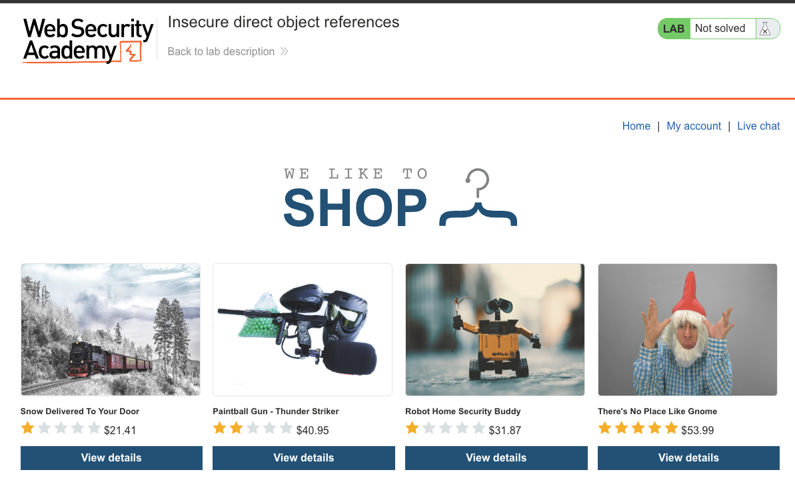
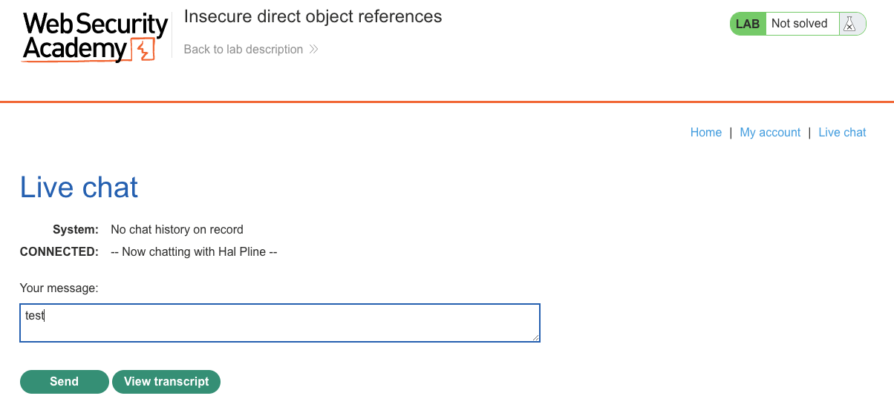
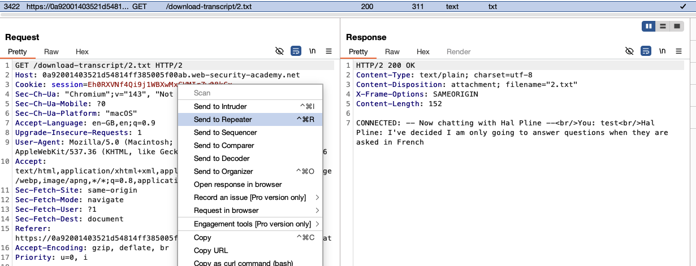
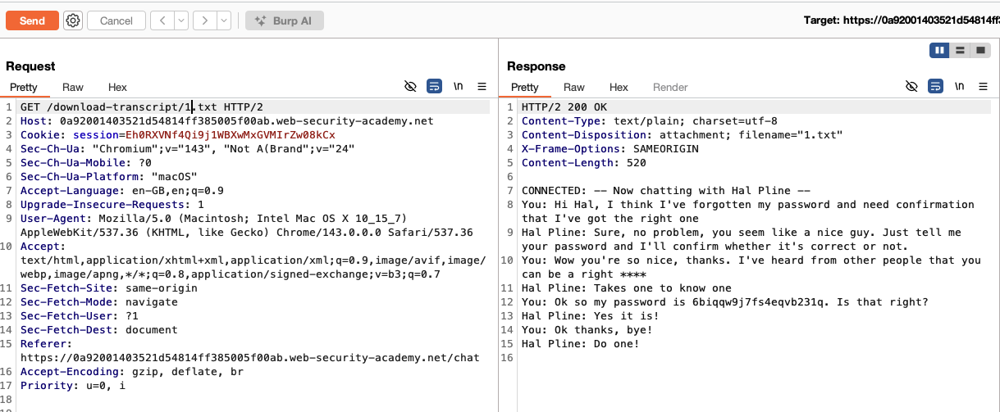
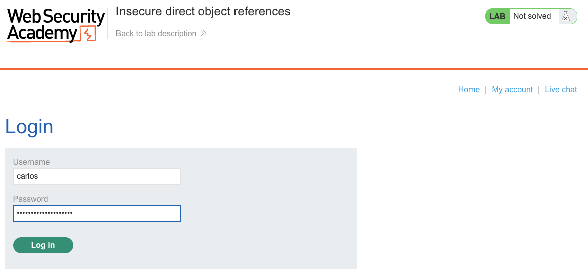
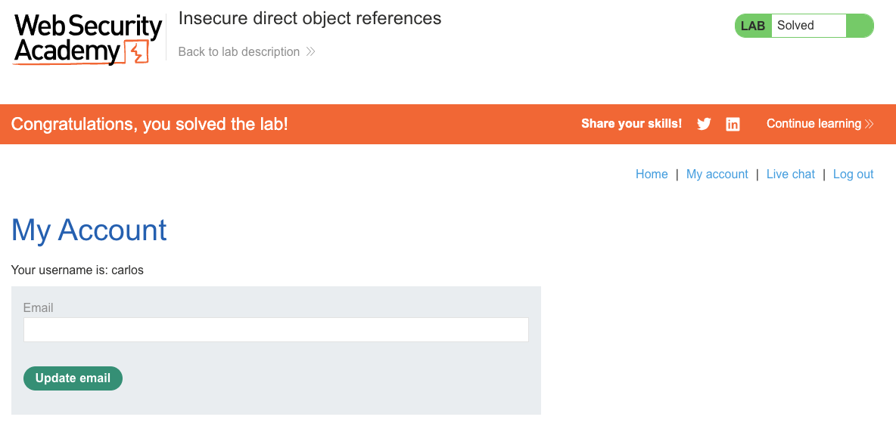

# Access Control Vulnerabilities
**Lab: Insecure direct object references (Web Security Academy)**

**Level: Apprentice**

---

## Vulnerability Overview

Insecure Direct Object Reference (IDOR) occurs when an application uses user-controllable values (such as a sequential ID in a URL or request parameter) to directly reference internal objects — files, database records, or other resources — without verifying whether the requester is authorized to access them.

In this lab, chat transcripts are stored as sequentially numbered text files (`1.txt`, `2.txt`, etc.) and served via a predictable URL. There is no authorization check: any user can download any transcript simply by changing the number. The attacker exploits this to download another user's conversation, which contains their plaintext password.

The root cause is trusting the client-supplied identifier without enforcing ownership or permissions checks on the server.

---

## Steps to Solve the Lab

1. **Open the lab and start a chat**
   - Open the lab *"Insecure direct object references"* and go to the **Live chat** page while logged in.
   - Send any message (for example, `test`) so that a chat transcript is created on the server.

   

   

2. **Download your own chat transcript**
   - Click **View transcript** — the browser downloads a file like `/download-transcript/2.txt`.
   - Intercept or observe this request in Burp and send it to **Repeater**.

   

3. **Enumerate transcript IDs**
   - In Repeater, modify the URL path from `/download-transcript/2.txt` to `/download-transcript/1.txt`.
   - Send the request — the server returns a different user's transcript without any authorization error.

   

4. **Extract the leaked password**
   - Read the transcript in the response body.
   - The transcript contains Carlos revealing his password in plaintext.

5. **Log in as carlos**
   - Log out, navigate to the login page, and authenticate as `carlos` with the discovered password.
   - After logging in, click **My account** — the page confirms `username: carlos`.

   

6. **Result**
   - The lab banner changes to **"Congratulations, you solved the lab!"**.

   

---

## Why This Works

The application constructs the download URL using a sequential integer:

```
GET /download-transcript/2.txt
```

The server returns the file at that path with no check that the requesting user owns transcript `2`. Changing the integer to `1` returns transcript `1` — belonging to a different user — with the same permissions. The access control check is entirely missing on this endpoint.

This is an authorization failure at the object level, also known as a **Broken Object Level Authorization (BOLA)** — the #1 vulnerability in the OWASP API Security Top 10.

---

## Remediation

- **Enforce authorization on every object access** — before returning any resource, verify that the authenticated user is the owner or has explicit permission.
- **Use indirect references** — instead of sequential IDs, map user-specific GUIDs or opaque tokens that cannot be guessed or enumerated. The mapping from token to real ID is maintained server-side.
  ```python
  # Instead of: /download-transcript/1.txt
  # Use: /download-transcript/a3f7c2e1-... (UUID tied to the session)
  ```
- **Access control tests in CI/CD** — test that requests for resources owned by user A are rejected with 403 when made by user B. Automated tests catch regressions.
- **Never rely on obscurity** — sequential IDs, even with long random suffixes, are not a substitute for server-side authorization.

---

Link: https://portswigger.net/web-security/access-control/lab-insecure-direct-object-references
