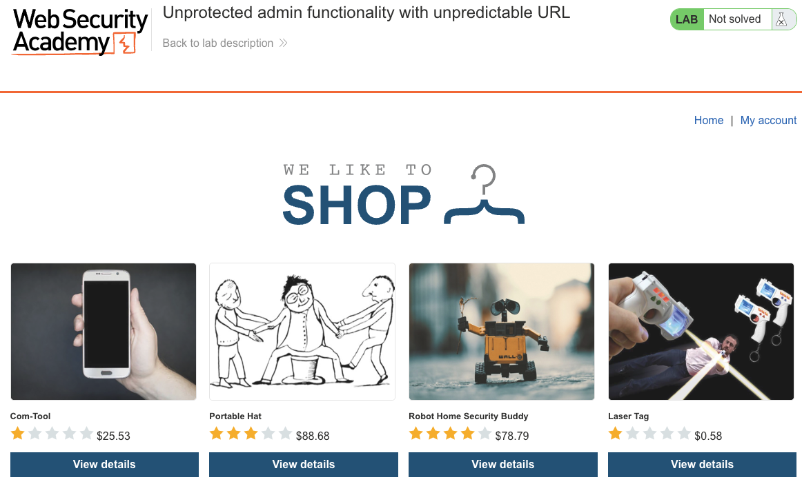
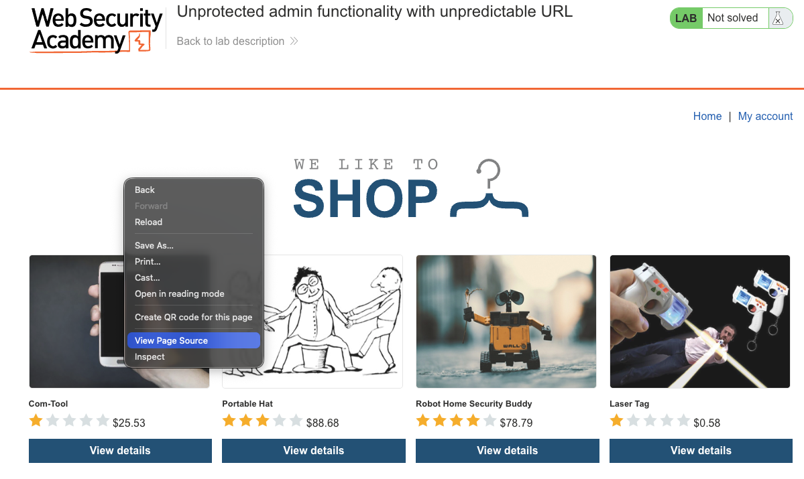
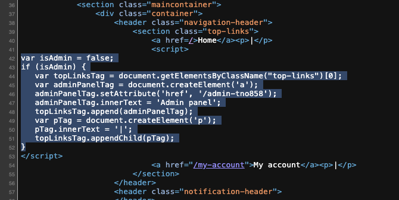
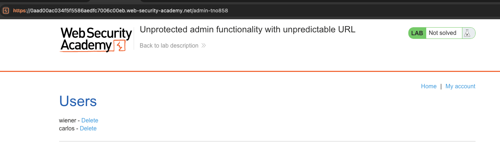
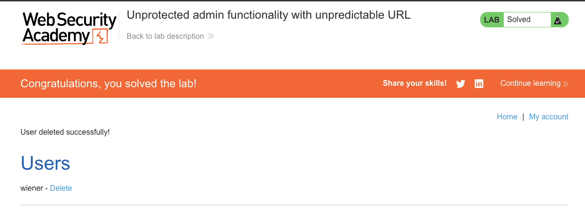

# Access Control Vulnerabilities
**Lab: Unprotected admin functionality with unpredictable URL (Web Security Academy)**

**Level: Apprentice**

---

## Vulnerability Overview

This lab extends the "unprotected admin panel" concept by using an obfuscated URL (a random-looking path like `/admin-tno858`) instead of an obvious name. The developer's assumption is that an attacker won't know this path.

The critical mistake: the path is embedded in client-side JavaScript that is sent to every user's browser. An attacker only needs to read the page source to find it. This is a classic **security through obscurity** failure — the secret is stored in a place any attacker can read.

Even if the path were truly unpredictable at runtime, the underlying problem would remain: there is no server-side authorization check protecting the endpoint.

---

## Steps to Solve the Lab

1. **Read the page source**
   - On the shop homepage, open the browser's **View Page Source** (`Ctrl+U` / `Cmd+U`).
   - Search for `admin` in the source.
   - Find a JavaScript snippet similar to:
     ```javascript
     if (isAdmin) {
         adminPanelTag.setAttribute('href', '/admin-tno858');
     }
     ```
   - This reveals the unpredictable admin URL to anyone who reads the source.

   

   

   

2. **Navigate directly to the admin panel**
   - Browse to `https://<lab-id>.web-security-academy.net/admin-tno858`.
   - The admin panel loads without any authentication check, showing the user list.

   

3. **Delete the target user**
   - Click **Delete** next to `carlos`.

4. **Result**
   - The lab banner changes to **"Congratulations, you solved the lab!"**.

   

---

## Why This Works

The `isAdmin` flag controls what link is shown in the UI — but it does not control what the server accepts. The JavaScript that builds the admin link runs in the browser, where it can be inspected by anyone. The server simply serves the admin panel to whoever requests that URL, regardless of their role.

Obfuscation is not authentication. A random path is not a password.

---

## Remediation

- **Server-side authorization on every admin route** — the URL being hard to guess is irrelevant if there's no role check on the server.
- **Never embed privileged paths in client-side code** — if the path must be dynamic, generate it server-side and return it only in the authenticated admin response.
- **Deny by default** — unauthenticated or unauthorized requests to any `/admin*` route should return `403 Forbidden`, not the page content.
- **Rotate or invalidate paths** — even if the obscure URL is useful as an extra layer, it must never be the only layer.

---

Link: https://portswigger.net/web-security/access-control/lab-unprotected-admin-functionality-with-unpredictable-url
