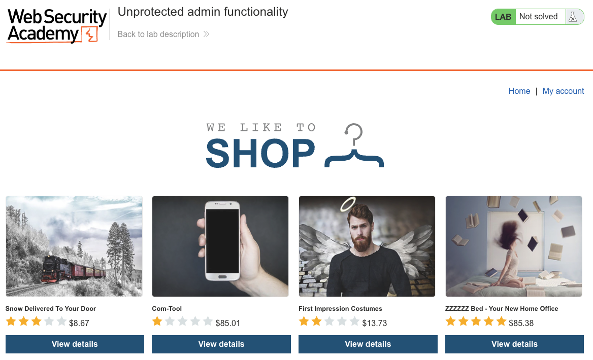
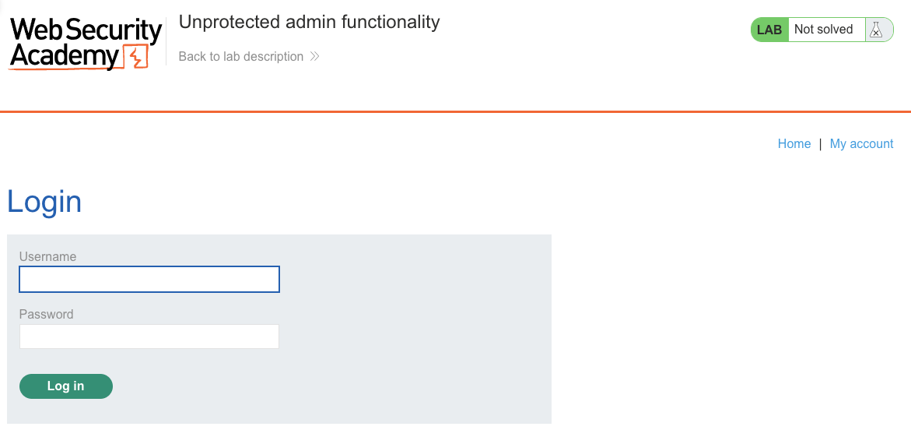
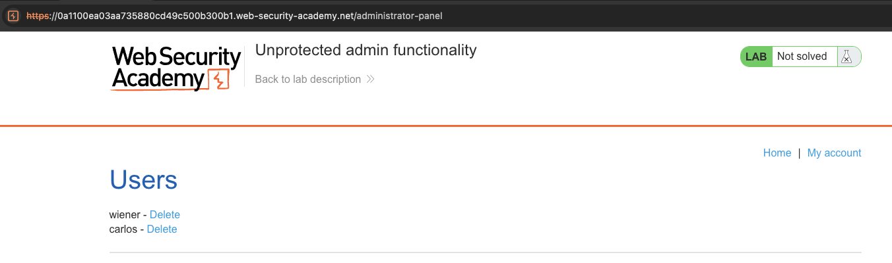
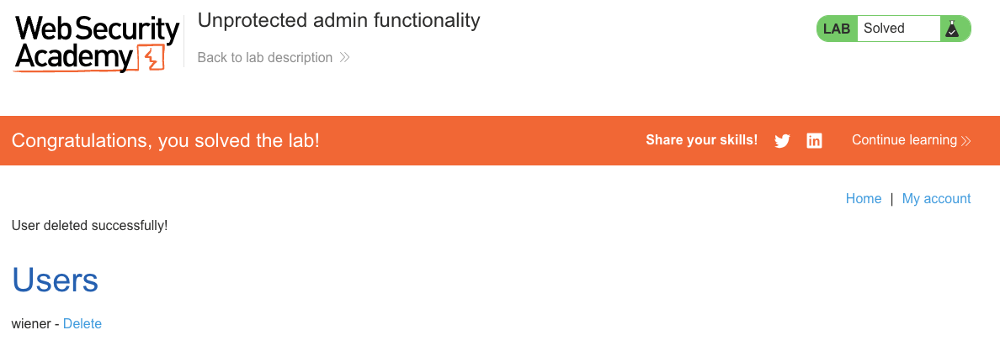

# Access Control Vulnerabilities
**Lab: Unprotected admin functionality (Web Security Academy)**

**Level: Apprentice**

---

## Vulnerability Overview

This lab demonstrates the most fundamental access control failure: an admin panel that is accessible to anyone who knows (or guesses) the URL, with no authentication or authorization check whatsoever. The server performs no session validation before serving the admin interface.

This is a **missing access control** vulnerability - not a bypass, not a logic flaw, but a complete absence of any check. The URL is the only "barrier," and URLs are not secrets.

---

## Steps to Solve the Lab

1. **Discover the admin panel URL**
   - Browse the application normally and view the page source.
   - In the page source, find a reference to `/administrator-panel` in a conditional block - the link is rendered in the HTML for admin users only, but the URL is visible in the source to anyone.

   

2. **Access the admin panel directly**
   - Navigate to `https://<lab-id>.web-security-academy.net/administrator-panel`.
   - The page loads fully without any login prompt or authorization error, listing all users including `wiener` and `carlos` with **Delete** links.

   

   

3. **Delete the target user**
   - Click **Delete** next to `carlos`.
   - The deletion is processed immediately.

4. **Result**
   - The lab banner changes to **"Congratulations, you solved the lab!"**.

   

---

## Why This Works

The server routes `GET /administrator-panel` to the admin controller without checking whether the requesting user is authenticated or has admin privileges. The conditional in the frontend (showing the admin link only to admin users) is a UI restriction only - it never reaches the server. Any user who requests the URL directly bypasses the UI entirely.

Security through obscurity - hiding the URL - is not access control.

---

## Remediation

- **Enforce authorization server-side on every request** - every route that serves privileged functionality must verify the session role before processing the request.
- **Deny by default** - any path not explicitly allowed for the current role should return `403 Forbidden`.
- **Do not rely on UI-level hiding** - the absence of a visible link does not prevent direct URL access.
- **Use a centralized access control middleware** - apply role checks in a single interceptor/middleware rather than ad-hoc per route, to avoid missed endpoints.

---

Link: https://portswigger.net/web-security/access-control/lab-unprotected-admin-functionality
