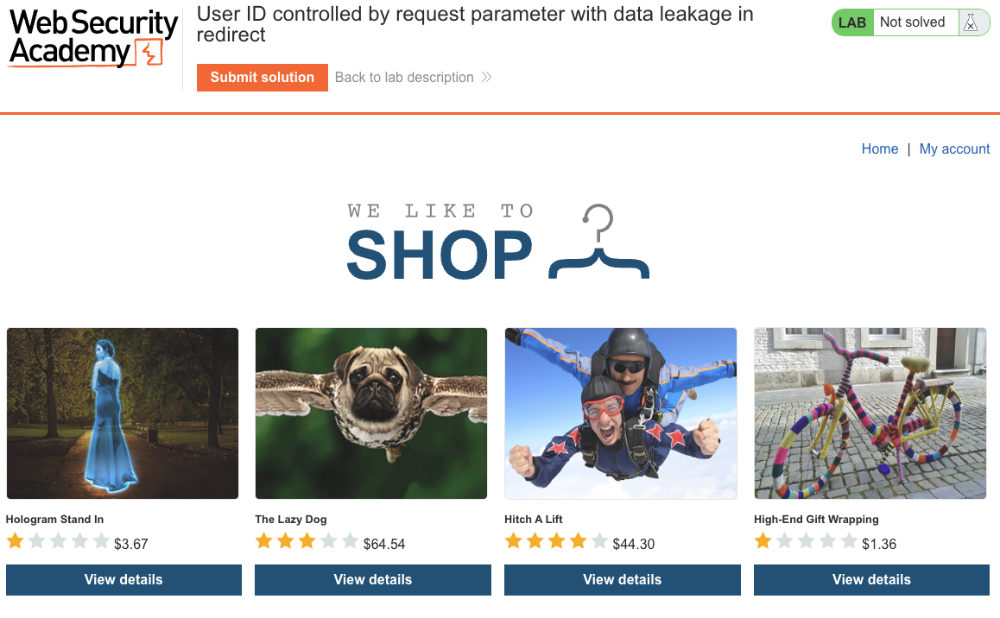
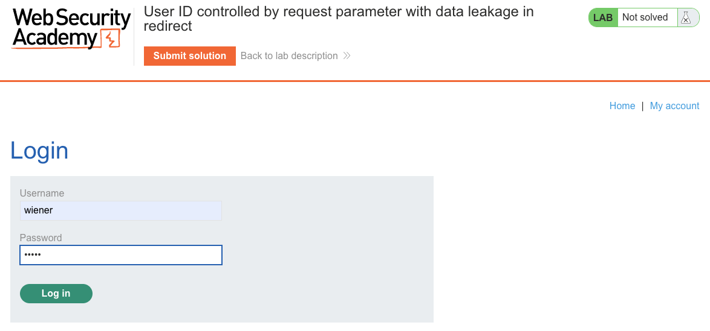
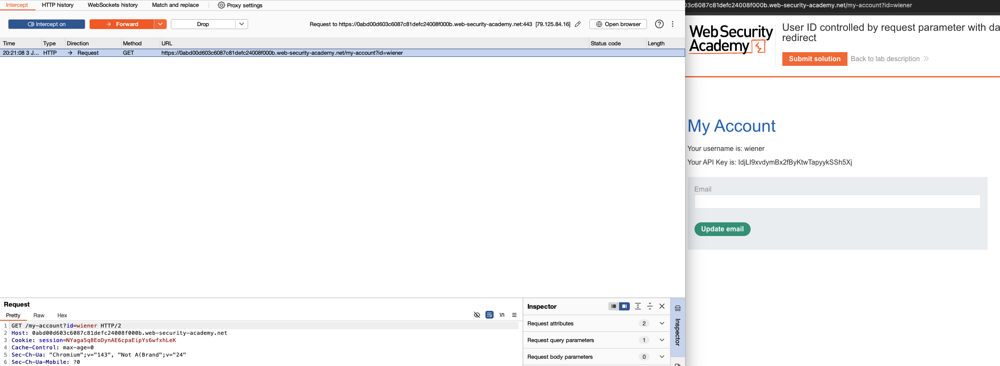
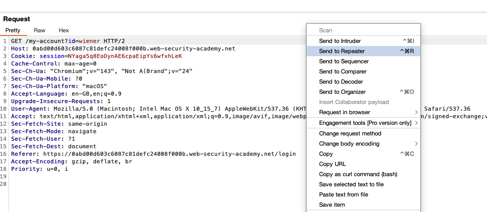
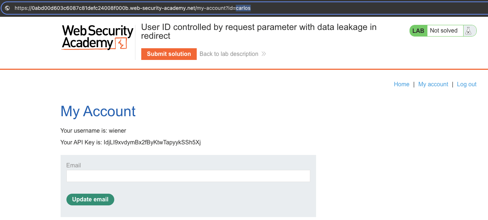
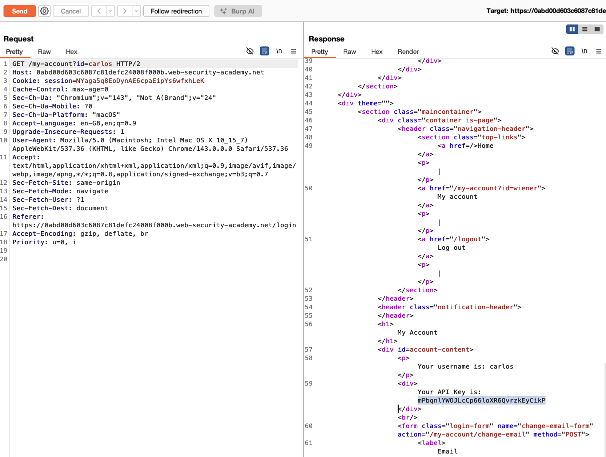
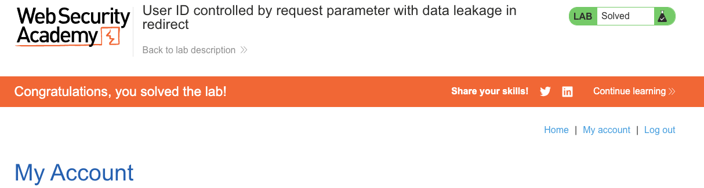

# Access Control Vulnerabilities
**Lab: User ID controlled by request parameter with data leakage in redirect (Web Security Academy)**

**Level: Apprentice**

---

## Vulnerability Overview

This lab demonstrates a subtle IDOR variant: the server detects unauthorized access and responds with a redirect (`302`) — but it populates the redirect response body with the target user's data before redirecting. The browser follows the redirect and never shows this data, but a proxy or Burp Repeater captures it.

This is a **data leakage in redirect** flaw: the server tries to enforce access control via a redirect, but leaks sensitive data in the response body that accompanies the redirect. It's a partial fix that creates a false sense of security — the redirect "works" in a browser but fails when inspected with any HTTP tool.

---

## Steps to Solve the Lab

1. **Log in and observe your account page**
   - Log in as `wiener` and click **My account**.
   - URL: `GET /my-account?id=wiener` — your API key is visible.

   

   

2. **Send the request to Burp Repeater**
   - Intercept the `GET /my-account?id=wiener` request and send it to **Repeater**.

   

   

3. **Change the `id` parameter to carlos**
   - In Repeater, change `id=wiener` to `id=carlos` and send.
   - The server responds with `302 Found` and a `Location` header pointing back to your account — so in a browser, you'd see your own data.

   

4. **Read the redirect response body in Repeater**
   - In the raw response, look at the HTML body sent alongside the `302`.
   - It contains carlos's account page HTML, including his API key — before the redirect is followed.

   

5. **Copy the API key and submit**
   - Click **Submit solution** and paste carlos's API key.

6. **Result**
   - The lab banner changes to **"Congratulations, you solved the lab!"**.

   

---

## Why This Works

The server renders the full account page for the requested `id`, then issues a redirect if the `id` does not match the session. The problem: rendering happens before the redirect check (or the body is generated and then abandoned):

```python
# Vulnerable pseudocode:
def my_account(request):
    user = db.get_user(request.args['id'])
    html = render('account.html', user=user)   # sensitive data already in html
    if request.args['id'] != session['user_id']:
        return redirect('/my-account'), 302     # redirect, but html was already built
    return html
```

Browsers automatically follow redirects and discard the body. Burp Repeater does not — it shows exactly what the server sent.

---

## Remediation

- **Perform the authorization check before rendering** — check ownership before querying or rendering any user data.
  ```python
  def my_account(request):
      if request.args['id'] != session['user_id']:
          return redirect('/my-account'), 302   # redirect before any data is fetched
      user = db.get_user(session['user_id'])
      return render('account.html', user=user)
  ```
- **Return an empty body with redirect responses** — a `302` response should never contain sensitive page content.
- **Prefer session-based lookups** — eliminate the `id` parameter entirely and always derive the user from the session.

---

Link: https://portswigger.net/web-security/access-control/lab-user-id-controlled-by-request-parameter-with-data-leakage-in-redirect
