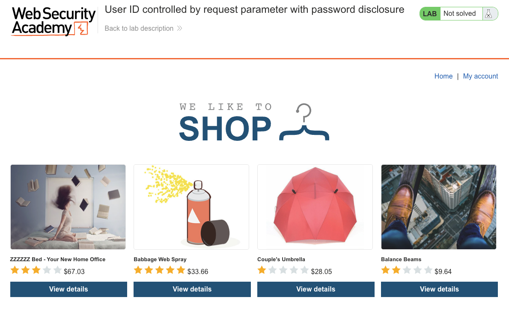
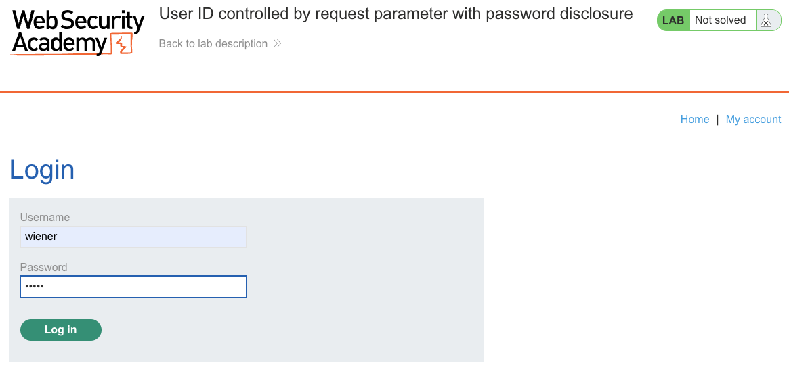
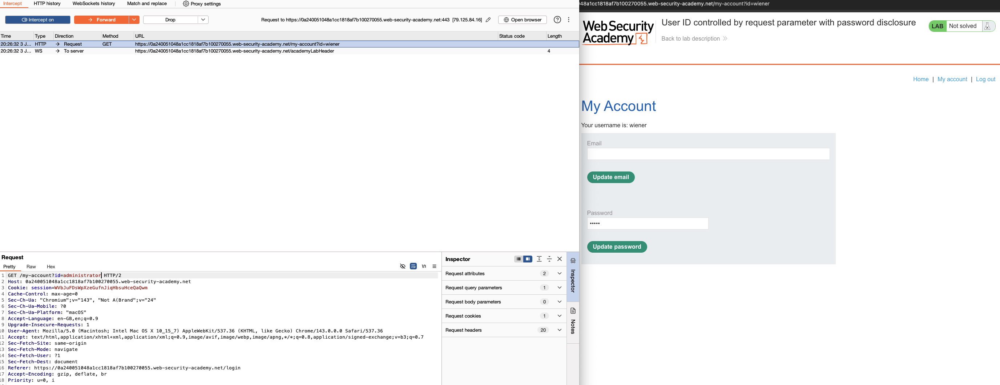
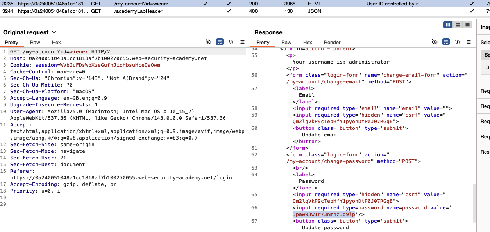
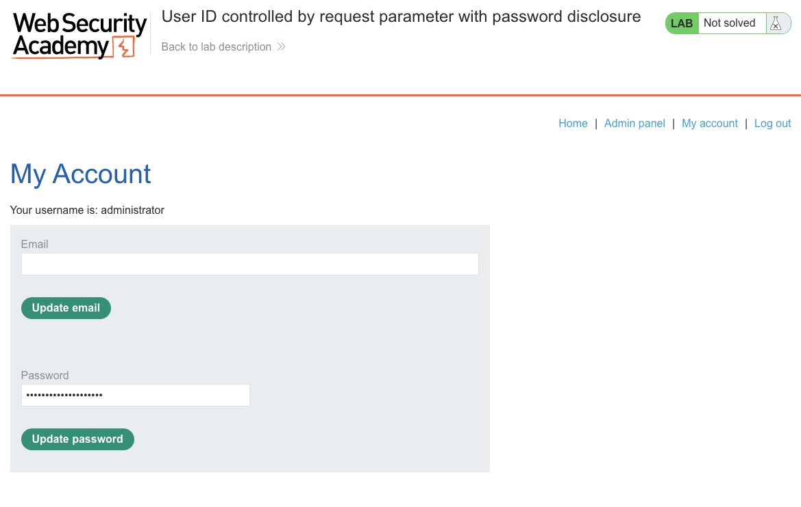
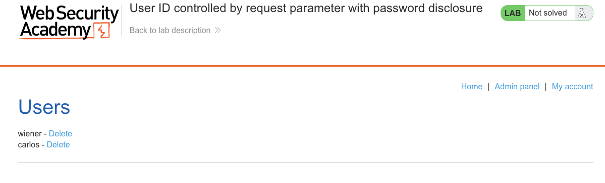
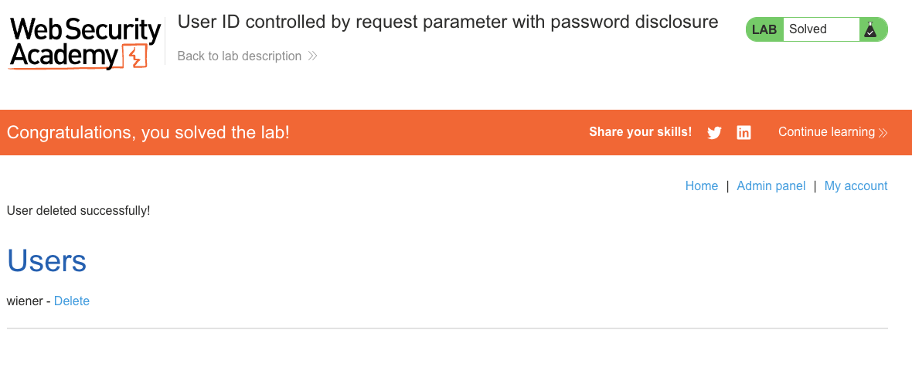

# Access Control Vulnerabilities
**Lab: User ID controlled by request parameter with password disclosure (Web Security Academy)**

**Level: Apprentice**

---

## Vulnerability Overview

This lab chains two vulnerabilities: an IDOR (accessing another user's account page via a parameter change) and **sensitive data exposure** (the account page renders the current password in a pre-filled HTML input field). Together they enable full account takeover - the attacker reads the administrator's password directly from the HTML source of their profile page.

Pre-filling password fields with the current password is a particularly dangerous pattern because it turns any account-page IDOR into an instant credential theft.

---

## Steps to Solve the Lab

1. **Log in as wiener and view your account page**
   - Log in as `wiener`. The URL is `GET /my-account?id=wiener`.
   - Notice the change-password form - the password field is pre-filled with your current password.

   

   

2. **Intercept the request and send to Repeater**
   - Intercept `GET /my-account?id=wiener` and send to **Repeater**.

   

3. **Change `id` to administrator**
   - In Repeater, modify `id=wiener` to `id=administrator` and send.
   - The server returns the administrator's account page.

   

4. **Extract the password from the HTML**
   - In the response body, find the password input field:
     ```html
     <input type="password" name="password" value="<admin-password>">
     ```
   - Copy the password value.

5. **Log in as administrator**
   - Log out, then log in as `administrator` with the extracted password.

   

6. **Delete carlos via the admin panel**
   - Navigate to `/admin` and delete `carlos`.

   

7. **Result**
   - The lab banner changes to **"Congratulations, you solved the lab!"**.

   

---

## Why This Works

Two independent failures combine:

1. **IDOR** - the server returns any user's account page based on the `id` parameter with no ownership check.
2. **Password in HTML response** - the account page renders the user's password in plaintext in a pre-filled `<input>` field so the browser can display it. This means the password is transmitted in every response for that account page.

Any attacker who can access the account page (via IDOR or any other means) gets the password for free.

---

## Remediation

- **Server-side ownership check** - before returning any account page, verify `session.user_id == id`.
- **Never pre-fill password fields with the actual password** - if you want to indicate a password exists, use a placeholder like `••••••••`. The current password should never be sent to the client.
- **Use separate endpoints for password changes** - the change-password form should not require transmitting the current password in the GET response; it should only accept the new password via a POST, validated with the current password entered by the user at that moment.

---

Link: https://portswigger.net/web-security/access-control/lab-user-id-controlled-by-request-parameter-with-password-disclosure
