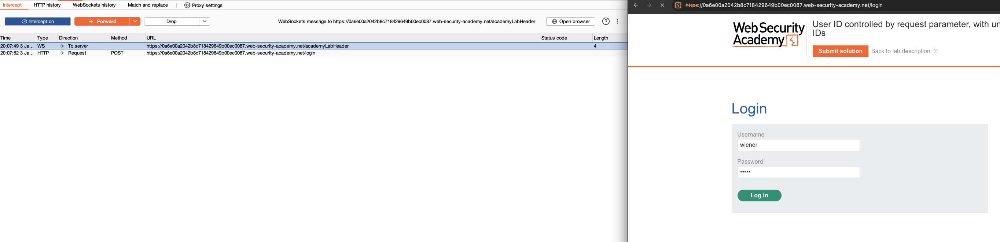
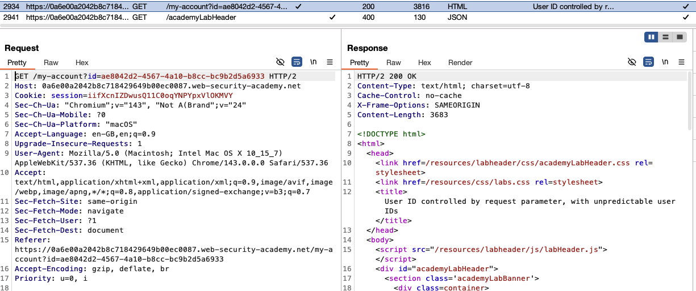
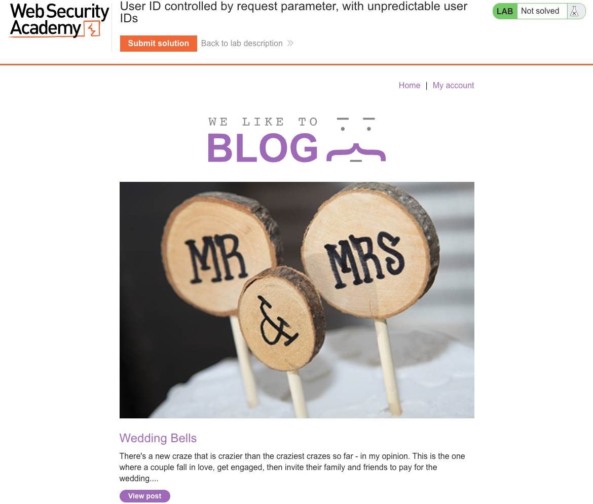
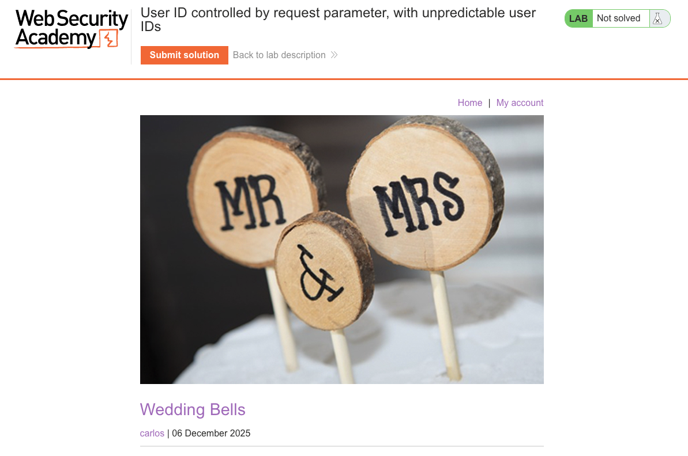
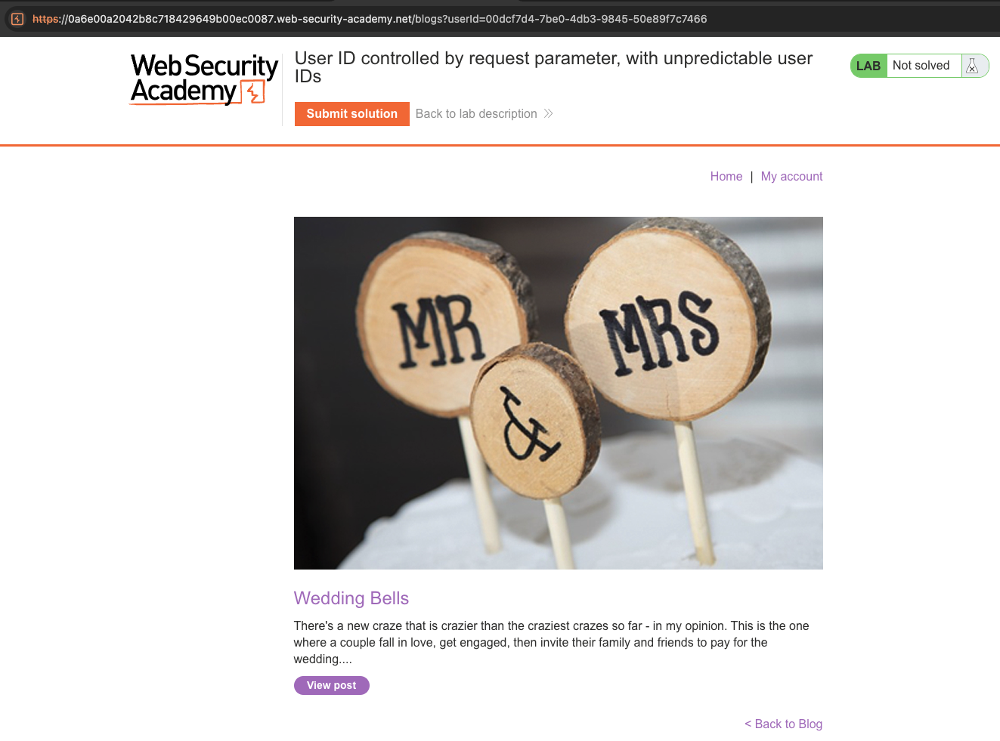
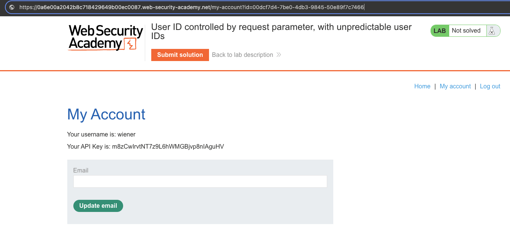
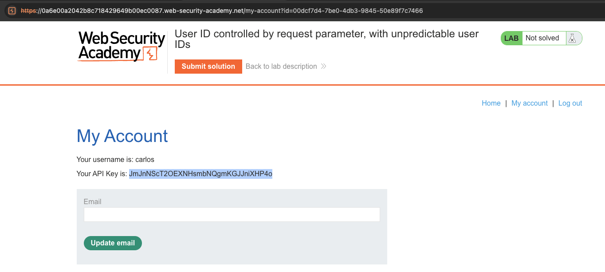
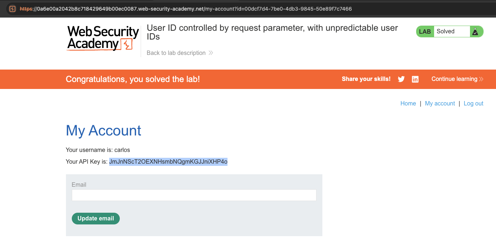

# Access Control Vulnerabilities
**Lab: User ID controlled by request parameter, with unpredictable user IDs (Web Security Academy)**

**Level: Apprentice**

---

## Vulnerability Overview

This lab is a variation of the basic IDOR - the `id` parameter uses GUIDs (long random identifiers) instead of predictable usernames, making guessing infeasible. However, the application leaks the victim's GUID through publicly accessible content (blog post author links). Once the GUID is obtained, the IDOR is exploited the same way.

The lesson: **unpredictable IDs are not access control**. If the ID leaks anywhere - in public pages, API responses, emails - the protection collapses.

---

## Steps to Solve the Lab

1. **Log in and observe the account page URL**
   - Log in as `wiener` and click **My account**.
   - The URL contains a long GUID: `?id=d3f4...` - not guessable by enumeration.

   

   

2. **Find carlos's GUID in a blog post**
   - Return to the blog and open any post authored by `carlos` (e.g., *"Wedding Bells"*).
   - Click the author link below the post title.
   - The URL of carlos's author profile contains his GUID: `?id=<carlos-guid>`.

   

   

   

3. **Access carlos's account page**
   - Use carlos's GUID in the my-account URL:
     ```
     /my-account?id=<carlos-guid>
     ```
   - Carlos's account page loads, exposing his API key.

   

   

4. **Submit the solution**
   - Click **Submit solution** and paste the API key.

5. **Result**
   - The lab banner changes to **"Congratulations, you solved the lab!"**.

   

---

## Why This Works

The server still performs no authorization check - it loads whichever account corresponds to the `id` parameter. The GUID was meant to prevent enumeration, but the same application exposes it in author profile links that any visitor can see. The assumed secrecy of the identifier was never enforced.

---

## Remediation

- **Authorization check is mandatory regardless of ID predictability** - verify that `session.user_id == requested_id` before returning any account data.
- **Treat GUIDs as additional hardening, not as security** - they slow down enumeration but do not replace access control.
- **Audit all places where user IDs are exposed** - public author profiles, API responses, emails, and logs. Any leak that exposes an ID to a third party undermines GUID-based protection.

---

Link: https://portswigger.net/web-security/access-control/lab-user-id-controlled-by-request-parameter-with-unpredictable-user-ids
