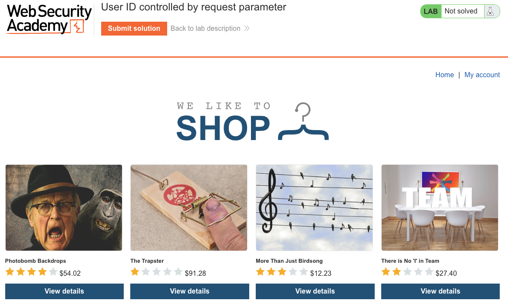
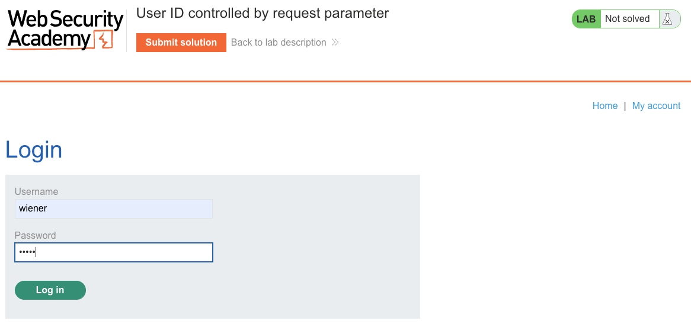
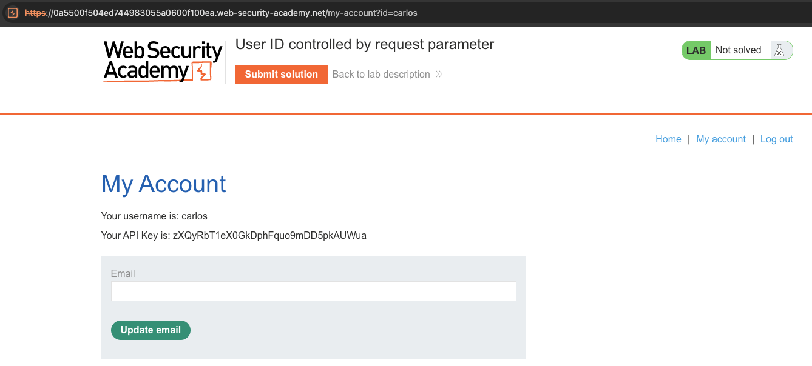
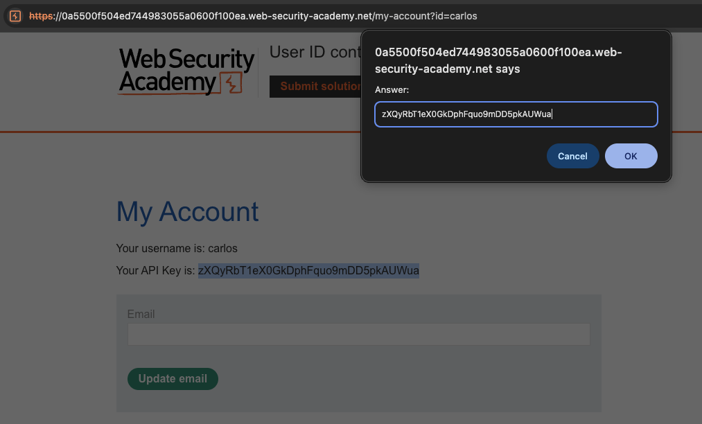
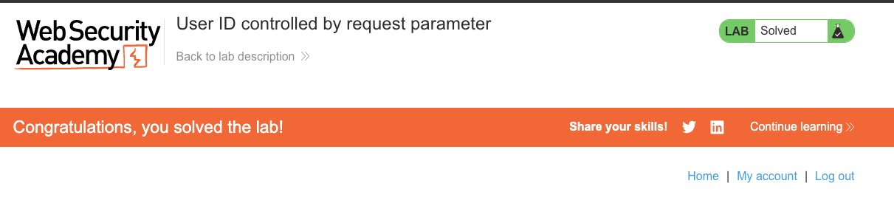

# Access Control Vulnerabilities
**Lab: User ID controlled by request parameter (Web Security Academy)**

**Level: Apprentice**

---

## Vulnerability Overview

This lab is a basic IDOR (Insecure Direct Object Reference): the application uses a user-supplied `id` parameter to determine which account page to display, with no check that the authenticated user matches the requested `id`. Changing the parameter to another user's identifier gives full access to their account data.

The vulnerability is straightforward — the `id` parameter uses a predictable value (the username itself), making enumeration trivial.

---

## Steps to Solve the Lab

1. **Log in and observe the account page URL**
   - Log in as `wiener` and click **My account**.
   - The URL is: `https://<lab-id>.web-security-academy.net/my-account?id=wiener`

   

   

2. **Modify the `id` parameter**
   - Change `id=wiener` to `id=carlos` in the URL and load the page.

3. **Extract carlos's API key**
   - The account page for `carlos` loads, showing his API key.
   - Copy the API key.

   

4. **Submit the solution**
   - Click **Submit solution** and paste carlos's API key.

   

5. **Result**
   - The lab banner changes to **"Congratulations, you solved the lab!"**.

   

---

## Why This Works

The server resolves the account to display based entirely on the `id` URL parameter, without verifying that the current session belongs to that user:

```python
# Vulnerable pseudocode:
def my_account(request):
    user_id = request.args.get('id')
    user = db.get_user(user_id)     # no session check
    return render('account.html', user=user)
```

The fix — comparing `user_id` against `session.user_id` — is a single line that's missing.

---

## Remediation

- **Always verify ownership** — before returning any user-specific resource, check that `session.user_id == requested_id`.
- **Use opaque session-based lookups** — instead of accepting a user ID from the URL, derive the user from the session server-side:
  ```python
  def my_account(request):
      user = db.get_user(session['user_id'])  # no user input needed
      return render('account.html', user=user)
  ```
- **Horizontal privilege escalation is still privilege escalation** — accessing another user's data of the same role is as serious as vertical escalation for the data owner.

---

Link: https://portswigger.net/web-security/access-control/lab-user-id-controlled-by-request-parameter
