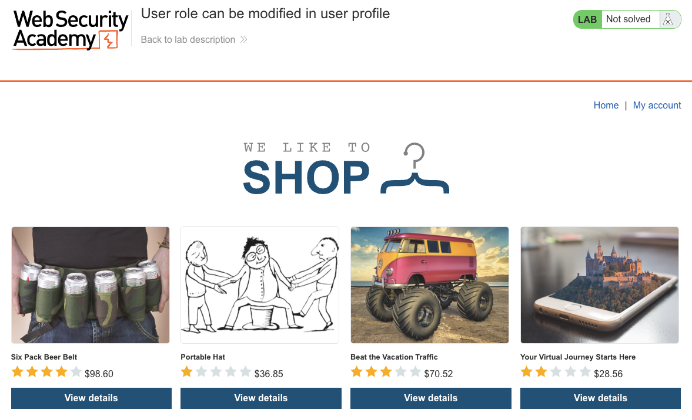
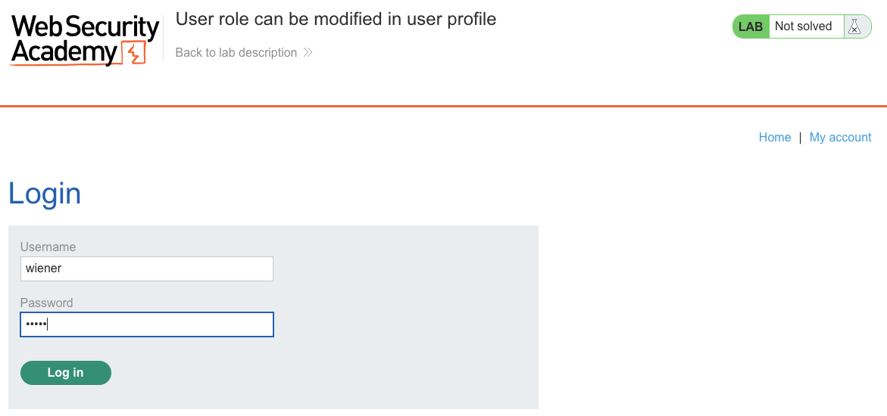
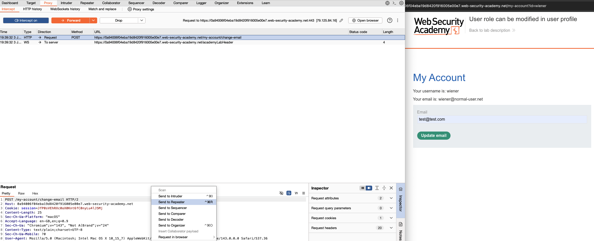
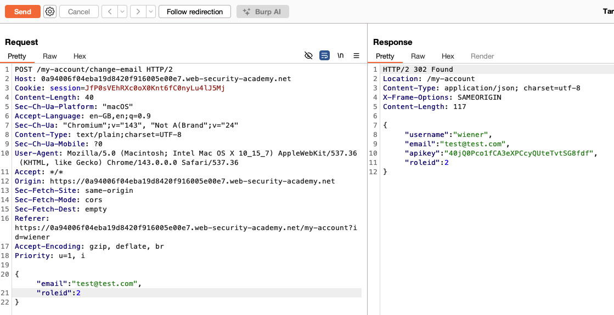
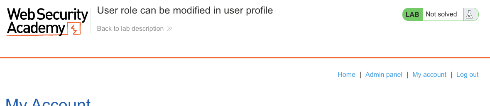
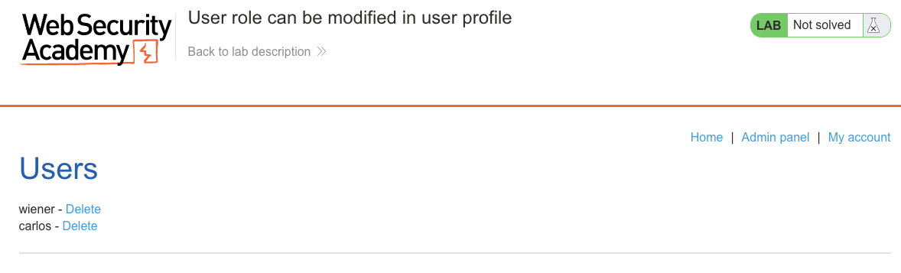
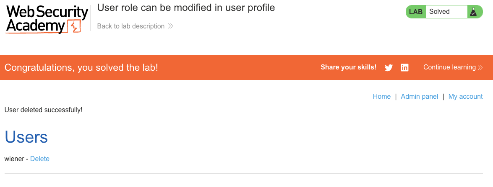

# Access Control Vulnerabilities
**Lab: User role can be modified in user profile (Web Security Academy)**

**Level: Apprentice**

---

## Vulnerability Overview

This lab demonstrates privilege escalation through a mass assignment vulnerability. The profile update endpoint accepts a JSON body and reflects back the full user object in the response — including a `roleid` field. The server processes any fields included in the request body, including ones the user shouldn't be allowed to set. By adding `"roleid": 2` to the request, a regular user can promote themselves to administrator.

This is a **mass assignment** vulnerability: the server binds all incoming fields to the model without filtering out privileged ones.

---

## Steps to Solve the Lab

1. **Log in and open the profile page**
   - Log in as `wiener` and go to **My account**.

   

2. **Update your email and intercept the request**
   - Enter any email address and click **Update email**.
   - Intercept the `POST /my-account/change-email` request in Burp and send it to **Repeater**.

   

3. **Inspect the JSON response**
   - Send the request and examine the response body — it returns a JSON object with fields like:
     ```json
     {"username": "wiener", "email": "...", "apikey": "...", "roleid": 1}
     ```
   - `roleid: 1` is a regular user. Admin role is `roleid: 2`.

   

4. **Add `roleid` to the request body**
   - Modify the request body to include `"roleid": 2`:
     ```json
     {"email": "test@test.com", "roleid": 2}
     ```
   - Send the modified request.

   

5. **Access the admin panel**
   - Browse to `/admin` — the panel is now accessible.

   

6. **Delete carlos**
   - Delete `carlos` from the admin panel.

   

   

---

## Why This Works

The server uses the incoming JSON body to update the user record directly, without filtering which fields are allowed to be changed:

```python
# Vulnerable pseudocode:
user.update(request.json)  # applies ALL fields from body, including roleid
db.save(user)
return user.to_dict()       # reflects full object back
```

The response revealing `roleid` is an information disclosure that makes the field name discoverable. But even without it, an attacker who knows the schema can try adding `roleid` to the body. The root problem is that the server never checks whether the requesting user is allowed to change their own role.

---

## Remediation

- **Explicitly allowlist updatable fields** — only apply fields the user is allowed to change. Never pass the raw request body to the ORM update method.
  ```python
  # Safe approach:
  allowed = {'email'}
  update_data = {k: v for k, v in request.json.items() if k in allowed}
  user.update(update_data)
  ```
- **Never reflect the full object back** — the response should only include fields relevant to the user. Returning `roleid` leaks the schema.
- **Validate role changes separately** — any change to `roleid`, `is_admin`, or equivalent privilege fields must require admin authentication on the request itself.

---

Link: https://portswigger.net/web-security/access-control/lab-user-role-can-be-modified-in-user-profile
