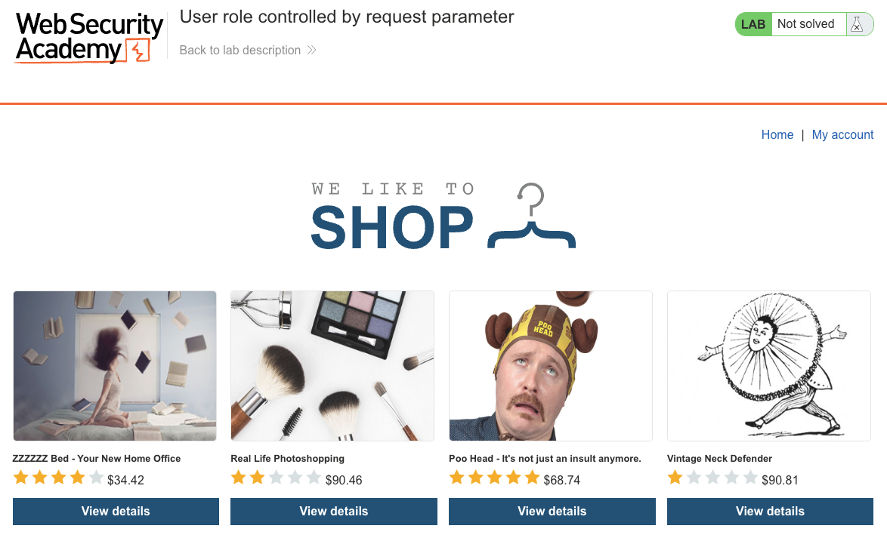
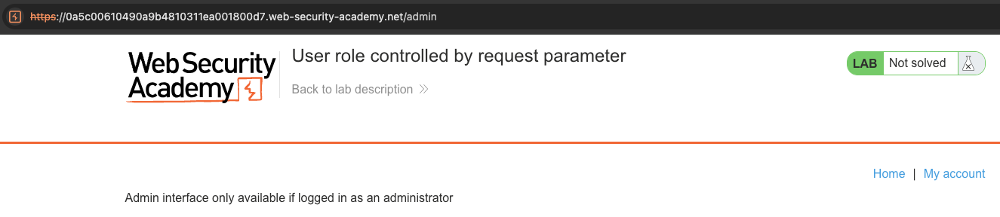
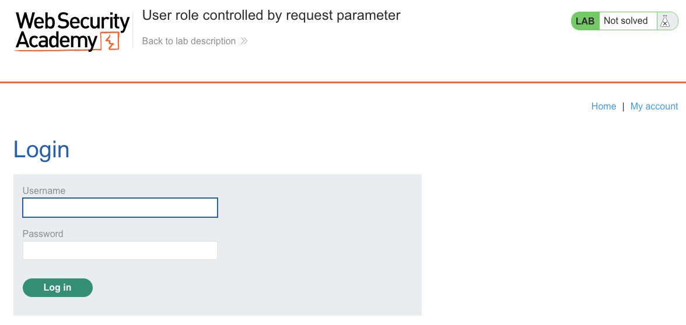
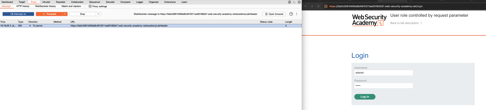
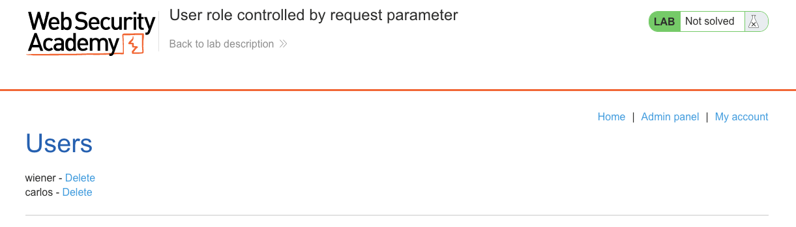
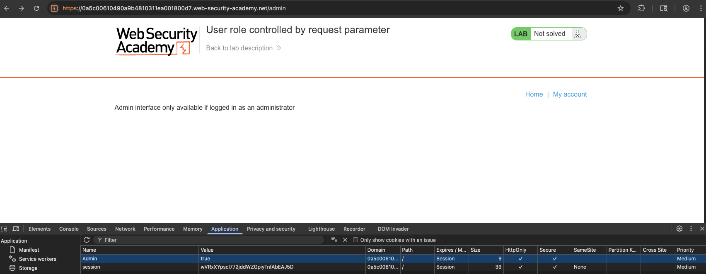
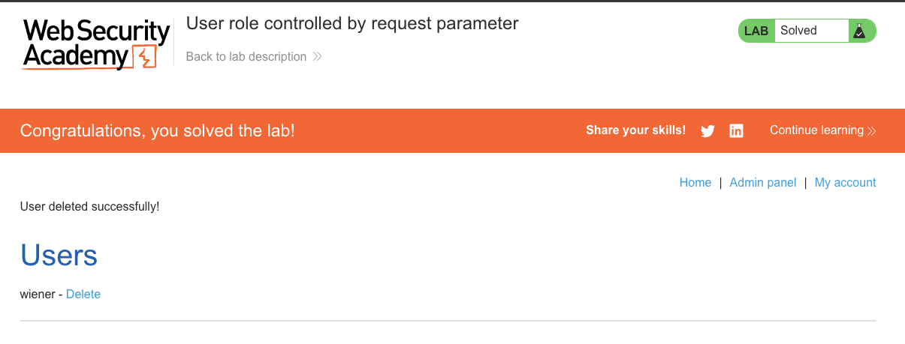

# Access Control Vulnerabilities
**Lab: User role controlled by request parameter (Web Security Academy)**

**Level: Apprentice**

---

## Vulnerability Overview

This lab demonstrates privilege escalation via a client-controlled role cookie. The application stores the user's role in a browser cookie (`Admin=false`) and trusts this value on every request to determine access rights. Because the cookie is stored on the client and never validated against a server-side session, any user can simply edit the cookie value to grant themselves admin access.

This is a **client-side authorization** flaw — the server delegates the trust decision to data it doesn't control.

---

## Steps to Solve the Lab

1. **Log in as a regular user**
   - Open the lab and log in with the credentials for `wiener`.

   

   

2. **Inspect the cookies**
   - Open **DevTools → Application → Cookies**.
   - Find a cookie named `Admin` with the value `false`.

   

3. **Request the admin panel to confirm it's blocked**
   - Navigate to `/admin`.
   - The server returns "Admin interface only available if logged in as an administrator."

4. **Edit the cookie to escalate privileges**
   - In DevTools, change the `Admin` cookie value from `false` to `true`.
   - Reload `/admin`.
   - The admin panel now loads, listing all users with **Delete** links.

   

   

5. **Delete the target user**
   - Click **Delete** next to `carlos`.

   

6. **Result**
   - The lab banner changes to **"Congratulations, you solved the lab!"**.

   

---

## Why This Works

The server reads the `Admin` cookie on each request and uses it as the authorization signal:

```python
# Vulnerable server-side logic (pseudocode):
if request.cookies.get('Admin') == 'true':
    render_admin_panel()
```

Since cookies are stored in the browser and modifiable by the user, this check is trivially bypassed. There is no server-side record of who is actually an admin — the cookie is the only source of truth, and it is fully controlled by the client.

---

## Remediation

- **Store authorization state server-side** — the session ID (cookie) should map to a server-side session record that contains the role. The role is never sent to or accepted from the client.
- **Never trust client-supplied role or privilege data** — any value that arrives from the client (cookie, header, hidden form field) must be treated as untrusted.
- **Use signed/encrypted session tokens** — if the role must be embedded in a token (e.g., JWT), sign it with a secret key so tampering is detectable.

---

Link: https://portswigger.net/web-security/access-control/lab-user-role-controlled-by-request-parameter
