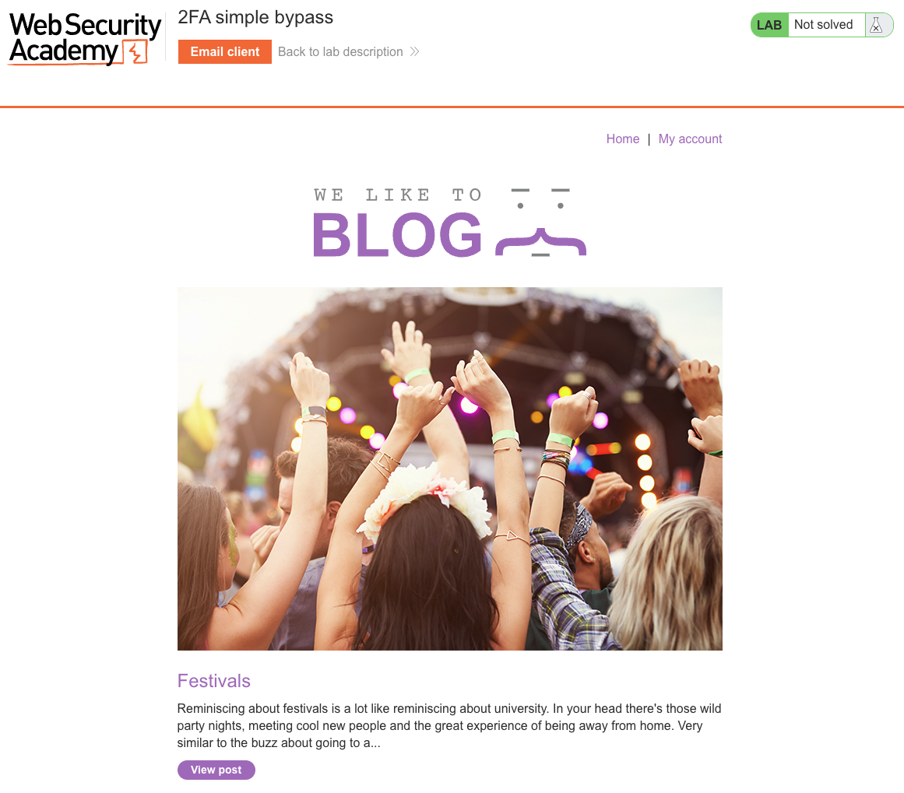
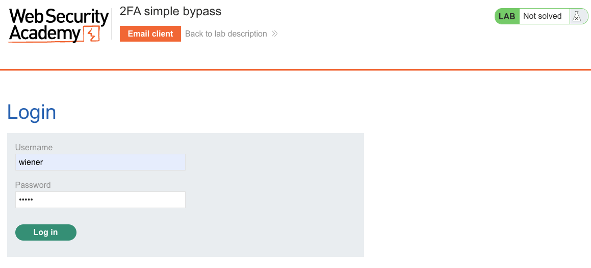
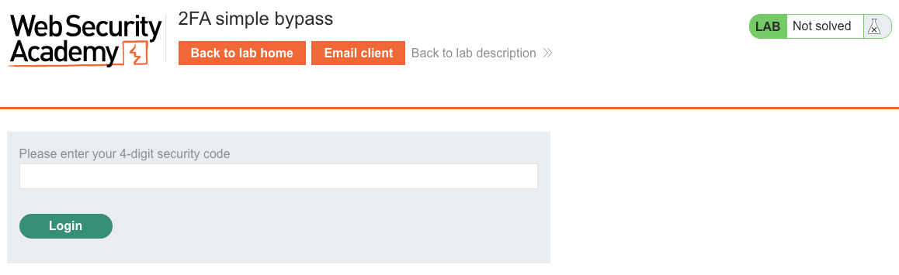
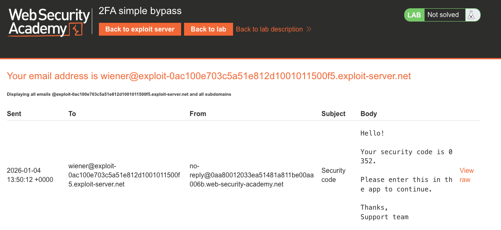
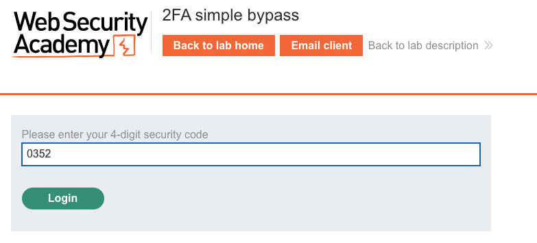
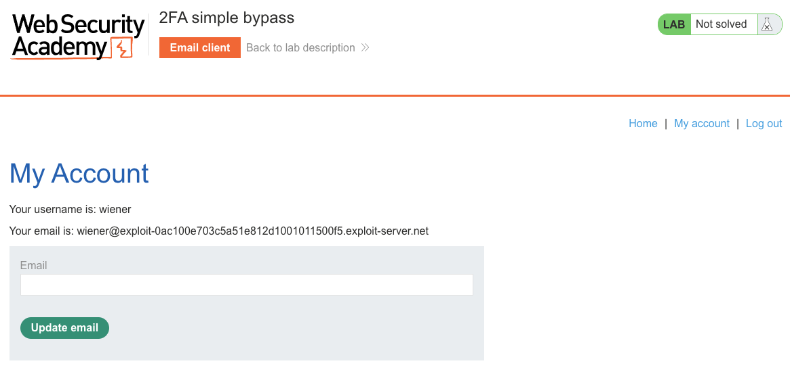
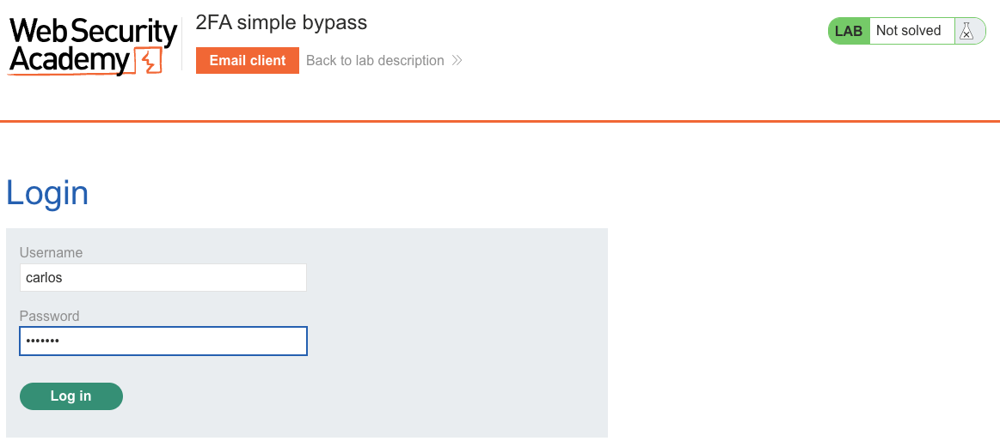
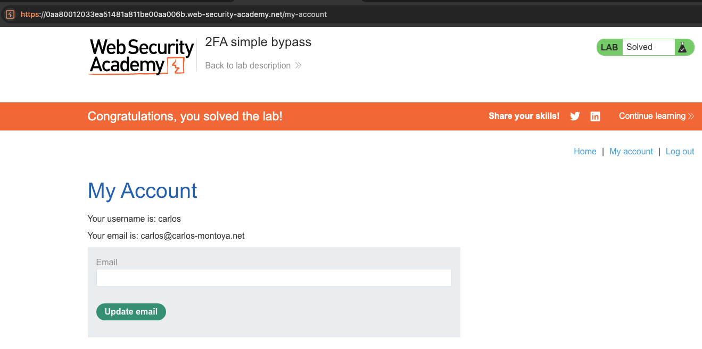

# Authentication
**Lab: 2FA simple bypass (Web Security Academy)**

**Level: Apprentice**

**Tools:** Browser

---

## Vulnerability Overview

This lab demonstrates that 2FA can be completely bypassed if the application doesn't enforce completion of the second factor before granting access. After entering correct credentials (factor 1), the server issues a session cookie. The 2FA page is presented as the next step - but if the user navigates away to a protected page directly, the server honors the session without checking whether the 2FA step was completed.

The flaw is that **authentication state is granted after factor 1**, rather than only after both factors succeed. The 2FA page is a UI gate, not a server-side enforcement point.



---

## Steps to Solve the Lab

### 1. Understand the target
- The goal is to log in as `carlos` using his known password, bypassing the 2FA step.
- Carlos's 2FA code is delivered to his email - which the attacker cannot access.

### 2. Log in as wiener to observe the 2FA flow
- Log in as `wiener:peter`.

  

- After entering credentials, the server redirects to `/login2` - the 2FA verification page.

  

- The security code for wiener is delivered to the email client. Copy it.

  

- Enter the code to complete the 2FA flow.

  

- The login completes and wiener's account page loads - confirming the normal flow.

  

### 3. Log out and initiate login as carlos
- Log out, then log in with carlos's credentials (`carlos:montoya`).
- The server redirects to `/login2` - the 2FA page.

  

### 4. Bypass 2FA by navigating directly
- Instead of entering a 2FA code, manually change the URL to `/my-account`.
- The server accepts the request and loads carlos's account page - the 2FA step was never enforced.

### 5. Result
- The lab banner changes to **"Congratulations, you solved the lab!"**.

  

---

## Why This Works

After entering valid credentials, the server creates a session and sets a session cookie - before the 2FA step is completed. The 2FA page is just a form the user is redirected to; there is no server-side flag marking the session as "pending 2FA." The server treats any request with a valid session cookie as fully authenticated:

```
POST /login  (valid credentials)
→ Server creates session, sets cookie, redirects to /login2

GET /my-account  (skip /login2 entirely)
→ Server sees valid session cookie → grants access
```

---

## Remediation

- **Use a two-stage session model** - after factor 1, issue only a "pre-auth" session token that allows access only to the 2FA endpoint. Replace it with a full session token only after factor 2 succeeds.
- **Block access to protected resources during pending 2FA** - any request to a non-2FA endpoint while the session is in "pending" state should redirect to `/login2` or return `403`.
- **Do not trust session state until all factors are verified** - the server, not the UI, must enforce this.

---

**OWASP Top 10:** A07:2021 - Identification and Authentication Failures

Link: https://portswigger.net/web-security/authentication/multi-factor/lab-2fa-simple-bypass
