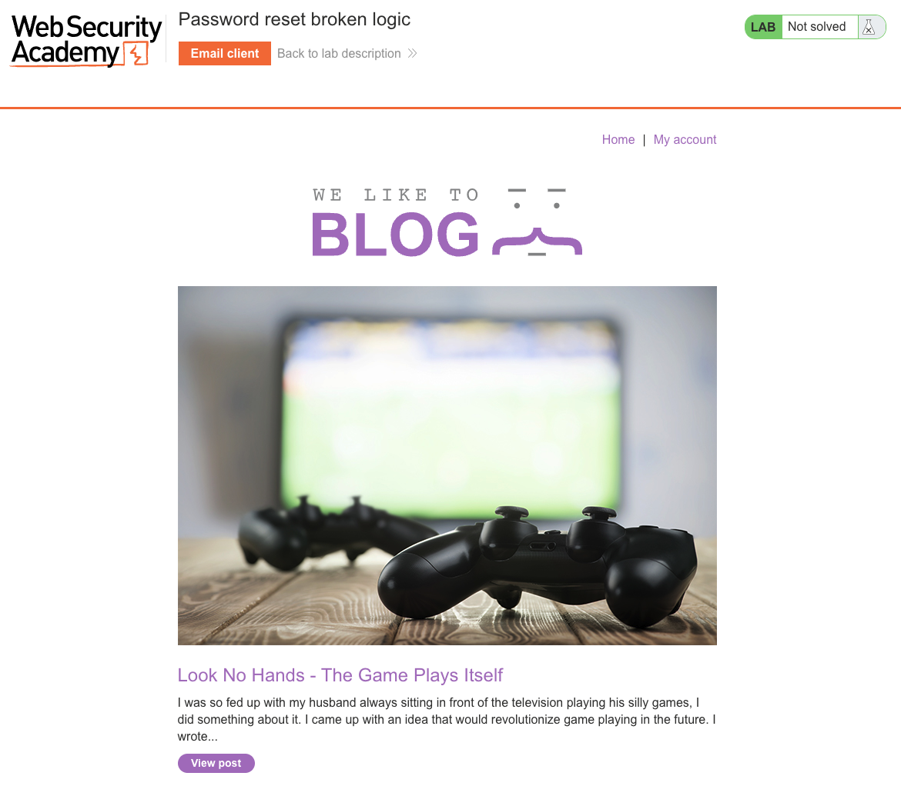
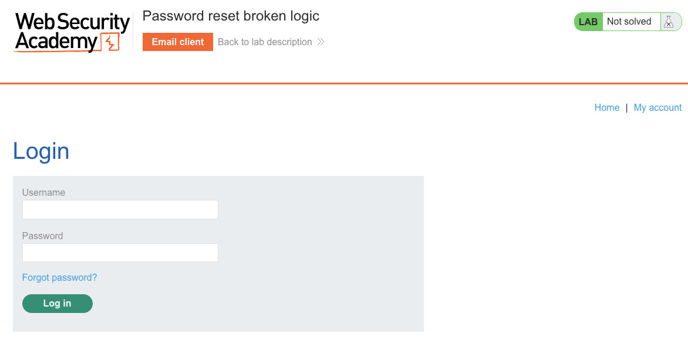
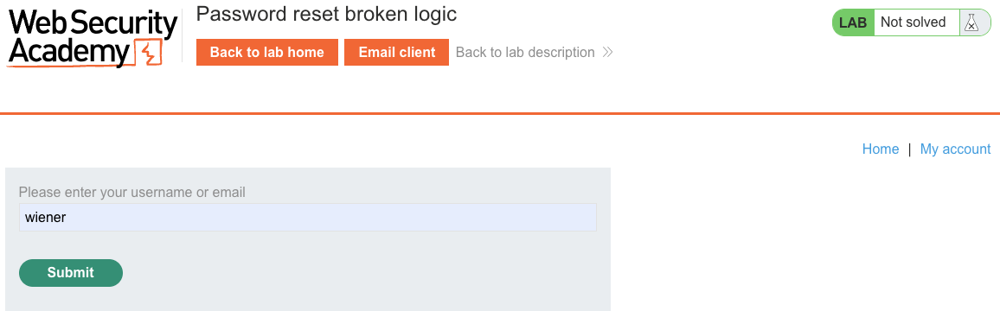
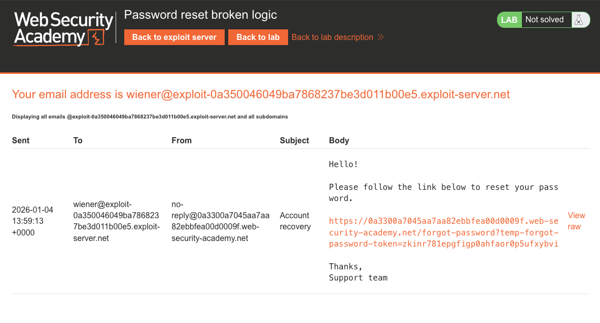
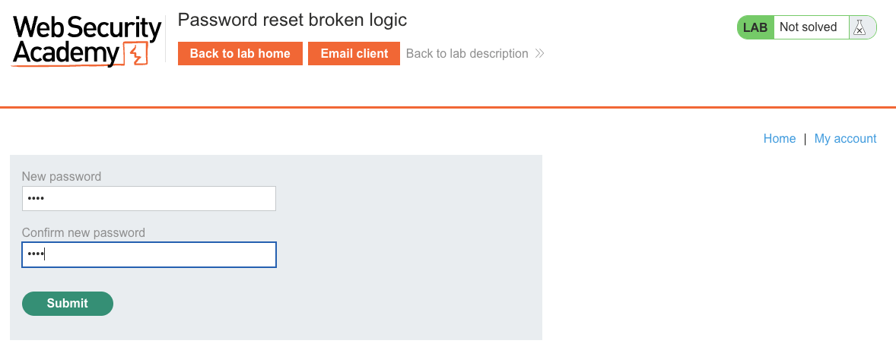
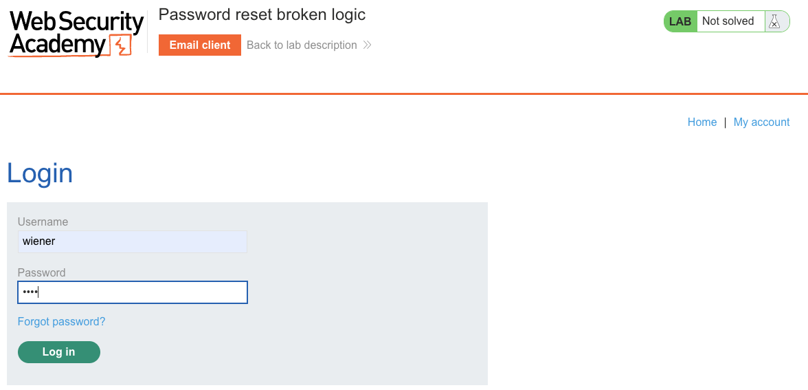
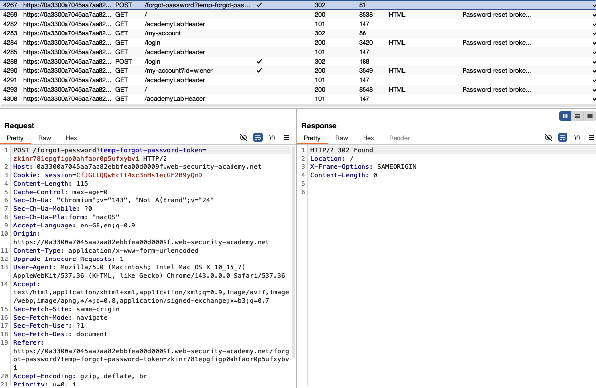
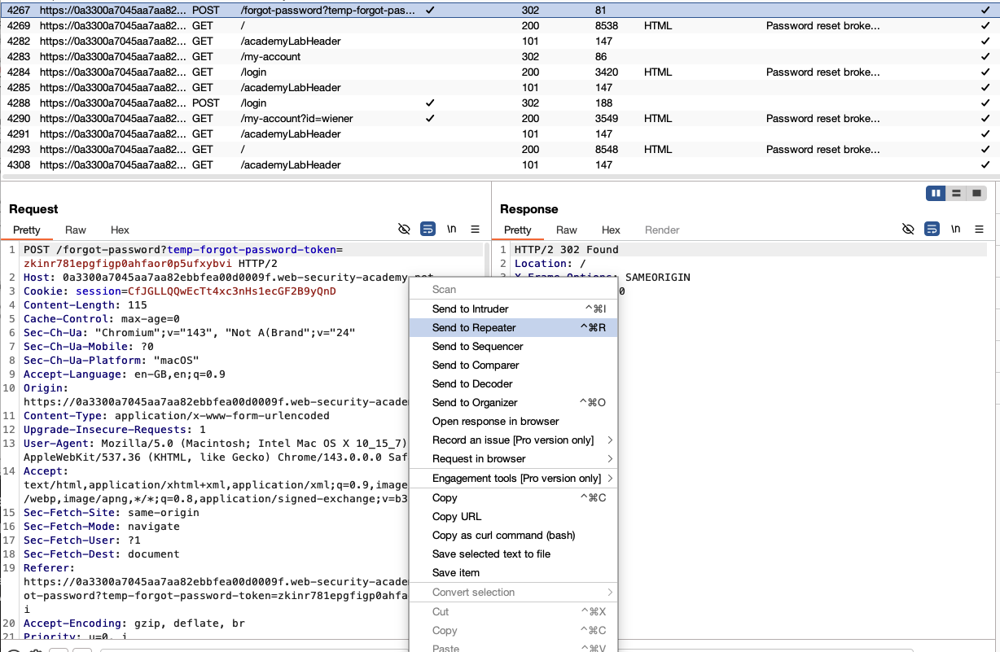
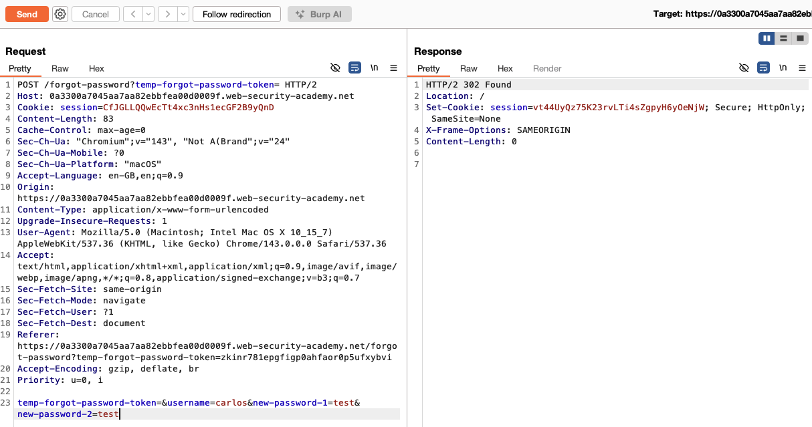
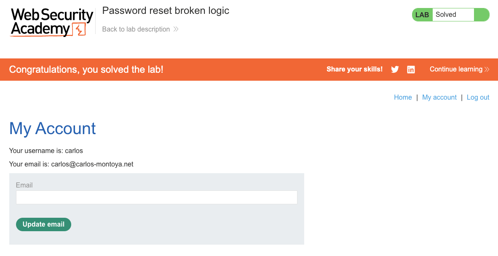

# Authentication
**Lab: Password reset broken logic (Web Security Academy)**

**Level: Apprentice**

**Tools:** Burp Suite (Proxy, Repeater)

---

## Vulnerability Overview

This lab demonstrates a broken password reset flow where the reset token is validated independently of the username in the final reset request. The server checks that the token is valid, but never verifies that the token was issued for the user specified in the `username` field. An attacker who obtains a valid token (for their own account) can reuse it to reset a different user's password.

The root cause is **missing binding between the token and the account** at the reset step - the server treats them as two independent inputs rather than a bound pair.



---

## Steps to Solve the Lab

### 1. Trigger a password reset for your own account
- Go to **Login → Forgot password**.

  

- Enter `wiener` and submit. The server sends a reset email to wiener's address on the exploit server.

  

### 2. Retrieve your own reset token
- Open the exploit server's **Email client**.
- Copy the `temp-forgot-password-token` value from the link in the email.

  

### 3. Open the reset link
- Visit the reset URL and observe the reset form. It shows **New password** and **Confirm new password** fields; the `username` and `temp-forgot-password-token` are submitted as **hidden fields** in the underlying `POST /forgot-password` request.

  

### 4. Confirm the reset works on your own account
- Complete the reset and log in as `wiener` to verify the flow end-to-end before pivoting.

  

### 5. Intercept the password reset submission
- Submit the reset form again and intercept the `POST /forgot-password` request in Burp.

  

- Send it to **Repeater**.

  

### 6. Swap the username to carlos while keeping your token
- In Repeater, change `username=wiener` to `username=carlos` while keeping the `temp-forgot-password-token` unchanged.
- Set new passwords and send. The server accepts the request - carlos's password is now changed.

  

> **Note:** In this lab the token is not properly validated at all - the request also succeeds if you **delete** the `temp-forgot-password-token` entirely. This reinforces the point: the server never ties the token to a specific account.

### 7. Log in as carlos
- Log in with `carlos` and the new password.

### 8. Result
- The lab banner changes to **"Congratulations, you solved the lab!"**.

  

---

## Why This Works

The reset flow has two steps:

1. Server generates a token and emails it → correct
2. Server validates the token at reset time but doesn't check that `username` matches the token's intended recipient → broken

```python
# Vulnerable pseudocode:
def reset_password(request):
    token = request.form['temp-forgot-password-token']
    username = request.form['username']   # attacker-controlled

    if db.token_exists(token):            # valid token (wiener's)
        user = db.get_user(username)      # but applied to carlos
        user.set_password(request.form['new-password-1'])
```

The token and the target account are never cross-referenced.

---

## Remediation

- **Bind the token to the user at issuance time** - store `{token: "abc123", user_id: 42}` in the database. At reset time, look up the user from the token - never accept a `username` field.
  ```python
  def reset_password(request):
      token = request.form['token']
      record = db.get_reset_record(token)
      if not record or record.expired:
          abort(400)
      user = db.get_user(record.user_id)   # derived from token, not user input
      user.set_password(request.form['new-password'])
  ```
- **Expire tokens after single use** - invalidate the token immediately after it's used.
- **Short token lifetime** - reset tokens should expire within 15-60 minutes.

---

**OWASP Top 10:** A07:2021 - Identification and Authentication Failures

Link: https://portswigger.net/web-security/authentication/other-mechanisms/lab-password-reset-broken-logic
