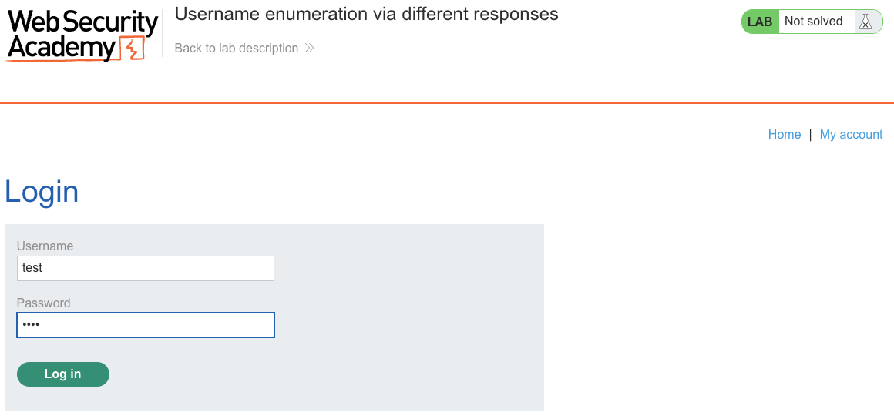
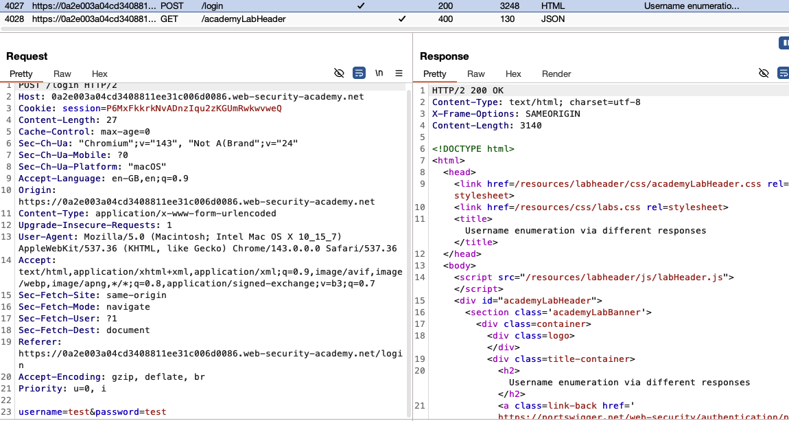
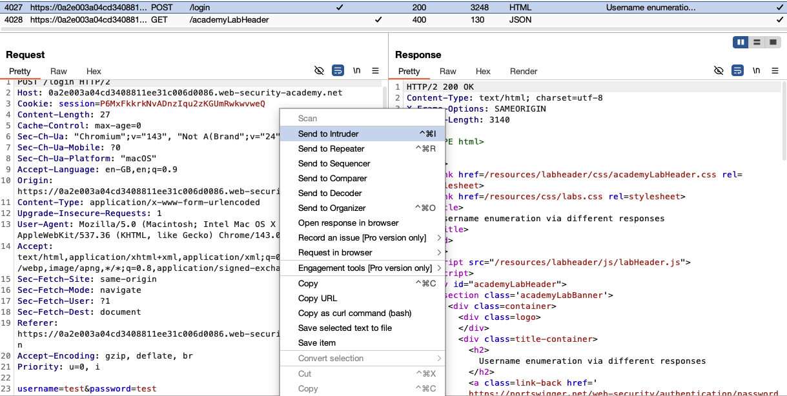
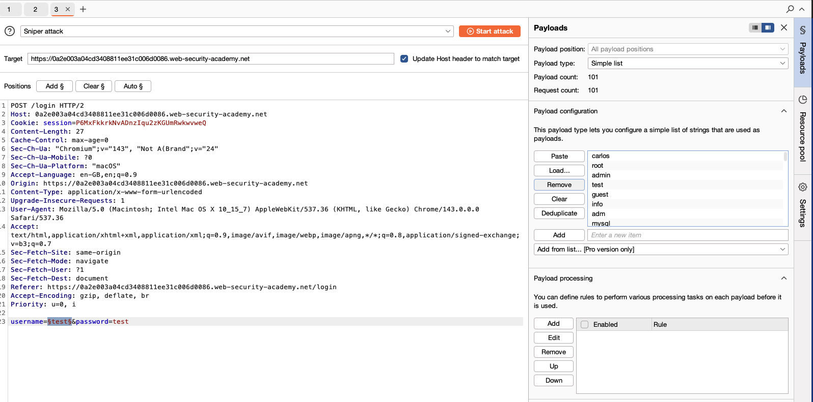
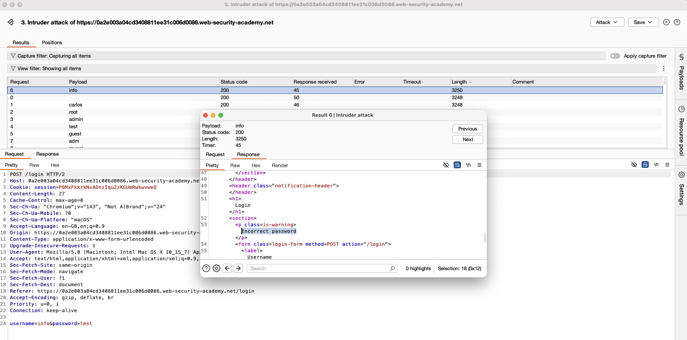
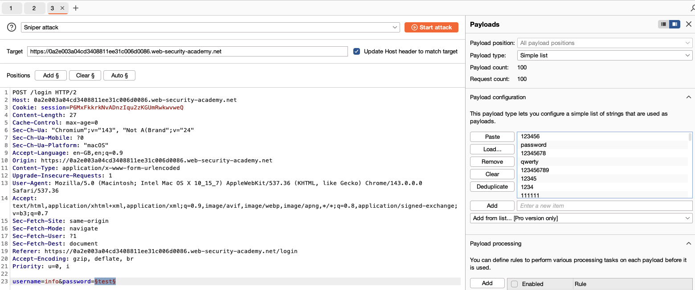
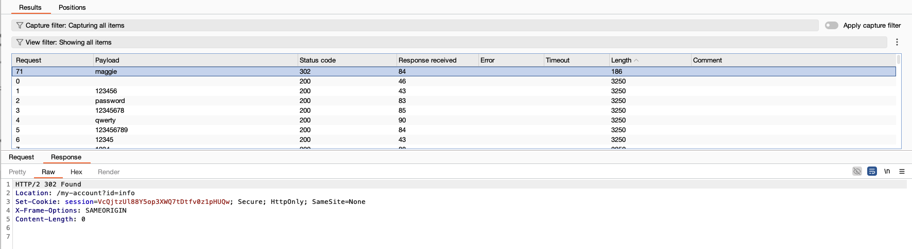
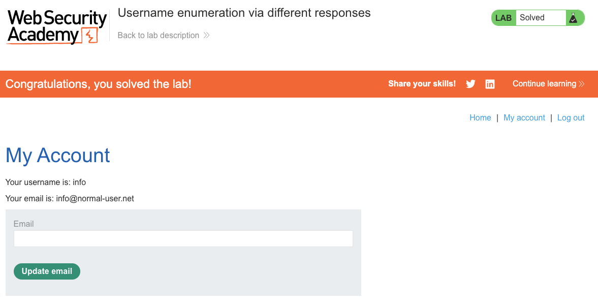

# Authentication
**Lab: Username enumeration via different responses (Web Security Academy)**

**Level: Apprentice**

**Tools:** Burp Suite (Proxy, Intruder)

---

## Vulnerability Overview

Username enumeration occurs when an application's error messages differ depending on whether a username exists. An attacker can use this difference to build a list of valid usernames, reducing a brute-force attack from trying all username+password combinations to just passwords for confirmed users.

In this lab, the login form responds with "Invalid username" for unknown users and "Incorrect password" for valid usernames with wrong passwords. This behavioral difference is detectable by automated tools — a single Burp Intruder sweep reveals which usernames are registered.

The root cause is **information leakage through differential error messages**.


---

## Steps to Solve the Lab

### 1. Capture the login request
- Submit a test login (`username=test&password=test`).

  

- Capture the `POST /login` request in Burp.

  

### 2. Send to Intruder for username enumeration
- Send the request to **Intruder**.
- Set the payload position on the `username` value. Attack type: **Sniper**.

  

### 3. Load a username wordlist and run the attack
- In **Payloads**, load a common username wordlist (PortSwigger provides one in the lab).

  

- Start the attack and compare response lengths or body content.
- One response will differ — the message changes from "Invalid username" to "Incorrect password", revealing the valid username (here, `info`).

  

### 4. Brute-force the password for the valid username
- Send the login request to Intruder again.
- Fix `username=info`, place the payload position on `password`.
- Load a password wordlist and run the attack.

  

- Find the response with a `302` redirect (successful login) — note the password (here, `maggie`).

  

### 5. Log in with the discovered credentials
- Log in as `info` with the found password.
- Navigate to **My account**.

### 6. Result
- The lab banner changes to **"Congratulations, you solved the lab!"**.

  

---

## Why This Works

The server uses different code paths for "user not found" vs. "user found, wrong password," and each path returns a different message to the client. From the attacker's perspective:

```
username=nonexistent → "Invalid username"       ← user does not exist
username=info        → "Incorrect password"     ← user EXISTS
```

This binary signal is enough to enumerate the entire user database one username at a time. With a 100-entry wordlist, 100 requests reveal all valid usernames.

---

## Remediation

- **Use a single generic error message** for all failed login attempts: "Invalid username or password." Never distinguish between "user not found" and "wrong password."
- **Normalize response timing** — even with identical messages, timing differences (the user lookup is faster if the user doesn't exist) can leak information. Use constant-time comparison and add artificial delay if needed.
- **Rate-limit login attempts** — implement progressive delays, account lockout after N failures, or CAPTCHA to slow brute-force regardless of enumeration.
- **Monitor for enumeration patterns** — repeated login failures from a single IP targeting different usernames is a detectable signal.

---

**OWASP Top 10:** A07:2021 – Identification and Authentication Failures

Link: https://portswigger.net/web-security/authentication/password-based/lab-username-enumeration-via-different-responses
