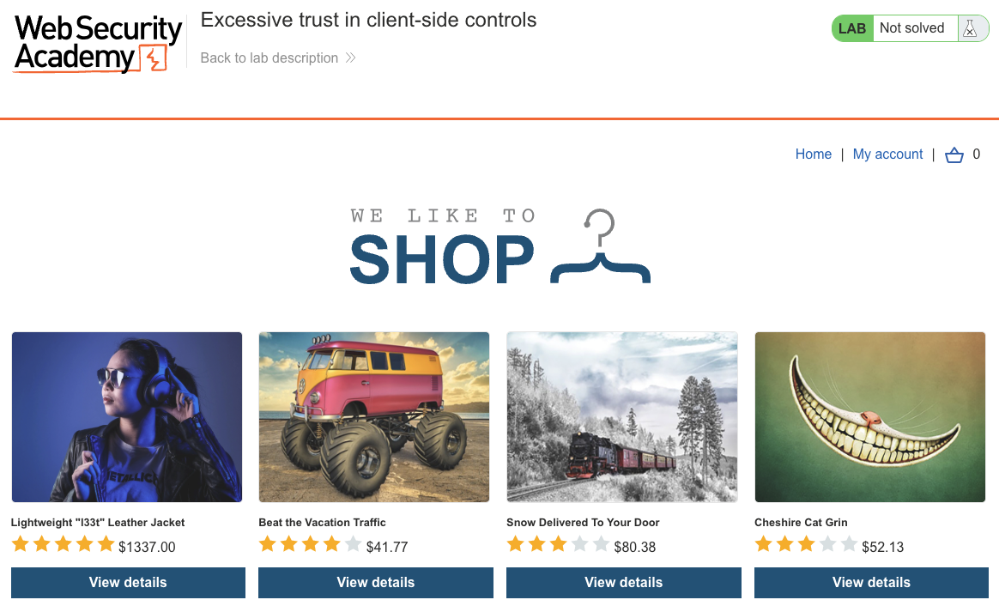
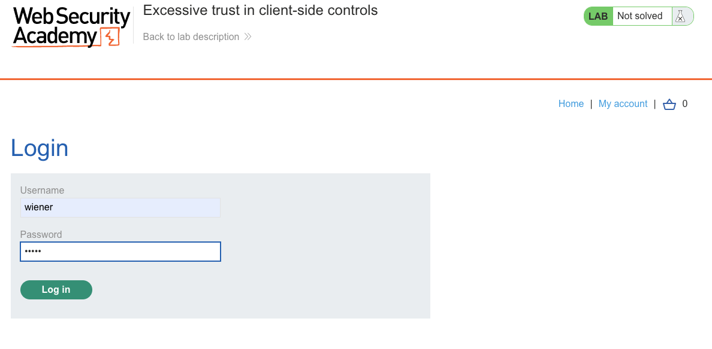
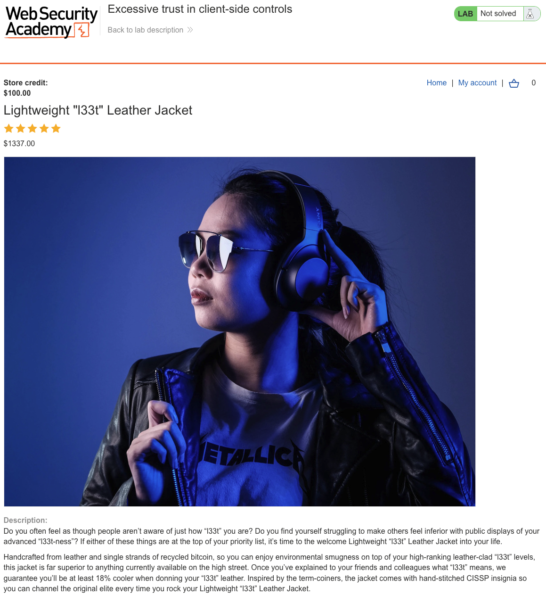
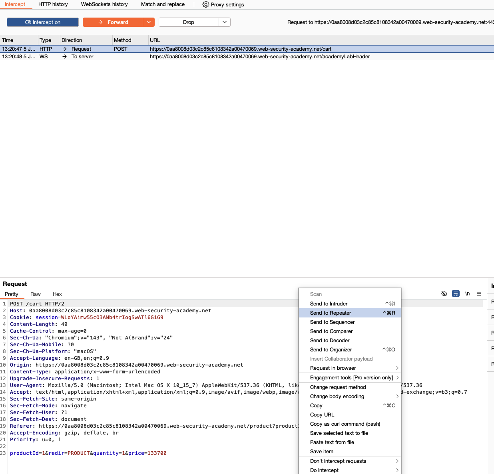
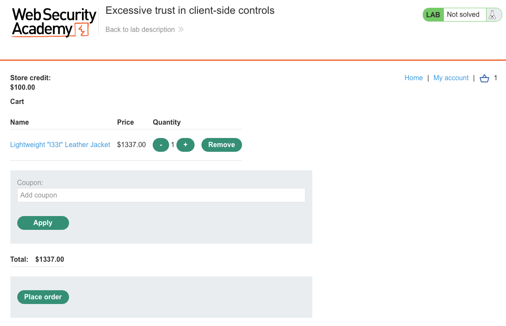
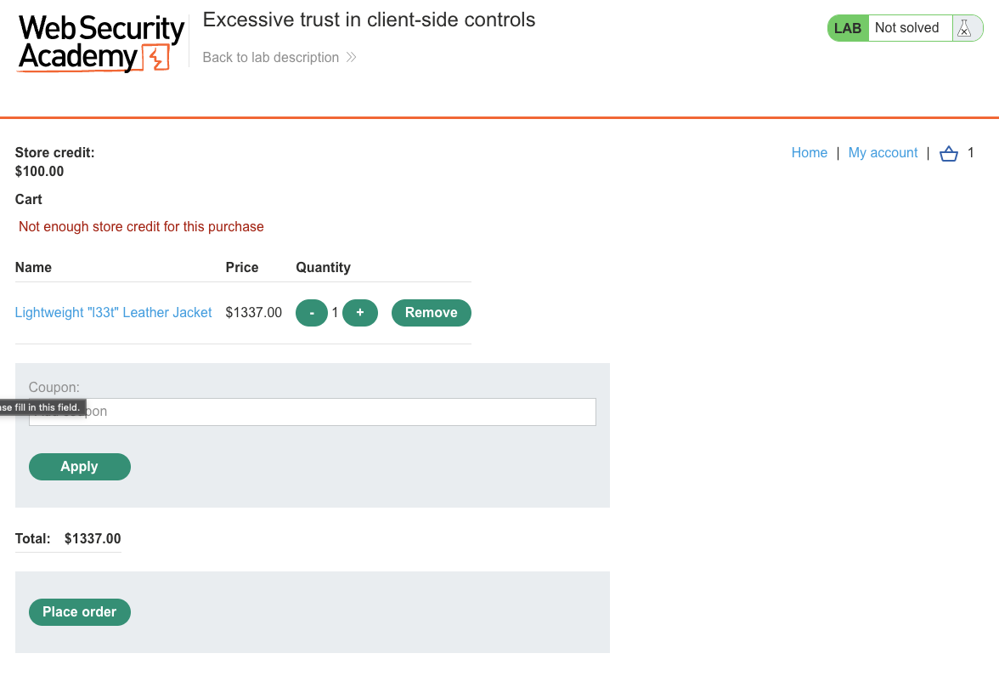
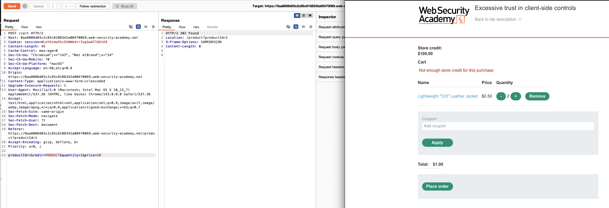
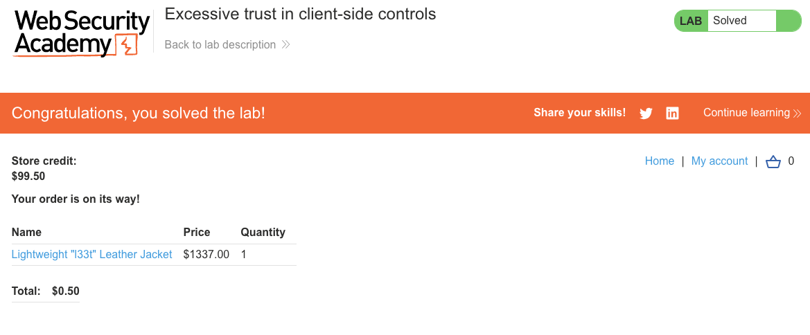

# Business Logic Vulnerabilities
**Lab: Excessive trust in client-side controls (Web Security Academy)**

**Level:** Apprentice
**Impact:** Financial - purchase a $1337.00 item for $0.50 by manipulating the price the client sends.
**CWE:** [CWE-602: Client-Side Enforcement of Server-Side Security](https://cwe.mitre.org/data/definitions/602.html) · [CWE-807: Reliance on Untrusted Inputs in a Security Decision](https://cwe.mitre.org/data/definitions/807.html)

---

## Vulnerability Overview

This lab demonstrates a business logic flaw where the server accepts the product price from the client-side request body without server-side validation. The assumption is that the browser will always send the "correct" price - but any user with a proxy can modify it to any value before it reaches the server.

This is an **excessive trust in client-side controls** vulnerability. The price displayed in the UI and included in the cart POST request is under the client's control - not the server's. There is no server-side lookup of the actual product price before processing the order.

---

## Steps to Solve the Lab

1. **Log in and find the target product**
   - Log in as `wiener` (store credit: $100.00).
   - Open the "Lightweight 'l33t' Leather Jacket" - priced at $1337.00, far above the store credit.

   
   
   

2. **Intercept the "add to cart" request**
   - With Burp Proxy intercepting, add the jacket to the cart and capture the `POST /cart` request.
   - Right-click → **Send to Repeater**. The request body looks like:
     ```
     productId=1&redir=PRODUCT&quantity=1&price=133700
     ```
   - The `price` parameter (in cents) comes directly from the client.

   
   

3. **Confirm credit is insufficient at the real price**
   - At $1337.00 the cart shows "Not enough store credit for this purchase" - proving the legitimate price is enforced for display but not for trust.

   

4. **Modify the price and re-add the item**
   - In Repeater, change `price=133700` to `price=50` (i.e., $0.50) and send the request.
   - The cart now shows the jacket at **$0.50**, within the $100.00 credit.

   

5. **Place the order**
   - Click **Place order**. The order completes and the lab banner changes to **"Congratulations, you solved the lab!"** (store credit drops from $100.00 to $99.50).

   

---

## Why This Works

The server builds the cart entry from whatever `price` value arrives in the request body:

```python
# Vulnerable pseudocode:
def add_to_cart(request):
    product_id = request.form['productId']
    price = request.form['price']         # attacker-controlled
    quantity = request.form['quantity']
    cart.add(product_id, price, quantity) # uses client-supplied price
```

The server never cross-references `price` against the actual product record. The real price exists in the database, but it's never queried during cart operations.

---

## Remediation

- **Never accept price (or any business-critical value) from the client** - the server must look up the price from its own database using the `productId`:
  ```python
  def add_to_cart(request):
      product = db.get_product(request.form['productId'])
      if not product:
          abort(400, "Unknown product")     # productId is untrusted too
      cart.add(product.id, product.price, request.form['quantity'])
  ```
- **Validate all business-critical data server-side** - treat every value in a POST body as untrusted, regardless of what the UI sends.
- **Remove price from client-side requests entirely** - the client should only send `productId` and `quantity`. The server derives the price.

---

Link: https://portswigger.net/web-security/logic-flaws/examples/lab-logic-flaws-excessive-trust-in-client-side-controls
