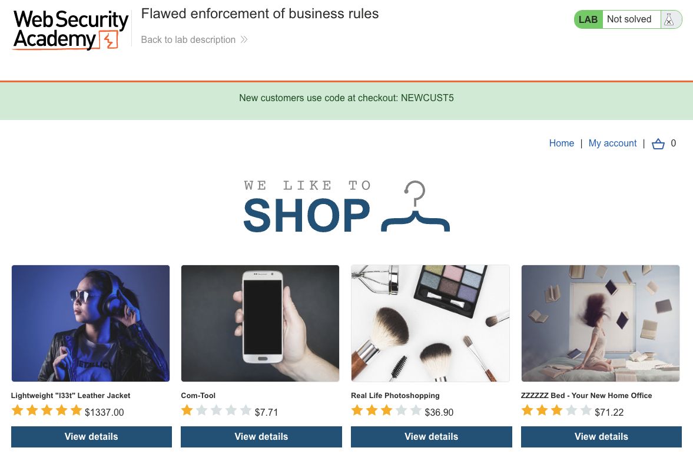
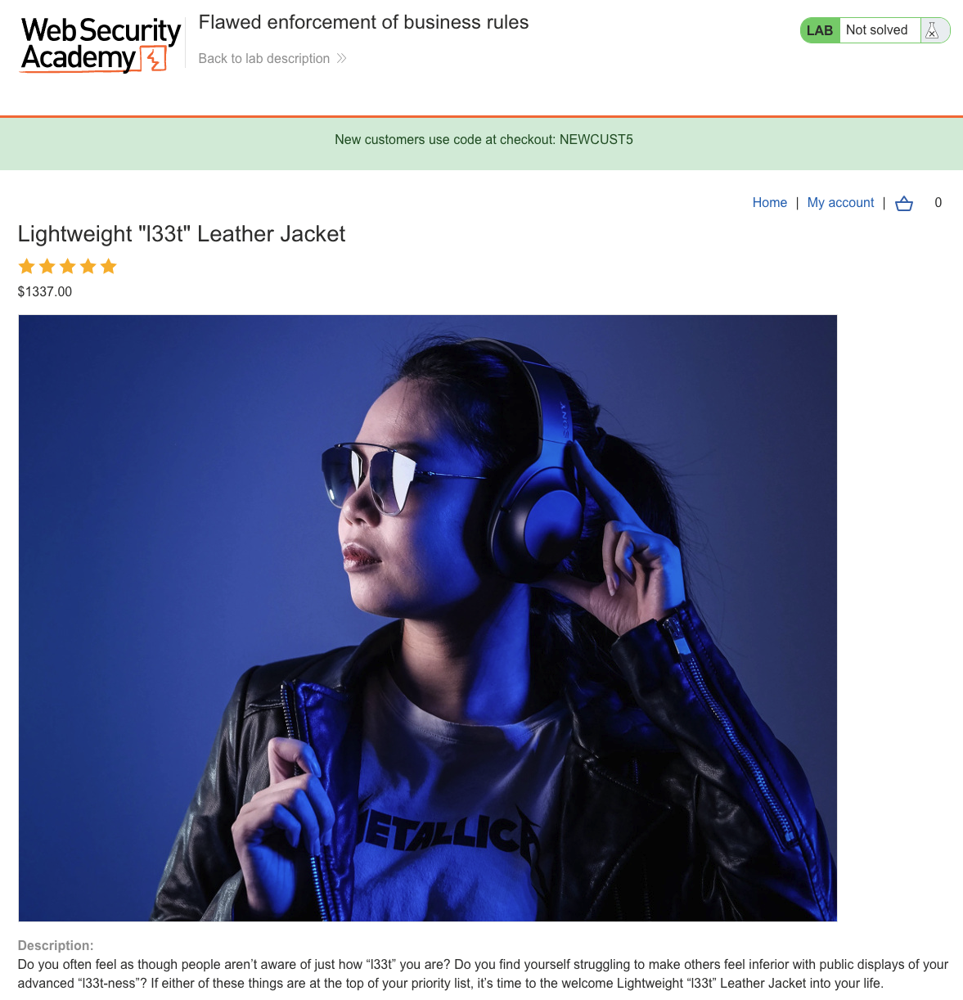
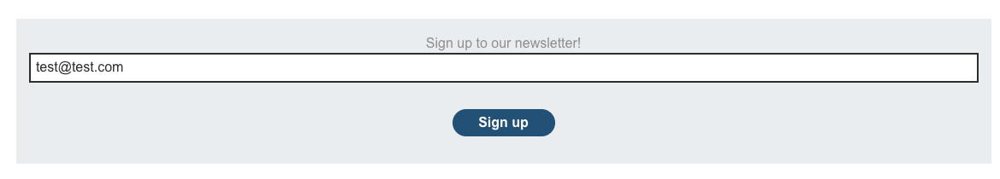
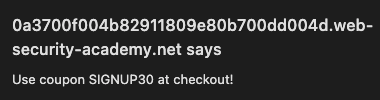
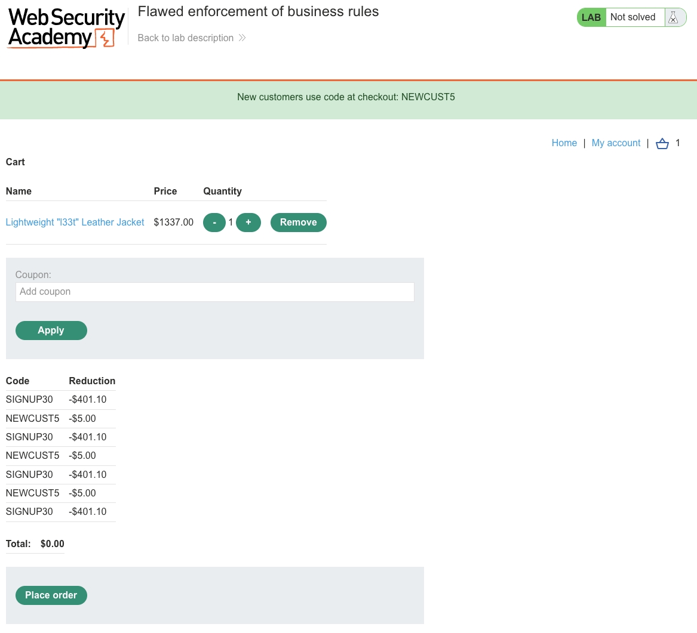
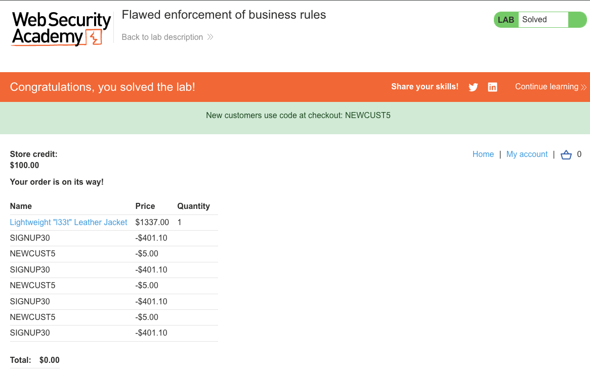

# Business Logic Vulnerabilities
**Lab: Flawed enforcement of business rules (Web Security Academy)**

**Level:** Apprentice
**Impact:** Financial - stack two single-use coupons alternately to bring a $1337.00 order to $0.00.
**CWE:** [CWE-840: Business Logic Errors](https://cwe.mitre.org/data/definitions/840.html) · [CWE-799: Improper Control of Interaction Frequency](https://cwe.mitre.org/data/definitions/799.html)

---

## Vulnerability Overview

This lab demonstrates a coupon-stacking vulnerability. The application offers two discount codes (`NEWCUST5` and `SIGNUP30`) and intends each to be used once. The server blocks consecutive use of the *same* code - but allows alternating between the two codes indefinitely. The "one use per code" check compares only against the most recently applied code, not against the full list of applied codes.

This is a **business-rule enforcement flaw**: the intent (one use per code per order) is correct, but the implementation only checks the local condition (last applied code), not the global one (total uses of each code).

---

## Steps to Solve the Lab

1. **Discover both discount codes**
   - The store banner advertises `NEWCUST5` for new customers.
   - Sign up for the newsletter (bottom of the jacket product page) - a modal reveals `SIGNUP30`.

   
   
   
   

2. **Log in and add the jacket to the cart**
   - Log in as `wiener` and add the "Lightweight 'l33t' Leather Jacket" ($1337.00) to the cart.

3. **Apply the coupons alternately**
   - In the cart, apply `SIGNUP30` (−$401.10), then `NEWCUST5` (−$5.00).
   - Apply `SIGNUP30` again → accepted (the server only blocks the *same* code twice in a row).
   - Keep alternating `SIGNUP30` / `NEWCUST5` until the total reaches **$0.00**.
   - In this run the sequence was SIGNUP30 → NEWCUST5 → SIGNUP30 → NEWCUST5 → SIGNUP30 → NEWCUST5 → SIGNUP30.

   

4. **Place the order**
   - Click **Place order** - the order completes with the jacket at $0.00.

5. **Result**
   - The lab banner changes to **"Congratulations, you solved the lab!"**.

   

---

## Why This Works

The server's coupon validation logic only prevents applying the same code consecutively:

```python
# Vulnerable pseudocode:
def apply_coupon(request, cart):
    code = request.form['coupon']
    if cart.last_applied_coupon == code:
        return error("Already applied this coupon")
    cart.apply_discount(code)
    cart.last_applied_coupon = code
```

By alternating between two different codes, the `last_applied_coupon` check never triggers. The server never counts how many times each code has been used in total.

---

## Remediation

- **Track per-code usage across the entire order** - store a set of applied coupon codes and reject any code that's already in the set:
  ```python
  if code in cart.applied_coupons:
      return error("Coupon already applied")
  cart.applied_coupons.add(code)
  ```
- **Enforce limits at the database level** - log coupon usage per user/order in the database and check the usage count before applying.
- **Test business rules at their boundaries** - when implementing "one use per code," specifically test with two different codes applied alternately. Business logic bugs are rarely caught by unit tests without explicit adversarial test cases.

---

Link: https://portswigger.net/web-security/logic-flaws/examples/lab-logic-flaws-flawed-enforcement-of-business-rules
