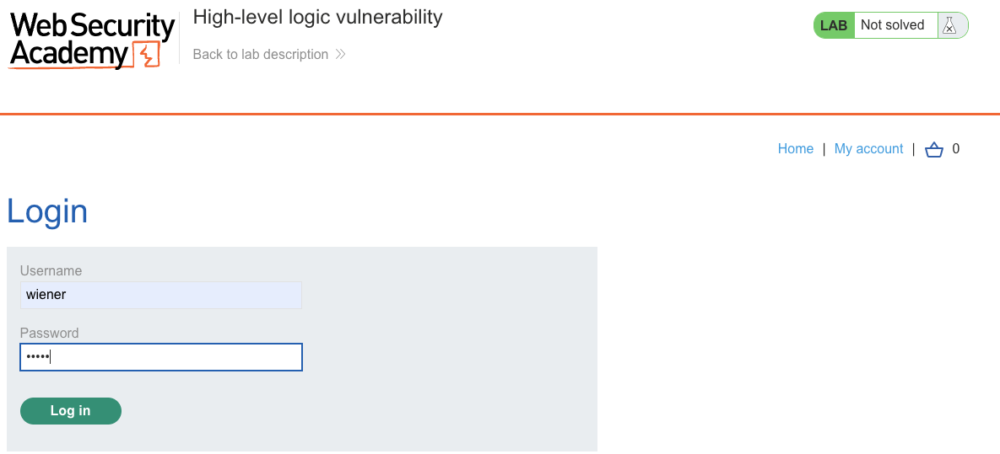
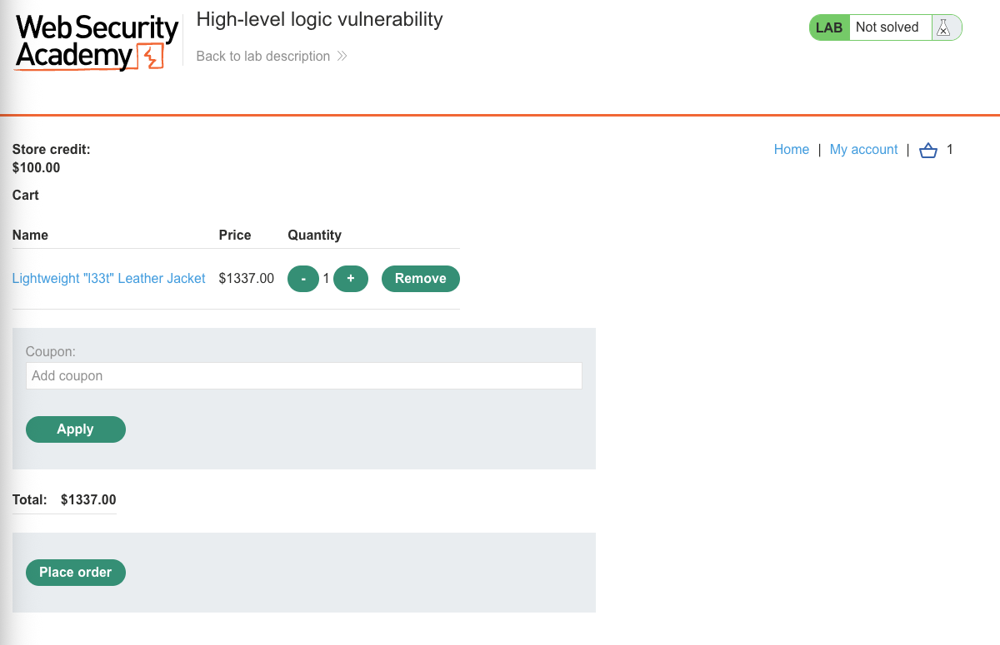
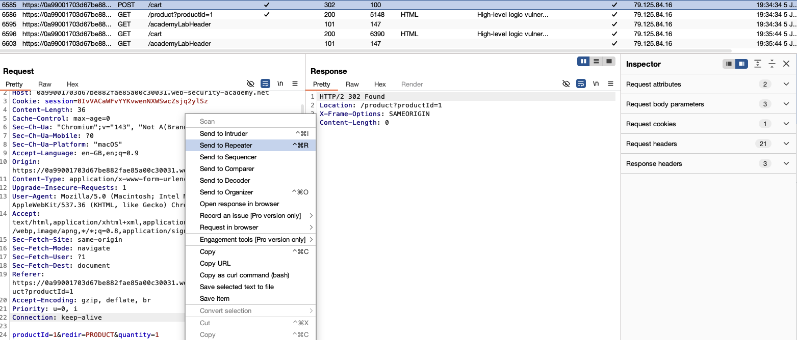
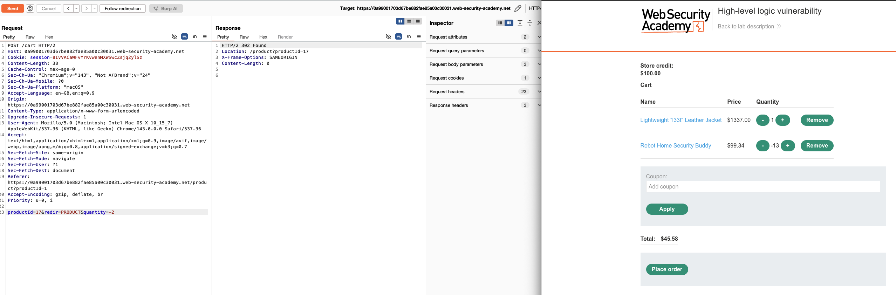
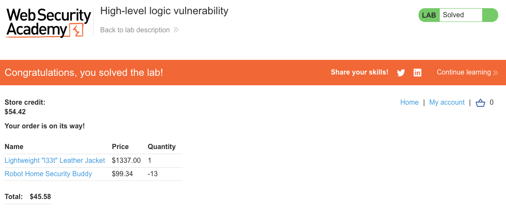

# Business Logic Vulnerabilities
**Lab: High-level logic vulnerability (Web Security Academy)**

**Level:** Apprentice
**Impact:** Financial - bring a $1337.00 order within a $100.00 credit limit using a negative quantity.
**CWE:** [CWE-20: Improper Input Validation](https://cwe.mitre.org/data/definitions/20.html) · [CWE-840: Business Logic Errors](https://cwe.mitre.org/data/definitions/840.html)

---

## Vulnerability Overview

This lab demonstrates a business logic flaw where the application fails to validate that item quantities must be positive. By adding a product with a **negative quantity**, an attacker reduces the cart total - effectively using one product to subsidize another. The server performs arithmetic on the quantity without checking its sign, allowing the cart total to be manipulated to any value.

This is a **missing input constraint** at the business logic level: the server validates that items exist and that the user can check out, but never verifies that quantities are sensible.

---

## Steps to Solve the Lab

1. **Log in and observe your store credit**
   - Log in as `wiener` (store credit: $100.00).
   - The target item is the "Lightweight 'l33t' Leather Jacket" at $1337.00 - far above the credit limit.

   
   
   

2. **Add the jacket to the cart**
   - Add 1 jacket to the cart. The total is $1337.00 - checkout is blocked by insufficient credit.

   

3. **Add a second product with a negative quantity**
   - Pick a cheaper product - here the **"Robot Home Security Buddy" ($99.34)**.
   - Intercept the `POST /cart` request when adding it, send it to Burp Repeater, and change `quantity=1` to a negative value (e.g. `quantity=-13`).
   - The quantity is chosen so the negative line item cancels most of the jacket's price without pushing the total below zero.

   
   

4. **Verify the cart total**
   - The negative quantity subtracts from the total:
     ```
     Jacket:               +$1337.00
     Robot Buddy x -13:    -$1291.42   (99.34 × 13)
     Total:                   $45.58
     ```
   - The total is now within the $100.00 store credit.

5. **Place the order**
   - Click **Place order** - the server accepts it. Store credit drops from $100.00 to $54.42.

6. **Result**
   - The lab banner changes to **"Congratulations, you solved the lab!"**.

   

---

## Why This Works

The server processes negative quantities as valid arithmetic:

```python
# Vulnerable pseudocode:
def add_to_cart(request):
    quantity = int(request.form['quantity'])  # no sign check
    cart.add(product_id, price * quantity)    # negative quantity → negative total
```

The business rule "you can only buy positive numbers of items" was never translated into a server-side constraint. The cart total arithmetic is correct - negative quantities genuinely reduce the total - but the business intent was violated.

---

## Remediation

- **Validate quantity constraints at the server** - reject any quantity ≤ 0 with a `400 Bad Request`.
  ```python
  quantity = int(request.form['quantity'])
  if quantity <= 0:
      abort(400, "Quantity must be positive")
  ```
- **Validate the final cart total before checkout** - ensure the cart total and every line item are positive and within expected bounds before processing payment.
- **Think through all input ranges** - business logic tests should include negative, zero, fractional, and very large values for any numeric input.

---

Link: https://portswigger.net/web-security/logic-flaws/examples/lab-logic-flaws-high-level
