# Business Logic Vulnerabilities
**Lab: Inconsistent security controls (Web Security Academy)**

**Level:** Apprentice
**Impact:** Privilege escalation - an external user gains admin access and deletes another user (`carlos`).
**CWE:** [CWE-639: Authorization Bypass Through User-Controlled Key](https://cwe.mitre.org/data/definitions/639.html) · [CWE-863: Incorrect Authorization](https://cwe.mitre.org/data/definitions/863.html)

---

## Vulnerability Overview

This lab demonstrates an **inconsistent security control**: the application enforces a rule (only `@dontwannacry.com` email users can access the admin panel) at registration time, but fails to re-validate it when the user later changes their email. A user who registers with any email can subsequently change their email to a `@dontwannacry.com` address - and the server now treats them as an employee with admin access.

The flaw is that the privileged access check is applied to a mutable attribute (email) only at one point in the lifecycle, not continuously. A security control that can be satisfied after-the-fact by changing account data is not a control at all.

---

## Steps to Solve the Lab

1. **Confirm the admin panel is gated**
   - Browsing to `/admin` returns "Admin interface only available if logged in as a DontWannaCry user."

   
   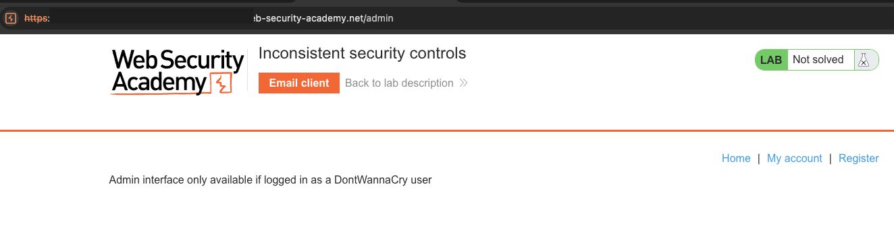

2. **Register a new account with the exploit-server email**
   - The registration page asks DontWannaCry employees to use a `@dontwannacry.com` address - and registering *directly* with that domain is blocked, which is why we register with the exploit-server email first.
   - Register with the exploit server address (e.g. `test@exploit-<id>.exploit-server.net`).
   - Confirm the account via the link delivered to the exploit-server inbox.

   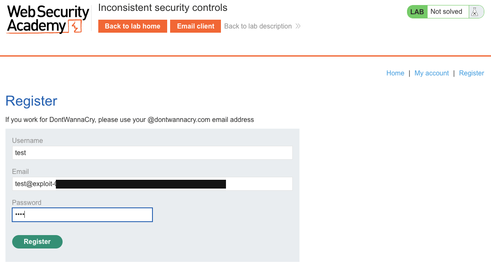
   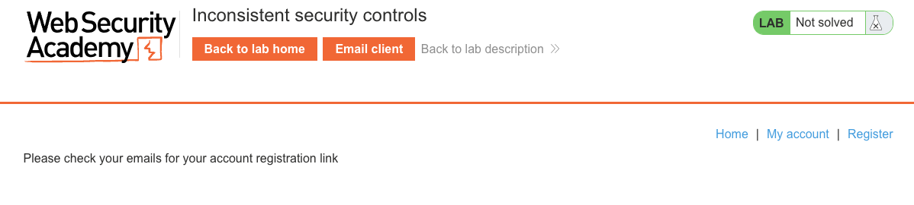
   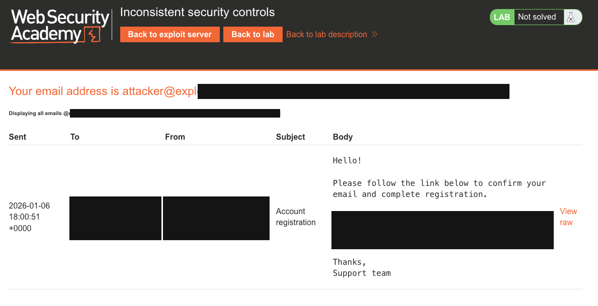
   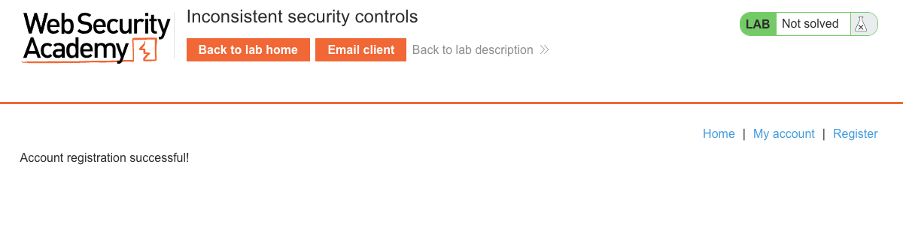
   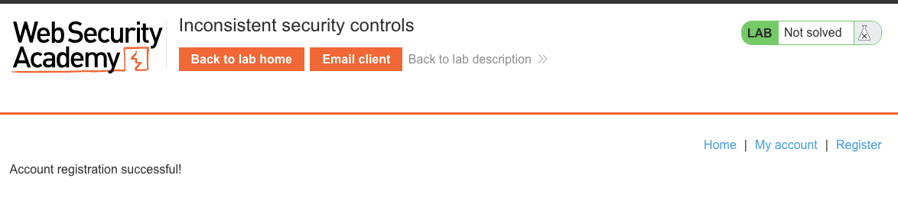

3. **Log in and open "My account"**
   - Log in as the new user. The account page shows the current (exploit-server) email and an **Update email** form.

   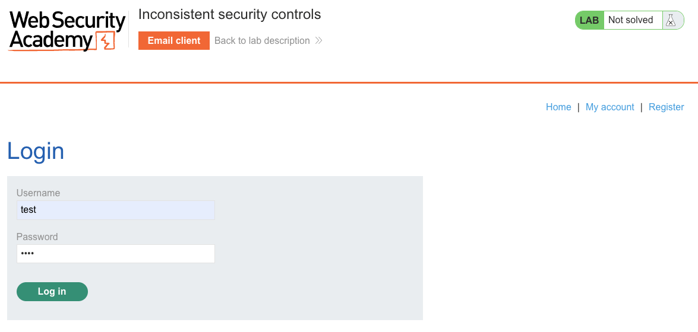
   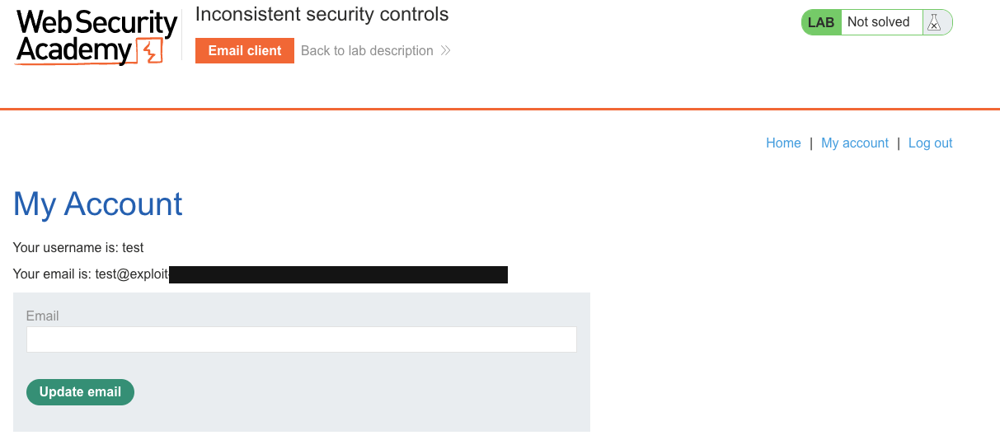

4. **Change your email to a dontwannacry.com address**
   - Enter `test@dontwannacry.com` and click **Update email**. The server accepts it with **no ownership verification** of the new address.

   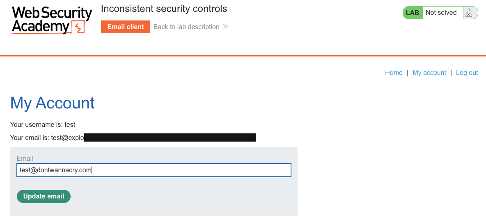
   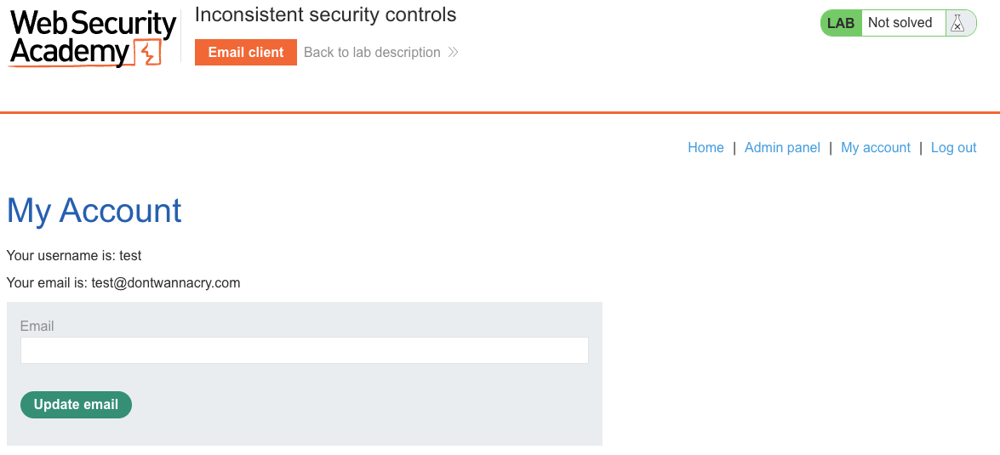

5. **Access the admin panel and delete carlos**
   - The **Admin panel** link is now available because the account email ends in `@dontwannacry.com`. Open it and delete `carlos`.

   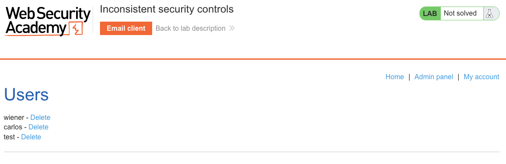

6. **Result**
   - The lab banner changes to **"Congratulations, you solved the lab!"**.

   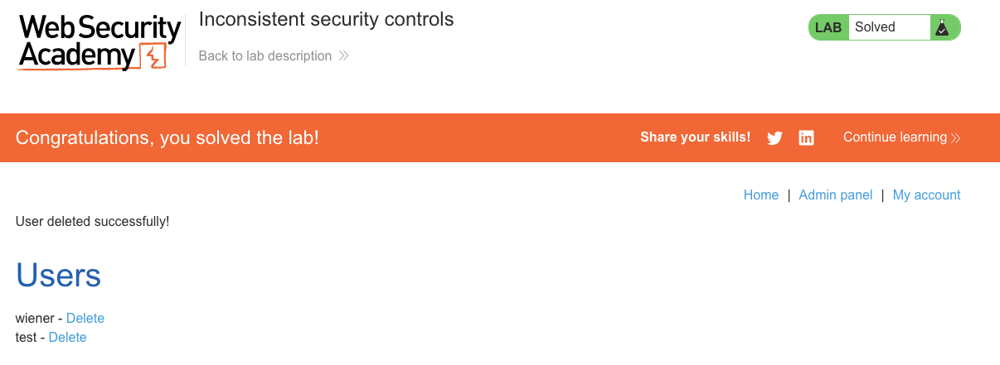

---

## Why This Works

The admin access check reads the current email at request time:

```python
# Server-side check (pseudocode):
def admin_panel(request):
    user = db.get_user(session['user_id'])
    if not user.email.endswith('@dontwannacry.com'):
        abort(403)
    return render_admin()
```

This check is correct in isolation, but the email field is writable by the user without any domain verification. There is no mechanism that prevents an external user from claiming a `@dontwannacry.com` address - the server never sends a verification email to confirm ownership.

---

## Remediation

- **Verify email ownership before granting privileges** - any email change should require clicking a confirmation link sent to the new address. Until confirmed, the new email is not active.
- **Separate verified-employee status from email address** - a boolean `is_employee` flag set during an admin-controlled onboarding process is more reliable than inferring it from an email domain.
- **Validate domain claims server-side with a directory lookup** - if the domain matters, check against an internal employee directory or IdP (e.g. LDAP, SSO), not just the email string.
- **Re-evaluate privilege on profile changes** - when a user changes their email, immediately reassess and potentially revoke elevated access until the new address is verified.

---

Link: https://portswigger.net/web-security/logic-flaws/examples/lab-logic-flaws-inconsistent-security-controls
