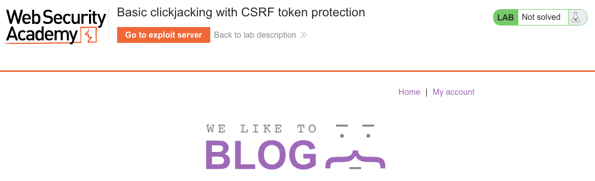
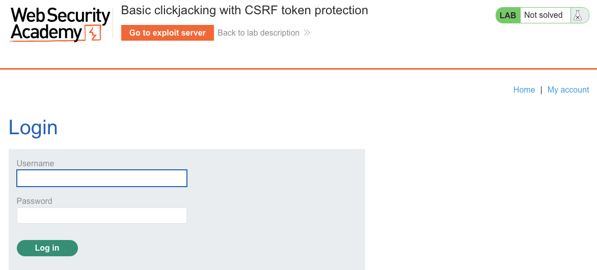
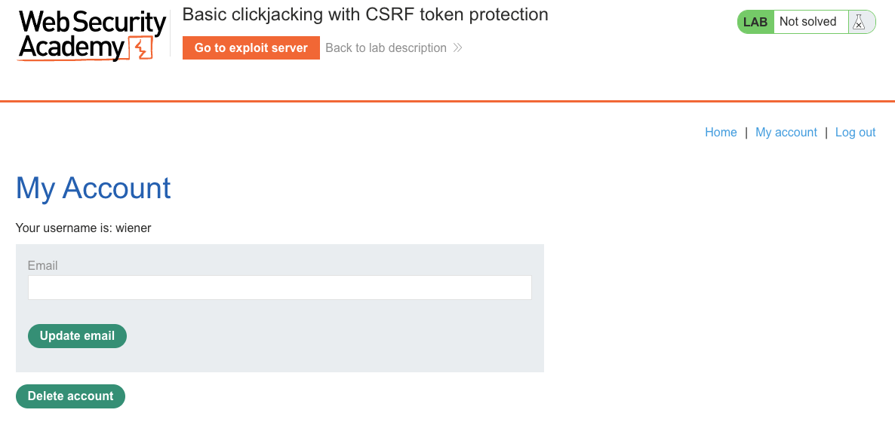
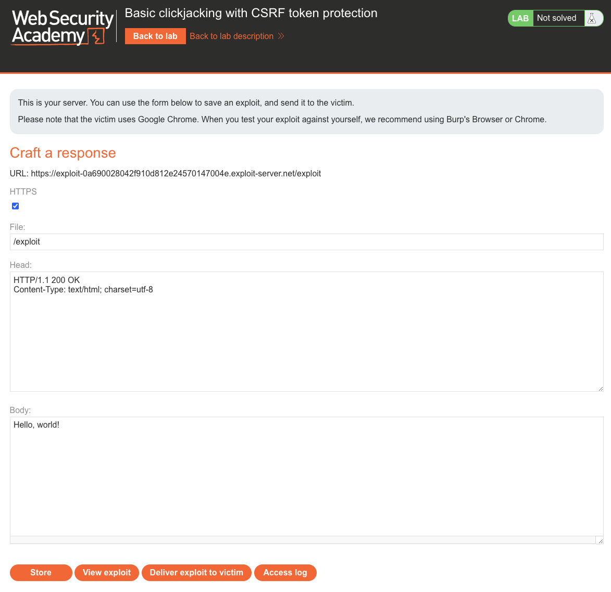
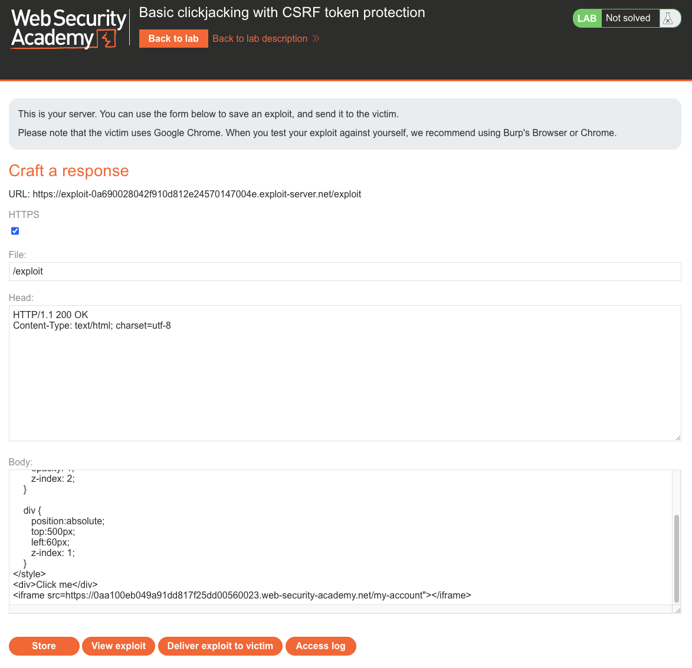
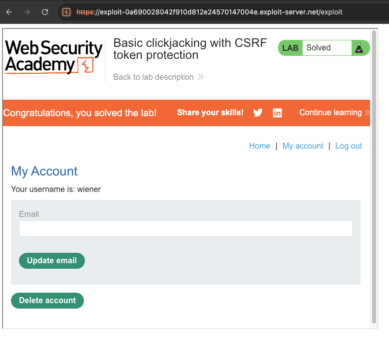

# Clickjacking
**Lab: Basic clickjacking with CSRF token protection (Web Security Academy)**

**Level: Apprentice**

---

## Vulnerability Overview

Clickjacking is a UI redressing attack: the attacker overlays a transparent iframe of the target site on top of a fake page. The victim believes they are clicking a harmless button on the attacker's page, but the click lands on an action inside the invisible iframe — on the target site, authenticated as the victim.

This lab shows that **CSRF token protection does not defend against clickjacking**. CSRF tokens ensure that requests come from the legitimate site's own forms — but in a clickjacking attack, the request genuinely comes from the target site's form, triggered by the victim's own click. The CSRF token is valid because the form is real.

The defense against clickjacking is **X-Frame-Options** or **CSP `frame-ancestors`**, not CSRF tokens.

---

## Steps to Solve the Lab

1. **Log in and identify the target action**
   - Open the lab and log in as `wiener`.

     

     

   - Go to **My account**. The page contains a **Delete account** button — this is the action the attacker wants the victim to trigger.

     

2. **Open the exploit server**
   - Click **Go to exploit server**.

     

3. **Build the clickjacking page**
   - In the **Body** field, create an HTML page with a transparent iframe overlaid on a visible fake button:
     ```html
     <style>
       iframe {
         position: absolute;
         top: 0;
         left: 0;
         width: 1000px;
         height: 700px;
         opacity: 0.0001;
         z-index: 1;
       }
       div {
         position: absolute;
         top: 500px;      /* align with Delete account button */
         left: 600px;
         z-index: 2;
         font-size: 24px;
         background: #fff;
         padding: 20px;
       }
     </style>
     <div>Click me</div>
     <iframe src="https://<lab-id>.web-security-academy.net/my-account"></iframe>
     ```
   - Adjust `top`/`left` on the `div` to visually align "Click me" over the **Delete account** button in the iframe.

4. **Store and deliver the exploit**
   - Click **Store**, then **Deliver exploit to victim**.

5. **Result**
   - The victim clicks "Click me," which sends a click to the **Delete account** button inside the hidden iframe — deleting their account.
   - The lab banner changes to **"Congratulations, you solved the lab!"**.

   

   

---

## Why This Works

The CSRF token in the form is valid because the form is the real form from the target site, loaded inside the iframe. The victim's browser sends the request with valid session cookies and a valid CSRF token. The server has no way to distinguish this from a legitimate click — because mechanically, it is one.

The iframe is nearly invisible (`opacity: 0.0001`) but fully functional. The decoy `div` is positioned to sit exactly over the **Delete account** button inside the iframe. The victim's eyes follow the visible "Click me" label, and the click lands on the underlying iframe button. Pixel-perfect alignment of the `div` over the target button — not the `z-index` values themselves — is what makes the attack land on the right control.

---

## Remediation

- **Set `X-Frame-Options: DENY`** (or `SAMEORIGIN`) on all responses — this instructs the browser to refuse loading the page inside any iframe (or only same-origin iframes).
- **Use `Content-Security-Policy: frame-ancestors 'none'`** — the modern, more flexible equivalent of `X-Frame-Options`.
- **Do not rely on CSRF tokens** as clickjacking protection — they serve different threat models.

---

Link: https://portswigger.net/web-security/clickjacking/lab-basic-csrf-protected
