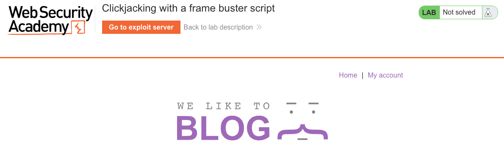
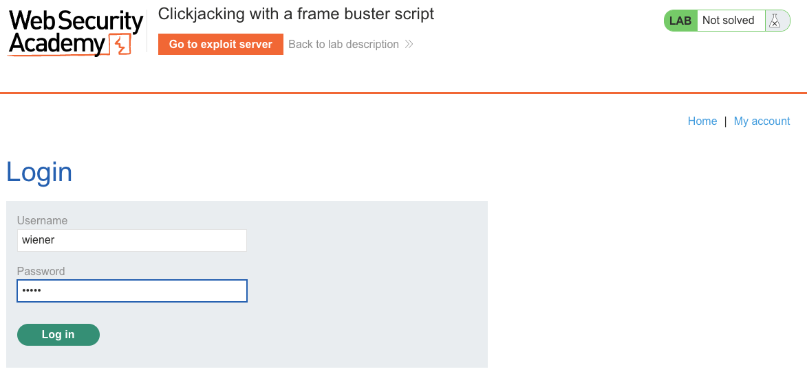
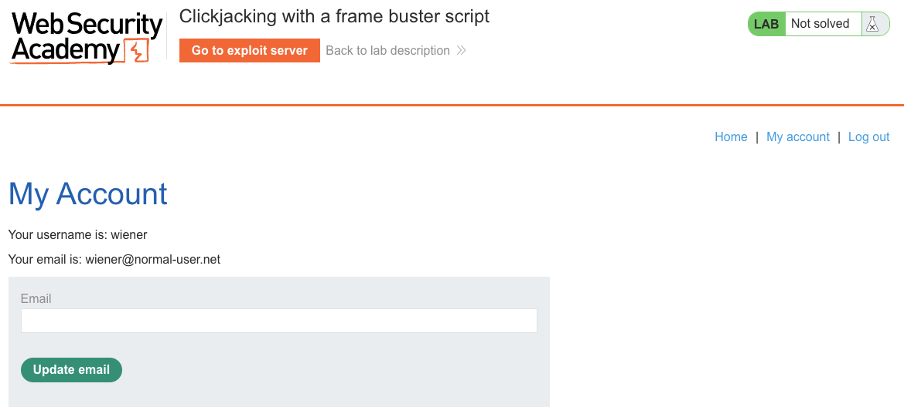
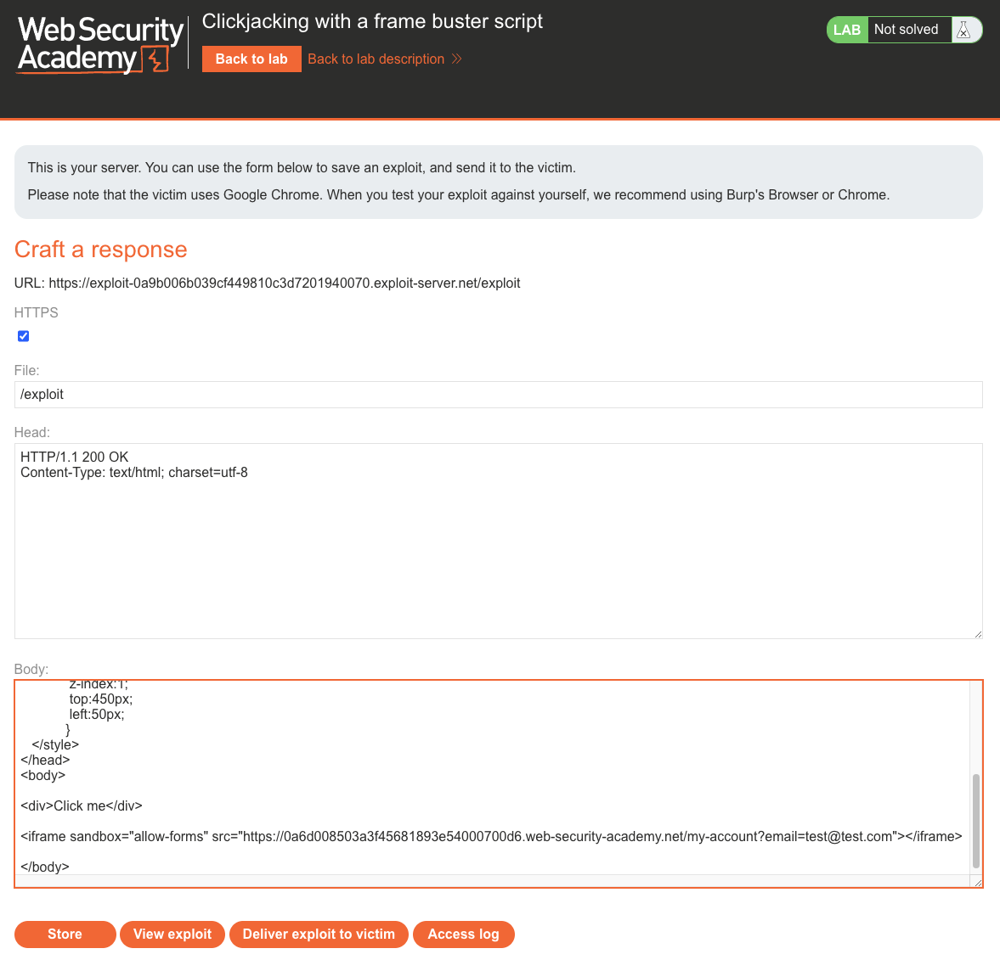
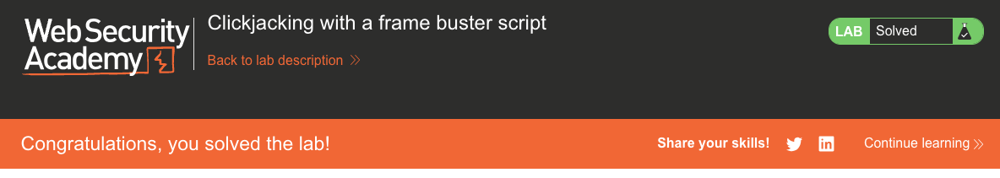

# Clickjacking
**Lab: Clickjacking with a frame buster script (Web Security Academy)**

**Level: Apprentice**

---

## Vulnerability Overview

Frame busting is a JavaScript-based defense against clickjacking: a script on the page checks whether the page is loaded inside an iframe and, if so, breaks out (`top.location = self.location`). This was the primary anti-clickjacking defense before HTTP headers were introduced.

However, frame busting scripts can be defeated by the `sandbox` attribute on the embedding iframe. When `sandbox="allow-forms"` is set, the iframe content can still submit forms, but JavaScript execution is restricted - the frame buster script cannot run. The attacker gets a fully functional, frameable page with all JavaScript disabled.

This lab demonstrates that **JavaScript-based security controls are not reliable**, because the browser provides mechanisms to disable them.

---

## Steps to Solve the Lab

1. **Log in and confirm the target action**
   - Open the lab and log in as `wiener`.

     

     

   - Go to **My account**. The target is the **Update email** button.

     

2. **Observe the frame buster**
   - Try loading the page in a normal iframe - the page breaks out.
   - The site uses a JavaScript frame buster script to prevent framing.

3. **Build the exploit with `sandbox="allow-forms"`**
   - On the exploit server, set the **Body** to:
     ```html
     <style>
       iframe {
         position: absolute;
         top: 0;
         left: 0;
         width: 1000px;
         height: 700px;
         opacity: 0.0001;
         z-index: 1;
       }
       div {
         position: absolute;
         top: 450px;       /* aligned with Update email button */
         left: 50px;
         z-index: 2;
         font-size: 24px;
         background: #fff;
         padding: 10px;
       }
     </style>
     <div>Click me</div>
     <iframe sandbox="allow-forms"
             src="https://<lab-id>.web-security-academy.net/my-account?email=test@test.com">
     </iframe>
     ```
   - `sandbox="allow-forms"` disables JavaScript (killing the frame buster) but allows form submission.
   - The `email` parameter pre-fills the form with the attacker's target email.

4. **Store and deliver the exploit**
   - Click **Store**, then **Deliver exploit to victim**.

5. **Result**
   - The victim clicks "Click me," submitting the email update form inside the sandboxed iframe.
   - The lab banner changes to **"Congratulations, you solved the lab!"**.

   

   

---

## Why This Works

The frame buster script runs as JavaScript. Applying the `sandbox` attribute disables all JavaScript by default; because `allow-scripts` is **not** listed, script execution stays blocked - silently neutralising the frame buster. It is the *absence* of `allow-scripts`, not the presence of `allow-forms`, that kills the script.

Meanwhile, `allow-forms` explicitly re-enables form submission, so the HTML form inside the iframe still works. The victim's click reaches the **Update email** button and submits the form with the attacker-controlled email - all within the victim's authenticated session.

---

## Remediation

- **Use HTTP headers, not JavaScript, for framing protection**:
  - `X-Frame-Options: DENY` or `SAMEORIGIN`
  - `Content-Security-Policy: frame-ancestors 'none'`
- These headers are enforced by the browser before any page content (including JavaScript) is loaded or executed, making them immune to sandbox bypasses.
- **Frame buster scripts are legacy** - they are not reliable and should not be the primary defense.

---

Link: https://portswigger.net/web-security/clickjacking/lab-frame-buster-script
