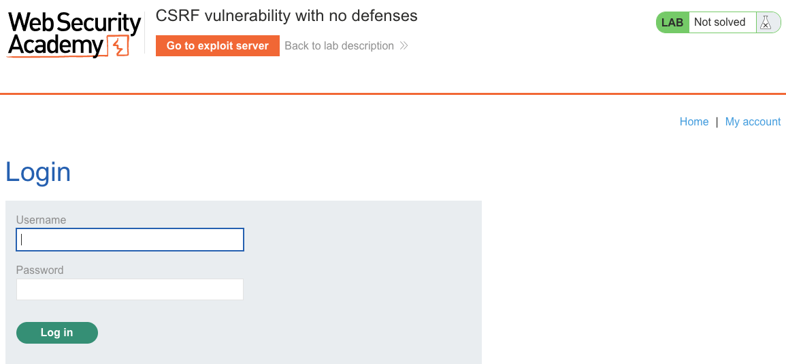
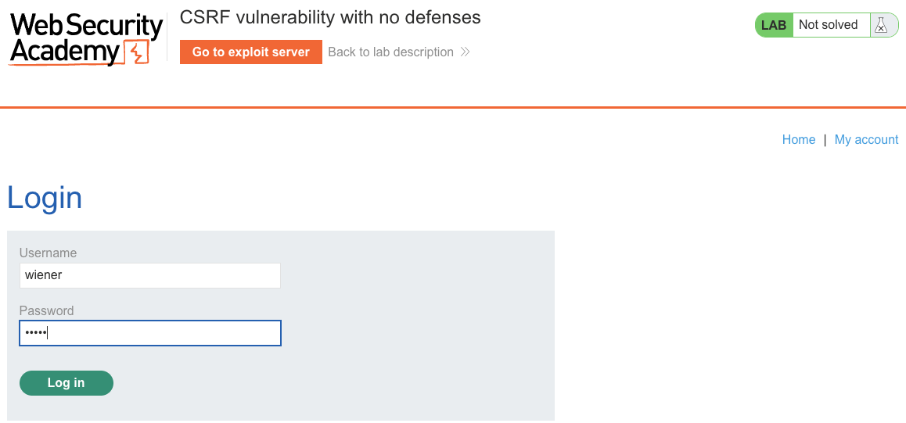
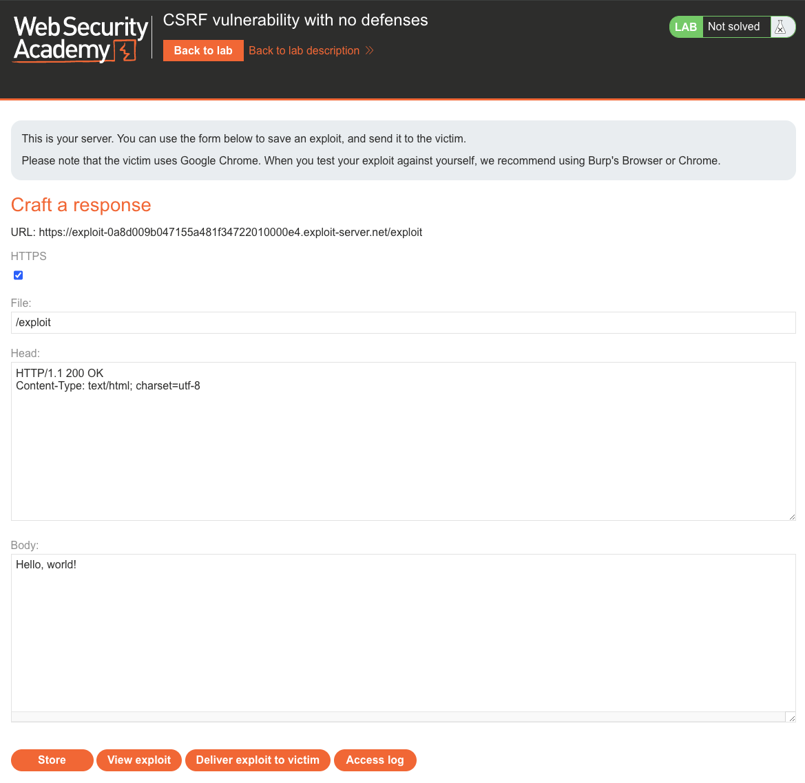
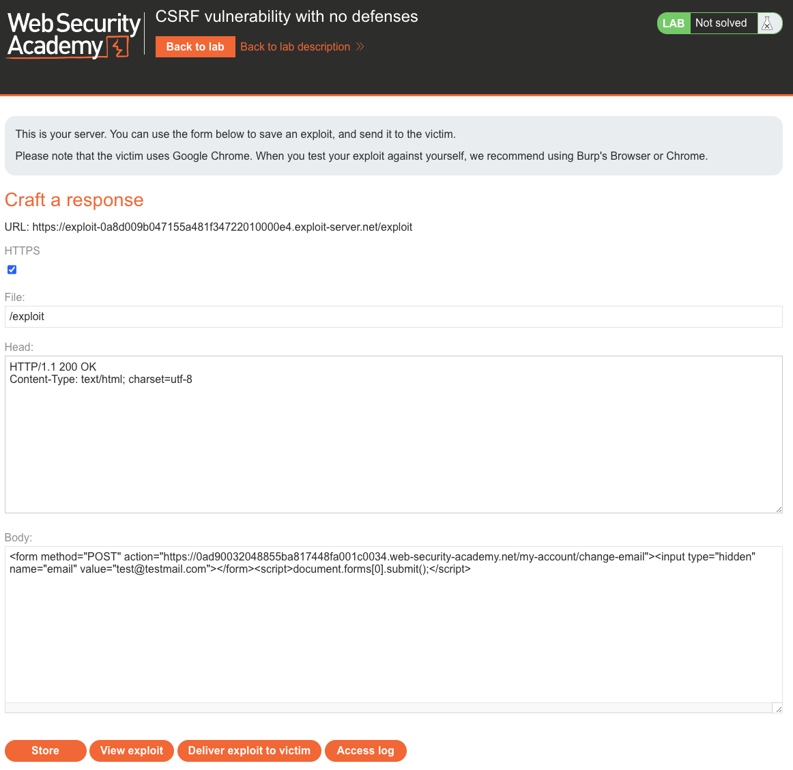
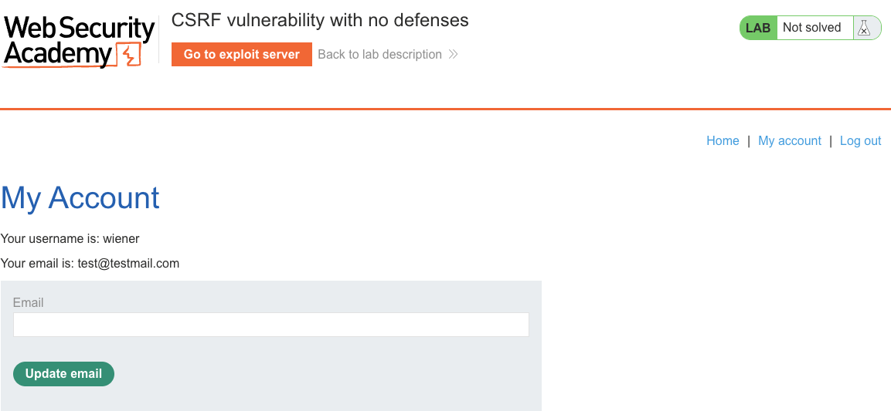
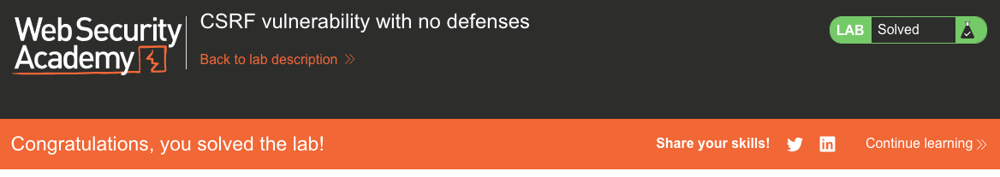

# Cross-Site Request Forgery (CSRF)
**Lab: CSRF vulnerability with no defenses (Web Security Academy)**

**Level: Apprentice**

---

## Vulnerability Overview

CSRF (Cross-Site Request Forgery) is an attack where a malicious page causes a victim's browser to send an authenticated request to a target application — without the victim's knowledge or intent. The attack is possible because browsers automatically attach cookies to requests, regardless of which site initiated them.

In this lab, the email change endpoint accepts `POST` requests with no CSRF token, no `SameSite` cookie attribute, and no origin validation. An attacker's page can host an auto-submitting HTML form that sends a `POST` to the target — and the victim's browser will include their session cookie, making the server believe the request is legitimate.

---

## Steps to Solve the Lab

1. **Identify the email change endpoint**
   - Log in as `wiener` and change your email.
   - Observe the `POST /my-account/change-email` request with body: `email=test@testmail.com`.
   - There is no CSRF token in the request.

   
   

2. **Build the exploit on the exploit server**
   - Set the **Body** to an auto-submitting form:
     ```html
     <form method="POST"
           action="https://<lab-id>.web-security-academy.net/my-account/change-email">
       <input type="hidden" name="email" value="test@testmail.com">
     </form>
     <script>
       document.forms[0].submit();
     </script>
     ```
   - When the victim visits this page, the form submits automatically without any interaction.

   
   

3. **Store and deliver the exploit**
   - Click **Store**, then **Deliver exploit to victim**.

4. **Verify the attack**
   - The victim's email has been changed to `test@testmail.com` — the server processed the request because it came with the victim's valid session cookie.

   

5. **Result**
   - The lab banner changes to **"Congratulations, you solved the lab!"**.

   

---

## Why This Works

The browser's cookie policy sends all cookies for `<lab-id>.web-security-academy.net` with every request to that domain — regardless of which page initiated the request. The server receives a `POST /my-account/change-email` with valid session cookies and processes it, with no way to distinguish it from a genuine request.

There is no mechanism on this endpoint to verify that the request originated from the application's own page.

---

## Remediation

- **CSRF tokens** — generate a unique, unpredictable token per session (or per form), embed it in forms as a hidden field, and validate it server-side on every state-changing request.
- **`SameSite=Strict` or `SameSite=Lax` cookies** — the `SameSite` attribute prevents the browser from sending cookies with cross-site requests. `Strict` blocks all cross-site requests; `Lax` allows top-level navigations (GET) but blocks cross-site POST, PUT, DELETE.
- **Check the `Origin` or `Referer` header** — validate that state-changing requests originate from the application's own domain.
- **Note:** CORS headers do not protect against CSRF — they control whether JavaScript can *read* cross-origin responses, not whether the browser *sends* cross-origin requests.

---

Link: https://portswigger.net/web-security/csrf/lab-no-defenses
