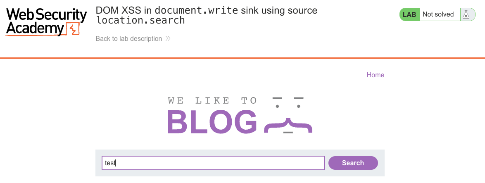
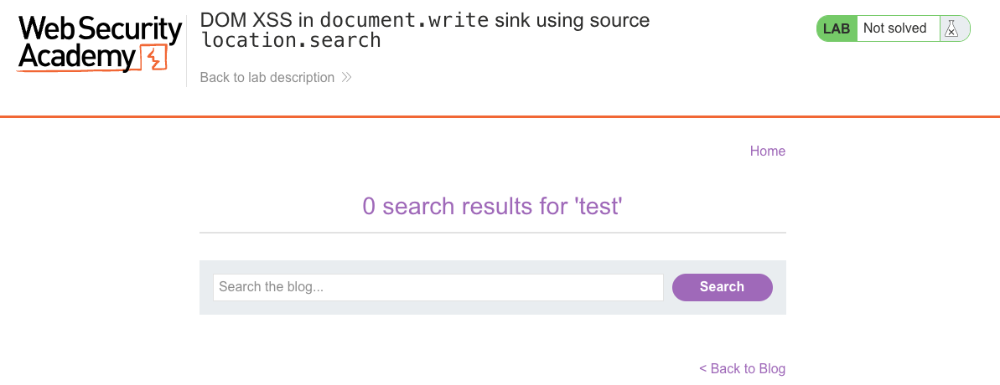
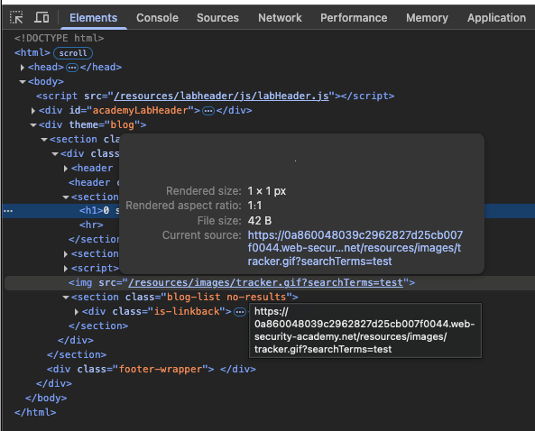
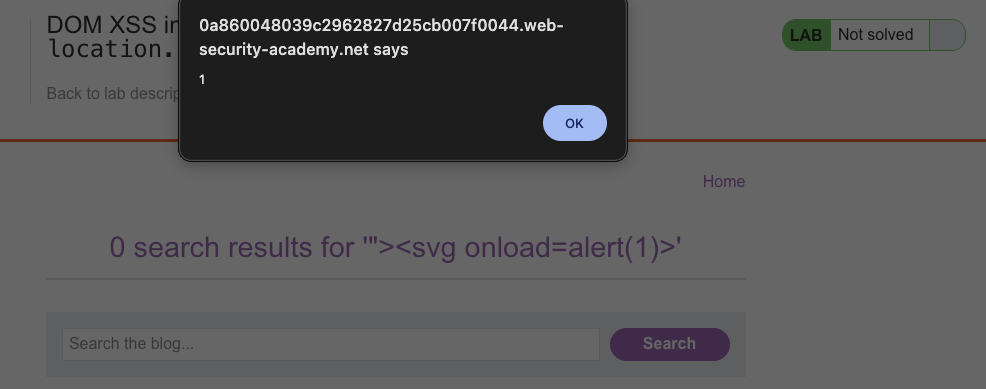
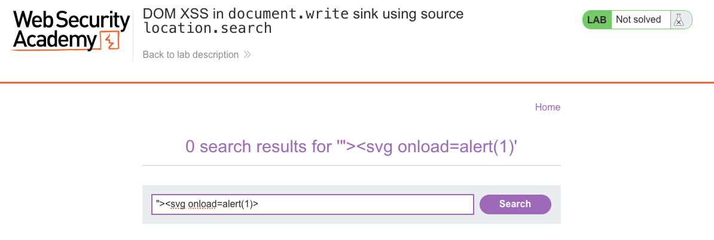

# Cross-Site Scripting (XSS)
**Lab: DOM XSS in document.write sink using source location.search (Web Security Academy)**

**Level: Apprentice**

---

## Vulnerability Overview

DOM-based XSS occurs entirely on the client side: the browser's own JavaScript reads attacker-controlled data (the **source**) and writes it into the page in a way that the browser interprets as executable code (the **sink**). No round-trip to the server is needed - the server response itself may be perfectly safe.

In this lab, JavaScript reads the search term from `location.search` (the URL query string) and passes it to `document.write()`, which inserts raw HTML into the DOM. Because `document.write` treats its argument as raw HTML markup, injected tags and event handlers are parsed and executed by the browser.

**Source:** `location.search`
**Sink:** `document.write()`

---

## Steps to Solve the Lab

1. **Open the lab**
   - Navigate to the lab titled *"DOM XSS in document.write sink using source location.search"*.

2. **Perform a normal search**
   - In the search box, type a harmless term such as `test` and click **Search**.
   - Observe the URL: `?search=test`.

3. **Inspect how the input is used**
   - Open DevTools → **Elements** tab.
   - Locate an image element:
     ```html
     
     ```
   - This shows JavaScript reading `location.search` and using `document.write` to build this tag dynamically.

4. **Craft the XSS payload**
   - The input is placed inside an `src` attribute. To break out and inject a new tag:
     ```
     "><svg onload=alert(1)>
     ```
   - Modify the URL to include this payload as the `search` value.

5. **Trigger the DOM XSS**
   - Load the modified URL in the browser.
   - `document.write` outputs the `<svg>` element directly into the DOM.
   - The `onload` handler fires immediately, executing `alert(1)`.

6. **Result**
   - A JavaScript alert box appears, confirming DOM-based XSS.
   - The lab banner changes to **"Congratulations, you solved the lab!"**.

---

## Why This Works

The vulnerable JavaScript does something like:

```javascript
var search = new URLSearchParams(location.search).get('search');
document.write('');
```

With the injected payload `"><svg onload=alert(1)>`, the output becomes:

```html
<svg onload=alert(1)>">
```

The `"` closes the `src` attribute, `>` closes the `` tag, and `<svg onload=alert(1)>` is a new, valid element whose `onload` event fires on render.

---

## Remediation

- **Never pass user-controlled data to `document.write()`** - it bypasses the browser's normal HTML parser protections.
- **Use safe DOM APIs instead**: `textContent` for text, `createElement` + `setAttribute` for structured HTML building. These APIs treat values as data, not as markup.
- **Encode before inserting** - if dynamic HTML is unavoidable, use a trusted library (DOMPurify) or encode special characters before passing to `innerHTML` / `document.write`.
- **Content Security Policy (CSP)** - disabling `unsafe-inline` prevents inline event handlers from executing.

---

## Screenshots

**Step 1 - normal search and the resulting URL**


**Step 2 - inspecting how the input is used in the DOM**


**Step 3 - crafting and submitting the payload**


**Payload execution - the alert fires**


**Solution - payload in the URL**


**Lab solved**


---

Link: https://portswigger.net/web-security/cross-site-scripting/dom-based/lab-document-write-sink
