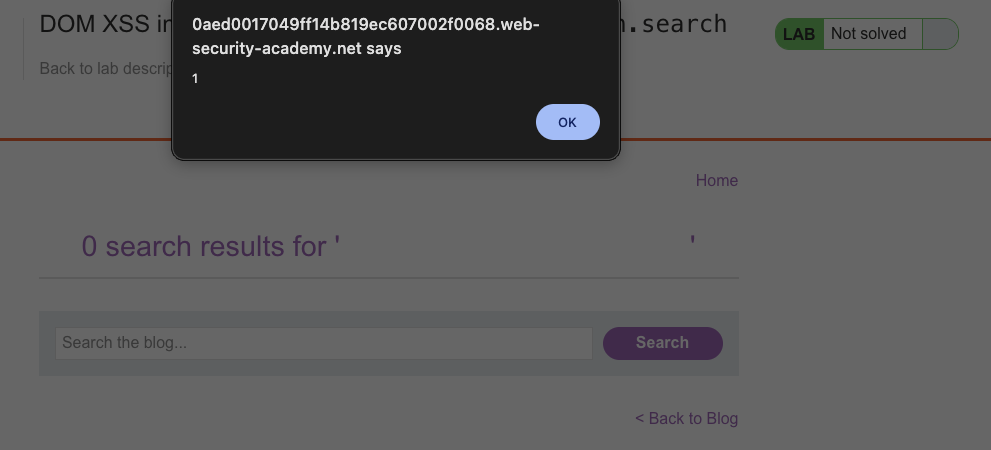
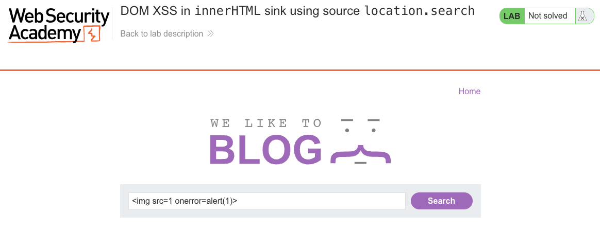

# Cross-Site Scripting (XSS)
**Lab: DOM XSS in innerHTML sink using source location.search (Web Security Academy)**

**Level: Apprentice**

---

## Vulnerability Overview

This lab demonstrates DOM-based XSS via the `innerHTML` sink. JavaScript reads the search term from `location.search` and assigns it directly to an element's `innerHTML` property - which causes the browser to parse the value as HTML, executing any injected event handlers.

A subtle but important detail: browsers do **not** execute `<script>` elements inserted via `innerHTML`. However, event-based payloads like `` or `<svg onload=...>` still fire. This means the classic `<script>alert(1)</script>` payload fails, but event-handler alternatives work fine.

**Source:** `location.search`
**Sink:** `element.innerHTML`

---

## Steps to Solve the Lab

1. **Open the lab**
   - Navigate to the lab titled *"DOM XSS in innerHTML sink using source location.search"*.

2. **Find the vulnerable input**
   - On the main page, locate the blog search box.
   - The value entered here is read from `location.search` and written into the page via `innerHTML`.

3. **Craft the XSS payload**
   - In the search field, enter:
     ```
     
     ```
   - This injects an image element with an invalid `src`, which triggers the `onerror` event handler.

4. **Submit the payload**
   - Click **Search**.
   - The application sets the result container's `innerHTML` to the injected value, inserting the `` element into the DOM.

5. **Trigger the DOM XSS**
   - The browser tries to load `src=1`, fails, and fires `onerror`.
   - `alert(1)` executes and a dialog box appears.

6. **Result**
   - Successful DOM-based XSS via `innerHTML`.
   - The lab displays **"Congratulations, you solved the lab!"**.

---

## Why This Works

The vulnerable JavaScript does something like:

```javascript
var search = new URLSearchParams(location.search).get('search');
document.getElementById('results').innerHTML = 'You searched for: ' + search;
```

With the payload ``, the rendered HTML becomes:

```html
<div id="results">You searched for: </div>
```

The browser parses this as a real `` element. When the image fails to load (because `src=1` is not a valid URL), `onerror` fires and the injected code runs.

---

## Remediation

- **Use `textContent` instead of `innerHTML`** - `textContent` treats the value as plain text and never interprets HTML. This is the correct fix for text rendering.
- **Sanitize with DOMPurify** - if HTML rendering is intentional (e.g., rich text), use a trusted sanitizer to strip dangerous tags and attributes.
- **Avoid reading from `location.*` directly into sinks** - treat URL parameters as untrusted input requiring the same care as server-side user input.
- **Content Security Policy (CSP)** - a policy that blocks `unsafe-inline` and restricts event handler execution provides defense in depth.

---

## Screenshots

**Payload execution - the alert fires**


**Solution - payload in the search field**


**Lab solved**


---

Link: https://portswigger.net/web-security/cross-site-scripting/dom-based/lab-innerhtml-sink
