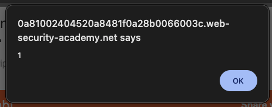
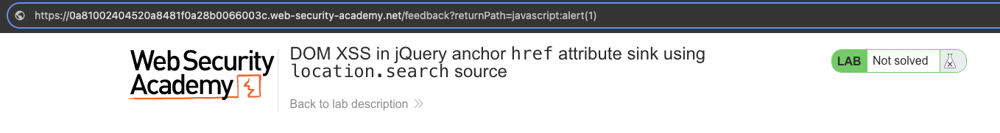

# Cross-Site Scripting (XSS)
**Lab: DOM XSS in jQuery anchor href attribute sink using location.search source (Web Security Academy)**

**Level: Apprentice**

---

## Vulnerability Overview

This lab demonstrates DOM XSS where jQuery reads a URL parameter and uses it to set an anchor's `href` attribute. The vulnerability is not in the HTML content being injected, but in a **javascript: URI** being assigned as a link destination. When a user clicks the link, the browser executes the JavaScript rather than navigating to a URL.

This class of DOM XSS is dangerous because it requires user interaction (a click) - which makes it harder to detect with automated scanners, and easy to exploit through social engineering ("click here to go back").

**Source:** `location.search` (`returnPath` parameter)
**Sink:** jQuery's `.attr('href', ...)` on an anchor element

---

## Steps to Solve the Lab

1. **Open the lab**
   - Navigate to the lab titled *"DOM XSS in jQuery anchor href attribute sink using location.search source"*.

2. **Identify the vulnerable parameter**
   - Look at the page URL, which contains a `returnPath` query parameter:
     ```
     /feedback?returnPath=/some/path
     ```
   - The application uses jQuery to read `location.search` and set an anchor's `href` from `returnPath`.

3. **Craft the XSS payload**
   - Replace the `returnPath` value with a JavaScript URI:
     ```
     javascript:alert(1)
     ```
   - Full URL:
     ```
     https://<lab-id>.web-security-academy.net/feedback?returnPath=javascript:alert(1)
     ```

4. **Trigger the payload**
   - Load the modified URL in the browser.
   - On the feedback page, click the **Back** link (which uses `returnPath` as its `href`).

5. **Observe code execution**
   - Because `href` is now `javascript:alert(1)`, the browser executes the JavaScript on click.
   - A JavaScript alert box with `1` appears.

6. **Result**
   - DOM-based XSS via the jQuery `href` sink is successfully exploited.
   - The lab displays **"Congratulations, you solved the lab!"**.

---

## Why This Works

The vulnerable jQuery code does something like:

```javascript
$(document).ready(function() {
    var returnPath = new URLSearchParams(location.search).get('returnPath');
    $('a.back').attr('href', returnPath);
});
```

`javascript:alert(1)` is a valid URI scheme. jQuery sets it as the `href` without validating whether it's a safe URL. When the user clicks the link, the browser treats it the same as it would treat a `javascript:` URI written directly in the HTML source - executing the code in the current page context.

---

## Remediation

- **Validate URL scheme before setting `href`** - only allow `http:` and `https:`. Reject or sanitize `javascript:`, `data:`, `vbscript:` etc.
  ```javascript
  var url = new URL(returnPath, location.origin);
  if (url.protocol === 'https:' || url.protocol === 'http:') {
      link.href = url.href;
  }
  ```
- **Use `textContent` or relative paths** - if the link destination is always on the same domain, construct it server-side as a relative path rather than reflecting user input.
- **Content Security Policy (CSP)** - a policy including `default-src 'self'` prevents `javascript:` URI execution in modern browsers.
- **Avoid using jQuery `.attr('href', userInput)` directly** - prefer DOM APIs that perform scheme validation.

---

## Screenshots

**Payload execution - the alert fires after clicking the Back link**


**Solution - the javascript: URI in the returnPath parameter**


**Lab solved**


---

Link: https://portswigger.net/web-security/cross-site-scripting/dom-based/lab-jquery-href-attribute-sink
