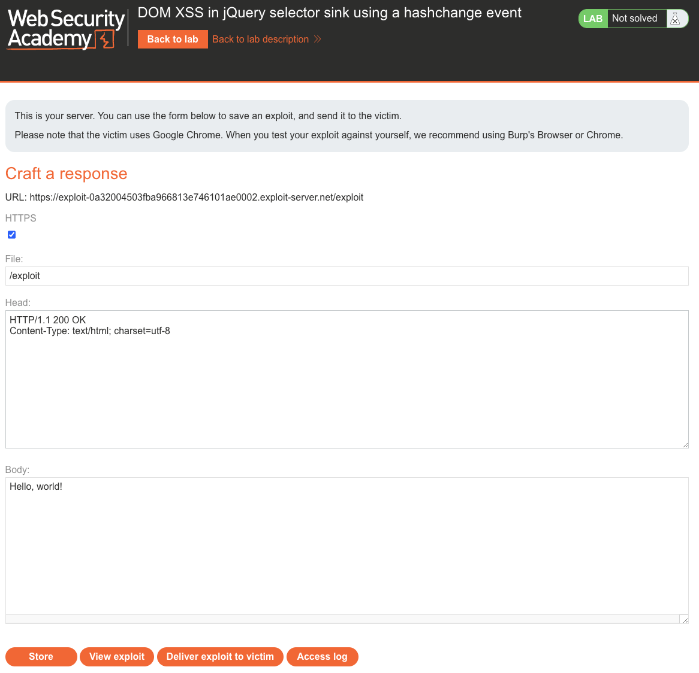
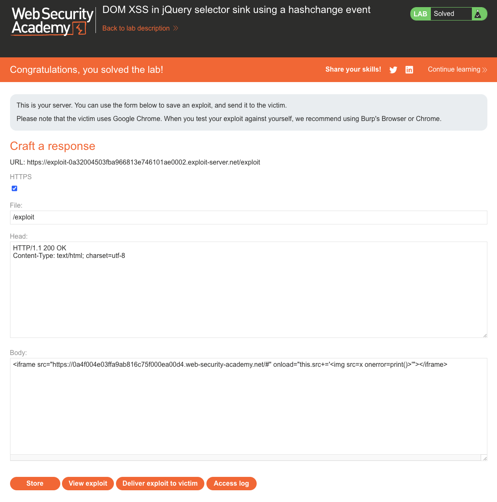

# Cross-Site Scripting (XSS)
**Lab: DOM XSS in jQuery selector sink using a hashchange event (Web Security Academy)**

**Level: Apprentice**

---

## Vulnerability Overview

This lab demonstrates a DOM XSS variant where jQuery's `$()` selector function is used as the sink. The application listens to the `hashchange` event and passes `location.hash` directly to `$()`. In old versions of jQuery (before 3.0), the `$()` function can parse and execute HTML if the string starts with `<` - making it a dangerous sink when fed attacker-controlled input.

This vulnerability is exploited differently from typical reflected XSS: because `hashchange` events can be triggered cross-origin via an iframe, the attacker doesn't need to trick the victim into directly editing the URL. Instead, a crafted exploit page delivers the payload silently through an embedded iframe.

**Source:** `location.hash`
**Sink:** jQuery `$()` selector

---

## Steps to Solve the Lab

1. **Open the lab and exploit server**
   - Start the lab *"DOM XSS in jQuery selector sink using a hashchange event"*.
   - Click **Go to exploit server** to open the exploit-hosting interface.

2. **Understand the vulnerability**
   - The lab application listens for `hashchange` events and passes `location.hash` to jQuery's `$()`.
   - Because `$()` with an HTML string creates DOM elements (and evaluates their event handlers), an attacker-controlled hash value can inject executable HTML.

3. **Prepare the exploit**
   - In the exploit server, set the **Body** to:
     ```html
     <iframe src="https://<lab-id>.web-security-academy.net/#"
             onload="this.src+=''"></iframe>
     ```
   - When the iframe loads the lab page, the `onload` handler appends the malicious payload to the `#` fragment, triggering a `hashchange` event on the lab page.

4. **Store and deliver the exploit**
   - Click **Store** to save the exploit.
   - Click **Deliver exploit to victim** to simulate the victim visiting the attacker's page.

5. **Trigger the XSS**
   - The victim's browser loads the exploit page.
   - The iframe triggers `hashchange` with `` as the hash value.
   - jQuery parses it as HTML, creates the `` element, and the `onerror` handler fires `print()`.

6. **Result**
   - The lab is marked as **Solved** when the `print()` dialog is triggered in the victim's browser context.

---

## Why This Works

The vulnerable code looks like this - it uses jQuery's `$()` selector to auto-scroll to the
blog post whose title is passed via `location.hash`:

```javascript
$(window).on('hashchange', function () {
    var post = $('section.blog-list h2:contains(' + decodeURIComponent(location.hash.slice(1)) + ')');
    if (post) post.get(0).scrollIntoView();
});
```

The unsanitized hash is concatenated straight into the string passed to `$()`. In vulnerable
jQuery versions (before 3.0), `$()` inspects the string and, if it looks like HTML (starts with
`<`), parses it and creates live DOM elements instead of treating it as a selector. With the
hash `#`, jQuery builds a real `` element; the invalid `src`
fails to load and the `onerror` handler fires `print()`.

The iframe trick works because a parent page can freely set `iframe.src` (including the hash), which triggers `hashchange` inside the iframe - a cross-origin mechanism that doesn't require the victim to interact with the URL.

---

## Remediation

- **Upgrade jQuery to version 3.0 or later** - newer jQuery versions no longer interpret a
  string passed to `$()` as HTML unless it is unambiguously markup, closing this vector.
- **Never pass `location.hash` to `$()`** - if you need to scroll to a section, use `document.getElementById()` or match against a known allowlist of IDs.
  ```javascript
  var hash = location.hash.slice(1).replace(/[^a-zA-Z0-9-_]/g, '');
  var target = document.getElementById(hash);
  ```
- **Validate hash values** - the hash should only contain alphanumeric characters and dashes if it's used as a section anchor.
- **Content Security Policy (CSP)** - prevents execution of injected inline event handlers.

---

## Screenshots

**Step 1 - preparing the iframe exploit on the exploit server**


**Step 2 - delivering the exploit to the victim**


**Solution - lab solved**


---

Link: https://portswigger.net/web-security/cross-site-scripting/dom-based/lab-jquery-selector-hash-change-event
