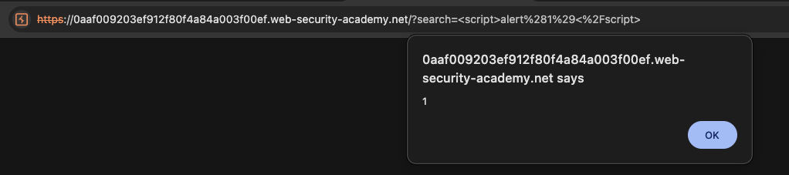
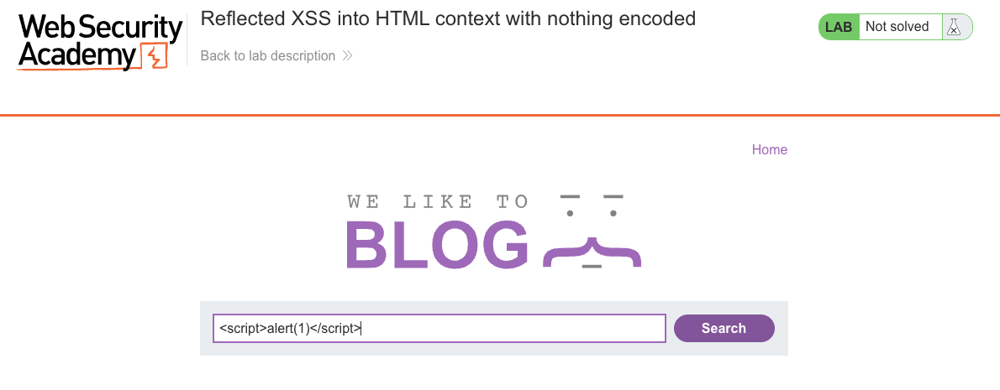
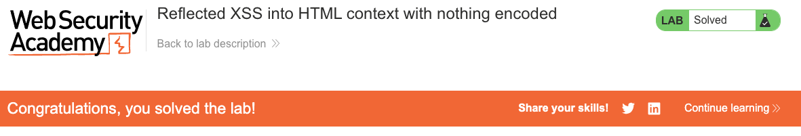

# Cross-Site Scripting (XSS)
**Lab: Reflected XSS into HTML context with nothing encoded (Web Security Academy)**

**Level: Apprentice**

---

## Vulnerability Overview

Reflected XSS occurs when user-supplied input is immediately echoed back in the HTTP response without encoding. The browser receives the injected script as part of the HTML and executes it in the context of the vulnerable page.

This is the most basic XSS scenario: the application takes a search term from the URL parameter, places it directly into the HTML body, and returns it with zero sanitization. An attacker can craft a malicious URL and trick a victim into visiting it - the moment the page loads, the script runs in the victim's browser.

The root cause is **missing output encoding** on server-side rendered content.

---

## Steps to Solve the Lab

1. **Open the lab**
   - Navigate to the lab titled *"Reflected XSS into HTML context with nothing encoded"*.

2. **Find the vulnerable input**
   - On the main page, locate the blog search box.
   - This input is reflected unsafely in the HTML response.

3. **Enter the XSS payload**
   - In the search field, type:
     ```
     <script>alert(1)</script>
     ```
   - Click **Search** to submit the query.

4. **Observe the JavaScript execution**
   - The search term is reflected directly into the page without encoding.
   - A JavaScript `alert` dialog with the text `1` pops up, proving code execution.

5. **Result**
   - The reflected XSS is successfully exploited.
   - The lab shows the banner **"Congratulations, you solved the lab!"**.

---

## Why This Works

The server renders the search term directly into HTML:

```html
<p>You searched for: <script>alert(1)</script></p>
```

Because the browser parses this as valid HTML, the `<script>` tag is executed immediately. No encoding, no stripping - the input goes in raw and comes back as executable code.

---

## Remediation

- **HTML-encode all user-supplied output** - convert `<` to `&lt;`, `>` to `&gt;`, `"` to `&quot;`, etc. before rendering. Most templating engines do this by default (Jinja2, Thymeleaf, Handlebars).
- **Use a Content Security Policy (CSP)** - a strict CSP (`script-src 'self'`) prevents inline scripts from executing even if encoding is missed.
- **Validate input on the server** - reject or strip unexpected characters where the input has a known format.

---

## Screenshots

**Payload execution - the alert fires**


**Solution - payload in the search field**


**Lab solved**


---

Link: https://portswigger.net/web-security/cross-site-scripting/reflected/lab-html-context-nothing-encoded
