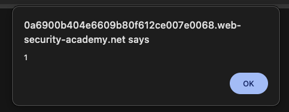
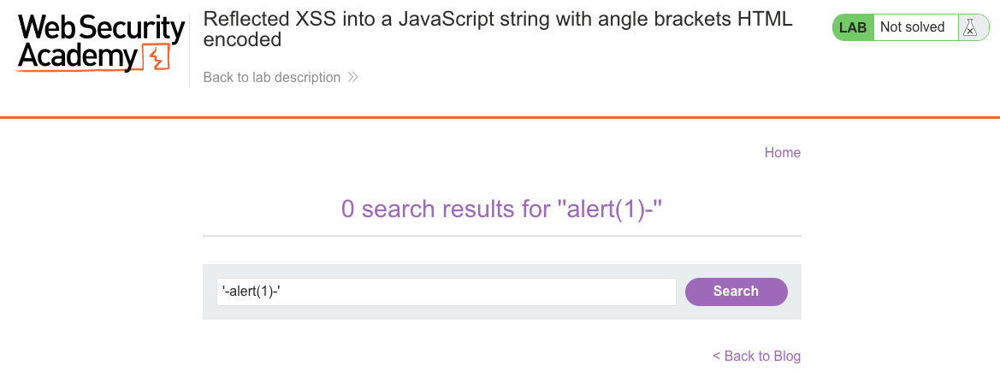
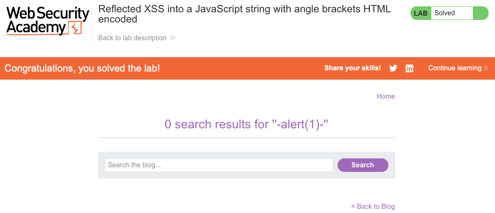

# Cross-Site Scripting (XSS)
**Lab: Reflected XSS into a JavaScript string with angle brackets HTML encoded (Web Security Academy)**

**Level: Apprentice**

---

## Vulnerability Overview

This lab demonstrates XSS in a **JavaScript string context**. The search term is reflected not into the HTML body but inside a `<script>` block, embedded within a JavaScript string literal. The server HTML-encodes `<` and `>`, so new HTML tags cannot be injected. However, single quotes are not encoded, which allows the attacker to break out of the JavaScript string and inject arbitrary code.

This is a distinct context from HTML injection: the payload does not need to create new tags - it only needs to be valid JavaScript. Defenses designed for HTML injection (encoding `<>`) are ineffective here.

---

## Steps to Solve the Lab

1. **Open the lab**
   - Navigate to the lab *"Reflected XSS into a JavaScript string with angle brackets HTML encoded"*.
   - Use the search box on the blog page.

2. **Identify how the input is used**
   - Enter a simple value like `test` and click **Search**.
   - View the page source - the search term is embedded inside a `<script>` block in a JavaScript string:
     ```html
     <script>
         var searchTerm = 'test';
     </script>
     ```
   - Note that `<` and `>` are HTML-encoded, but `'` is not.

3. **Craft a payload for a JS string context**
   - Close the existing string with `'`, inject JavaScript, then repair the syntax:
     ```
     '-alert(1)-'
     ```

4. **Trigger the XSS**
   - Put the payload `'-alert(1)-'` into the search field and click **Search**.
   - The resulting script becomes:
     ```javascript
     var searchTerm = ''-alert(1)-'';
     ```
     Which JavaScript evaluates as string concatenation with an `alert(1)` call in between.
   - The alert fires when the page loads.

5. **Result**
   - JavaScript executes even though angle brackets are HTML-encoded - the context was JavaScript, not HTML.
   - The lab displays **"Congratulations, you solved the lab!"**.

---

## Why This Works

The server places the search term inside a JS string literal:

```javascript
var searchTerm = 'USER_INPUT';
```

With the payload `'-alert(1)-'`:

```javascript
var searchTerm = ''-alert(1)-'';
```

JavaScript parses this as: `''` (empty string) `-` `alert(1)` `-` `''` - the subtraction operators are valid, and `alert(1)` is called as part of the expression. The page never sees a `<script>` tag being injected, so the angle-bracket encoding is irrelevant.

---

## Remediation

- **JavaScript-encode user data placed inside script blocks** - encode `'`, `"`, `\`, `/`, and Unicode escapes. This is a different character set from HTML encoding.
  ```javascript
  // Instead of reflecting raw input:
  var term = '<%- userInput %>';         // WRONG
  // Use JSON encoding:
  var term = <%- JSON.stringify(userInput) %>;  // CORRECT
  ```
- **Use `JSON.stringify()`** - it produces a properly quoted and escaped JavaScript value that cannot break out of string context.
- **Prefer data attributes over inline scripts** - pass server data to the frontend via `data-*` attributes and read them with `dataset`, avoiding inline `<script>` blocks with user data entirely.
- **Content Security Policy (CSP)** - blocking `unsafe-inline` prevents execution of any inline `<script>` blocks.

---

## Screenshots

**Payload execution - the alert fires on page load**


**Solution - payload in the search field**


**Lab solved**


---

Link: https://portswigger.net/web-security/cross-site-scripting/contexts/lab-javascript-string-angle-brackets-html-encoded
