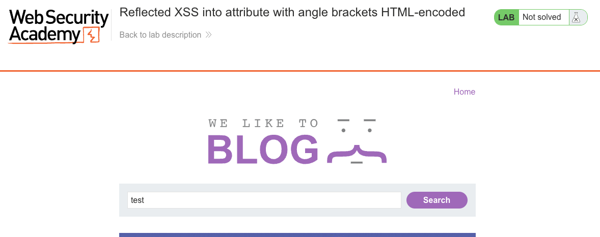
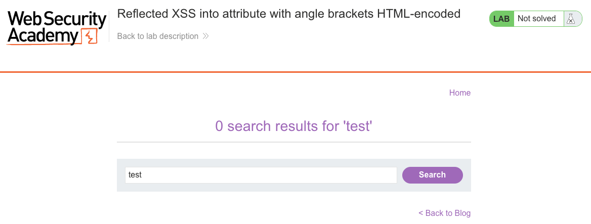
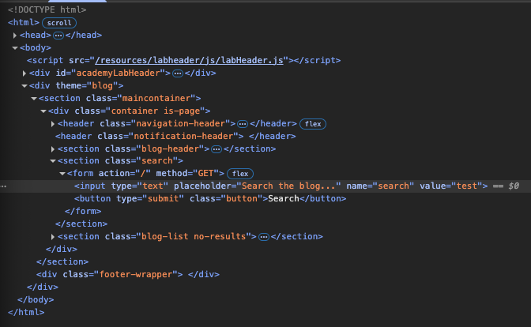
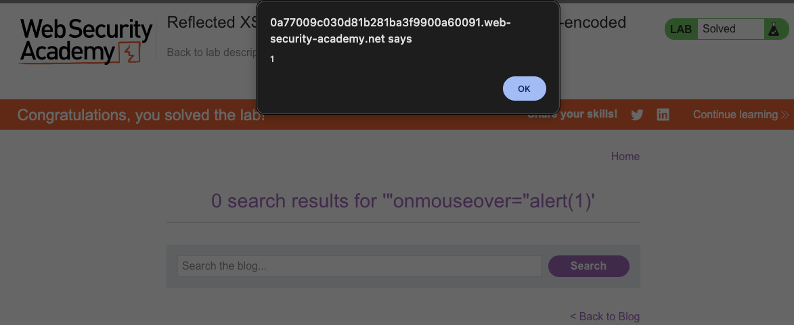

# Cross-Site Scripting (XSS)
**Lab: Reflected XSS into attribute with angle brackets HTML-encoded (Web Security Academy)**

**Level: Apprentice**

---

## Vulnerability Overview

This lab demonstrates that HTML-encoding angle brackets is not sufficient protection against XSS when user input is reflected inside an HTML attribute value. The developer correctly encodes `<` and `>` - so classic tag-injection payloads like `<script>` won't work. But the input is placed inside a quoted attribute without escaping quotes, which allows an attacker to break out of the attribute and inject event handlers.

The lesson: **the encoding strategy must match the output context**. HTML-encoding `<>` only defends tag-based injection. To be safe inside an attribute, you must also encode `"` and `'`.

---

## Steps to Solve the Lab

1. **Open the lab**
   - Navigate to the lab *"Reflected XSS into attribute with angle brackets HTML-encoded"*.
   - Use the search box on the blog page.

2. **Confirm how input is reflected**
   - Type a harmless value such as `test` and click **Search**.
   - On the results page, inspect the HTML and notice your input appears inside an attribute value:
     ```html
     <input type="text" name="search" value="test">
     ```
   - Note that `<` and `>` are HTML-encoded, so classic tag-injection payloads will not work.

3. **Prepare an attribute-based payload**
   - Since input is placed inside the `value` attribute, break out of it using a double quote and inject an event handler:
     ```
     " onmouseover="alert(1)
     ```

4. **Trigger the XSS**
   - Submit the payload with **Search**.
   - The generated input element will look like:
     ```html
     <input type="text" name="search" value="" onmouseover="alert(1)">
     ```
   - Move the mouse cursor over the search field - the browser executes `alert(1)`.

5. **Result**
   - JavaScript is executed without injecting new HTML tags, only by manipulating the existing attribute.
   - The lab status changes to **Solved**.

---

## Why This Works

The server encodes `<` as `&lt;` and `>` as `&gt;`, but does **not** encode `"`. The injected `"` closes the `value` attribute, and the following text becomes new, unescaped HTML attributes on the same element. Event handlers like `onmouseover` are valid HTML attributes - they require no new tags.

```
Input:   " onmouseover="alert(1)
Output:  value="" onmouseover="alert(1)"
```

The browser parses this as a normal attribute and executes the event handler on user interaction.

---

## Remediation

- **Encode `"` as `&quot;` (and `'` as `&#x27;`) inside attribute values** - HTML-encoding for attribute context is different from HTML body context.
- **Use template engines with context-aware encoding** - modern frameworks (Angular, React JSX, Thymeleaf) automatically apply the correct encoding depending on where the value is placed.
- **Content Security Policy (CSP)** - blocks inline event handlers (`unsafe-inline` not present in the policy).
- **Avoid reflecting user input into HTML attributes** - where possible, use server-side state instead of echoing URL parameters back into the page.

---

## Screenshots

**Step 1 - confirming how the input is reflected into the attribute**


**Step 2 - submitting the attribute break-out payload**


**Step 3 - payload execution on mouseover**


**Solution - lab solved**


---

Link: https://portswigger.net/web-security/cross-site-scripting/contexts/lab-attribute-angle-brackets-html-encoded
