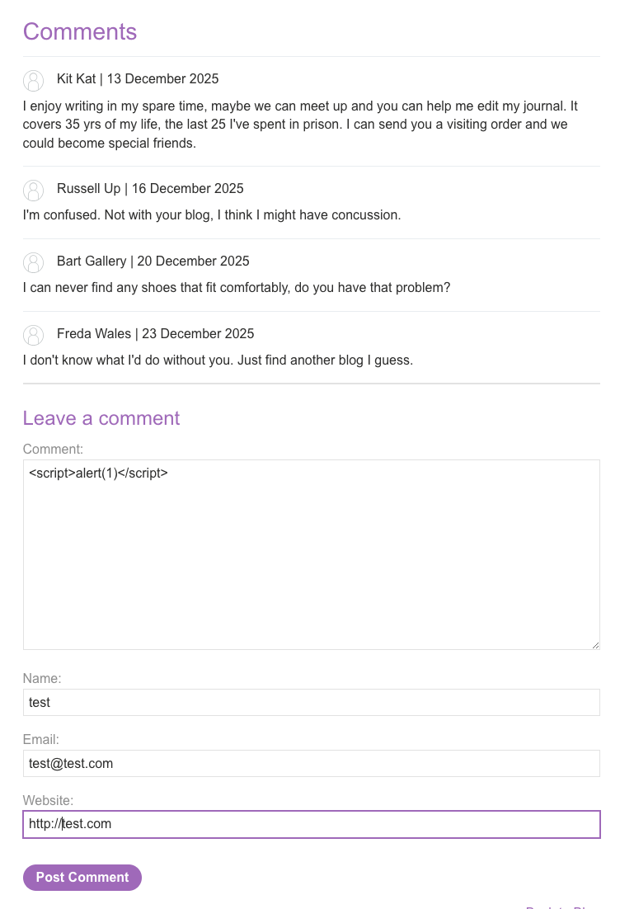
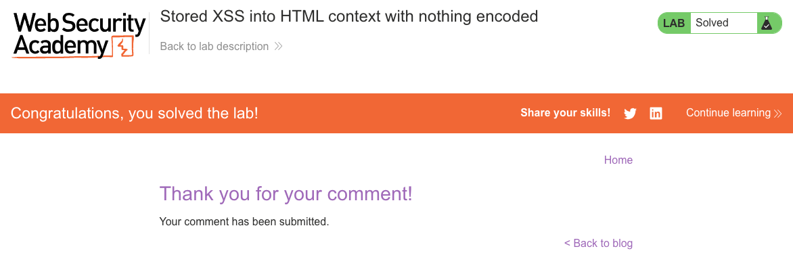

# Cross-Site Scripting (XSS)
**Lab: Stored XSS into HTML context with nothing encoded (Web Security Academy)**

**Level: Apprentice**

---

## Vulnerability Overview

Stored XSS (also called persistent XSS) occurs when user-supplied input is saved in a database and later rendered in the HTML without output encoding. Unlike reflected XSS, the payload does not need to be delivered via a malicious URL - it fires automatically every time any user visits the affected page.

In this lab, a comment submitted to a blog post is stored server-side and rendered directly into the HTML. Any visitor who loads the blog post after the malicious comment is posted will execute the injected script in their browser.

The impact is significantly higher than reflected XSS: a single submission can affect every future visitor, including authenticated users and admins.

---

## Steps to Solve the Lab

1. **Open the lab**
   - Navigate to the blog post page and choose any article.

2. **Find the vulnerable input**
   - Scroll down to the **Leave a comment** section.
   - The comment text area is stored and later rendered in the HTML without encoding.

3. **Prepare the XSS payload**
   - In the **Comment** field, enter:
     ```
     <script>alert(1)</script>
     ```
   - Fill in the remaining required fields with any valid data:
     - Name: `test`
     - Email: `test@test.com`
     - Website: `http://test.com`

4. **Submit the comment**
   - Click **Post Comment** to send the payload to the server.

5. **Verify persistence**
   - You are redirected back to the blog post. The page loads and the `alert(1)` fires immediately.
   - The script will execute for every user who visits this page in the future.

6. **Result**
   - The lab status changes to **Solved**, confirming successful exploitation of stored XSS.

---

## Why This Works

The comment is stored as-is in the database and rendered into the page template without encoding:

```html
<!-- Comment rendered server-side -->
<p><script>alert(1)</script></p>
```

The browser parses the `<script>` tag as executable code. The server never sanitized the input before storage, and never encoded it before output.

---

## Remediation

- **HTML-encode all stored user content on output** - encoding at render time is the correct approach. Even if the database stores the raw string, the template must escape it before inserting it into HTML.
- **Sanitize rich text with an allowlist** - if HTML formatting in comments is intentional, use a library like DOMPurify (client-side) or Bleach (Python) to strip disallowed tags.
- **Content Security Policy (CSP)** - a strict CSP prevents inline script execution as a defense-in-depth layer.
- **Do not trust stored data** - storage is not sanitization. Treat data from your own database with the same suspicion as raw user input.

---

## Screenshots

**Solution - the stored comment payload executing on page load**


**Lab solved**


---

Link: https://portswigger.net/web-security/cross-site-scripting/stored/lab-html-context-nothing-encoded
