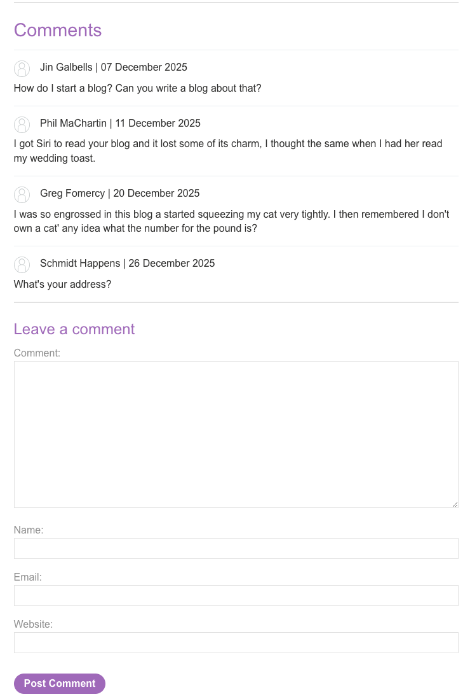
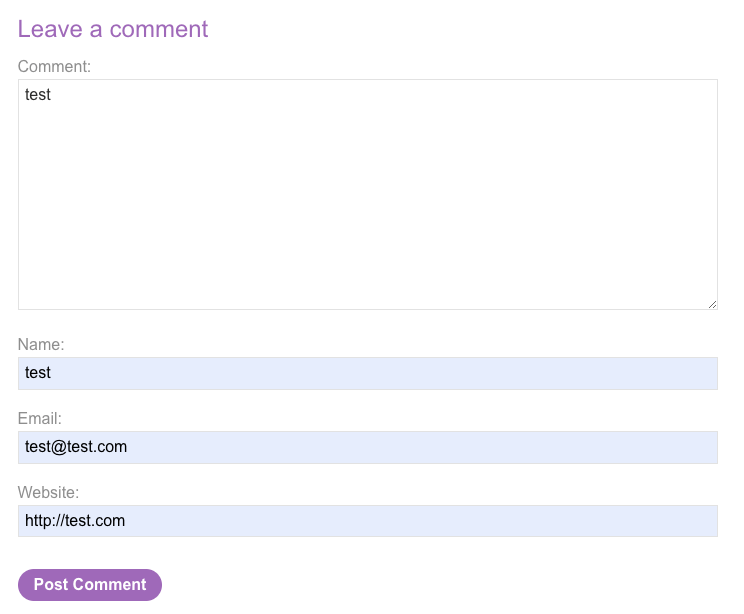
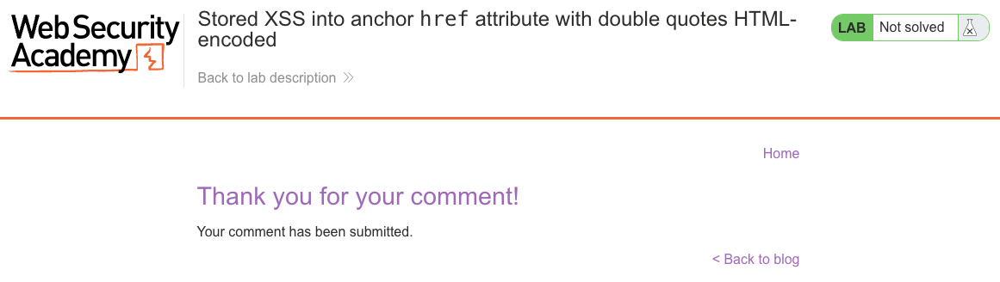
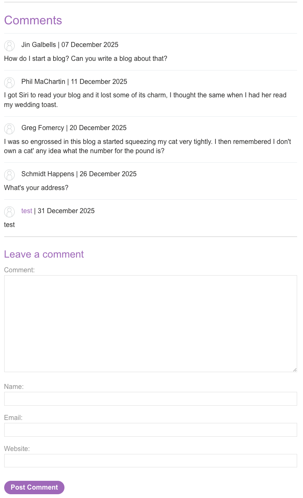
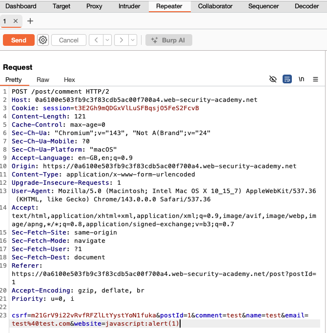
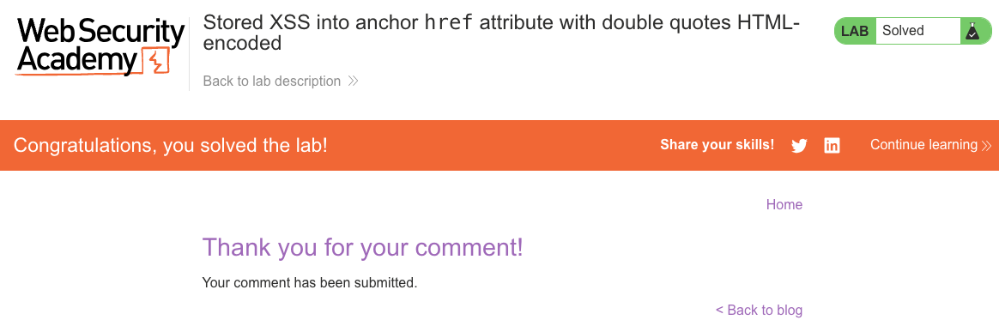

# Cross-Site Scripting (XSS)
**Lab: Stored XSS into anchor href attribute with double quotes HTML-encoded (Web Security Academy)**

**Level: Apprentice**

---

## Vulnerability Overview

This lab combines stored XSS with the `javascript:` URI sink. Comment authors are rendered as clickable links using the `website` field as the `href`. The application HTML-encodes double quotes in the attribute, which prevents breaking out of the attribute - but it does not validate the URL scheme. As a result, a `javascript:` URI can be stored as the link destination and executed when any user clicks the author's name.

This is a **stored XSS via a URL sink** - distinct from tag-injection XSS. The attack payload is a valid `href` value; no HTML syntax is broken.

---

## Steps to Solve the Lab

1. **Open the blog post and comment form**
   - Navigate to the blog post in the lab.
   - Scroll down to the **Leave a comment** section.

2. **Submit a normal comment to observe the output**
   - Enter a simple comment such as `test` and fill in Name, Email, and `http://test.com` for Website.
   - Click **Post Comment** and verify that your author name appears as a clickable link.

3. **Intercept the comment request in Burp**
   - Enable Burp as a proxy and submit the comment again.
   - In Burp Proxy, send the `POST /post/comment` request to **Repeater**.
   - Locate the `website` parameter in the request body.

4. **Inject a JavaScript URI into the `website` field**
   - Replace the `website` value with:
     ```
     javascript:alert(1)
     ```
   - Send the modified request from Repeater to store the payload.

5. **Trigger the stored XSS**
   - Reload the blog post in the browser and scroll to the comments section.
   - Your author name is now rendered as:
     ```html
     <a href="javascript:alert(1)">test</a>
     ```
   - Click the author name - the browser executes the JavaScript URI and displays an alert box.

6. **Result**
   - The payload is stored and executes for any user who clicks the link.
   - The lab banner changes to **"Congratulations, you solved the lab!"**.

---

## Why This Works

The server HTML-encodes `"` when rendering the `href`, so breaking out of the attribute with a quote isn't possible. However, it does not validate the URL scheme. The rendered HTML is:

```html
<a href="javascript:alert(1)">test</a>
```

This is syntactically correct HTML - no attribute boundary was broken. The browser simply treats `javascript:` as a valid URI scheme and executes the code in the current page context when the link is clicked. Double-quote encoding is irrelevant here because the attack doesn't need quotes.

---

## Remediation

- **Validate URL scheme before storing or rendering `href` values** - only allow `http:` and `https:`. Reject `javascript:`, `data:`, `vbscript:`, and bare strings.
- **Use an allowlist for the website field** - the value should always be a full HTTPS URL; reject anything else server-side.
- **Sanitize stored URLs at render time** - even if past data exists in the database, validate scheme during output, not only during input.
- **Content Security Policy (CSP)** - a policy without `unsafe-inline` and with a restrictive `default-src` blocks `javascript:` URI execution in modern browsers.

---

## Screenshots

**Step 1 - submitting a normal comment to observe the output**


**Step 2 - the author name rendered as a clickable link**


**Step 3 - intercepting the comment request in Burp**


**Step 4 - injecting the javascript: URI into the website parameter**


**Step 5 - payload execution when clicking the author link**


**Solution - lab solved**


**Lab solved banner**


---

Link: https://portswigger.net/web-security/cross-site-scripting/contexts/lab-href-attribute-double-quotes-html-encoded
