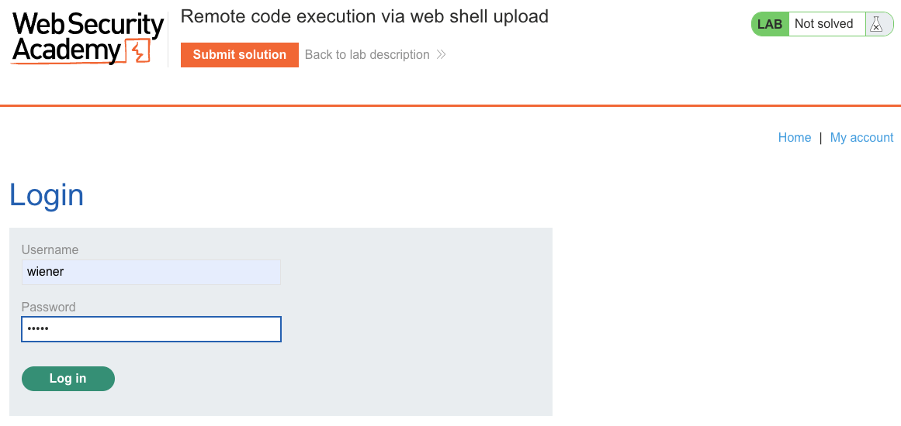
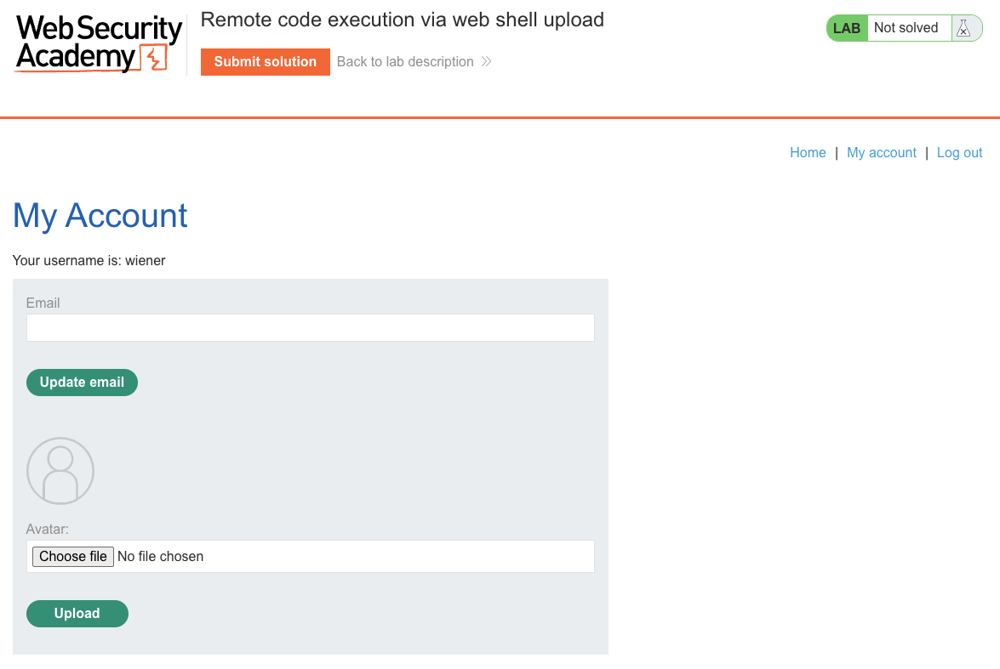
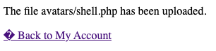
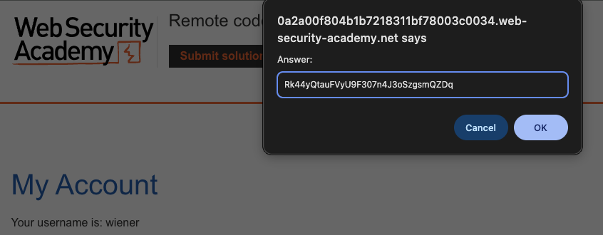
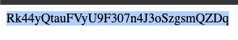
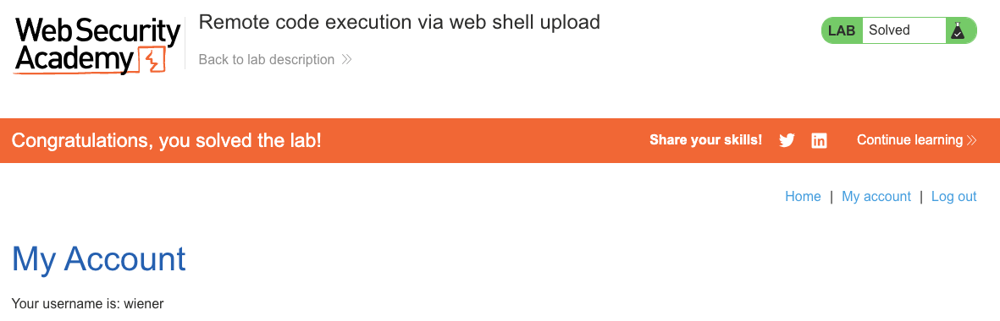

# File Upload Vulnerabilities
**Lab: Remote code execution via web shell upload (Web Security Academy)**

| | |
| --- | --- |
| **Level** | Apprentice |
| **Classification** | [CWE-434: Unrestricted Upload of File with Dangerous Type](https://cwe.mitre.org/data/definitions/434.html) |
| **OWASP** | [A03:2021 - Injection](https://owasp.org/Top10/A03_2021-Injection/) · [OWASP File Upload Cheat Sheet](https://cheatsheetseries.owasp.org/cheatsheets/File_Upload_Cheat_Sheet.html) |
| **Impact** | Remote Code Execution (full server-side compromise) |

---

## Vulnerability Overview

The application exposes an avatar upload that performs **no validation** on the uploaded file - not on its extension, its declared MIME type, or its actual content. Because the upload directory sits inside the web root and the server executes `.php` files there, an attacker can upload a PHP *web shell* (a script that runs server-side code) and invoke it with a single HTTP request.

A file upload becomes a Remote Code Execution primitive when **all three** of the following hold:

1. The server accepts a dangerous, executable file type (`.php`, `.jsp`, `.aspx`, `.phtml`, ...).
2. The uploaded file is stored **within the web root**, reachable over HTTP.
3. The web server is configured to **execute** that file type in the storage directory.

All three conditions are met here, which turns a cosmetic feature (profile pictures) into full **Remote Code Execution (RCE)**.

---

## Impact

RCE is the highest-severity outcome in web security: the attacker runs arbitrary code with the privileges of the web server process. In this lab the payload reads a single secret file, but the same primitive enables an attacker to:

- Read any file the web server user can access (source code, configuration, credentials, other users' data).
- Establish an interactive shell and pivot deeper into the internal network.
- Modify or deface the application, or use the host to attack third parties.

Because the payload is attacker-authored, "read one file" is only the demonstration - the ceiling is complete compromise of the host.

---

## Steps to Solve the Lab

1. **Log in and locate the upload feature**
   - Log in as `wiener` and go to **My account**.
   - Find the **Upload avatar** functionality.

   
   

2. **Create a PHP web shell**
   - Create a file named `shell.php` with the contents:
     ```php
     <?php echo file_get_contents('/home/carlos/secret'); ?>
     ```
   - When executed by the PHP interpreter, this reads Carlos's secret file and writes its contents into the HTTP response body.

3. **Upload the web shell**
   - Upload `shell.php` as the avatar.
   - The server accepts it without validating the file type, extension, or content.
   - The response confirms: `The file avatars/shell.php has been uploaded`.

   

4. **Execute the shell**
   - Request the uploaded file directly:
     ```http
     GET /files/avatars/shell.php HTTP/2
     ```
   - The server hands the file to the PHP interpreter instead of serving it as a static download. The script runs, and the response body contains the contents of `/home/carlos/secret`.

   

5. **Submit the secret**
   - Copy the secret value and paste it into the **Submit solution** form.

   

6. **Result**
   - The lab banner changes to **"Congratulations, you solved the lab!"**.

   

---

## Why This Works

The upload is stored under `/files/avatars/` inside the web root, and the web server is configured to execute `.php` files in that directory (for example via Apache `mod_php` or a PHP-FPM handler). No check is applied to the extension, MIME type, or content, so `shell.php` is handled exactly like `photo.jpg` would be: it lands on disk and is immediately reachable and executable over HTTP.

The distinction between *serving* and *executing* is the crux. A hardened server would return the raw bytes of `shell.php` as a download; this server passes them to the PHP interpreter. The `file_get_contents` call then runs with the web server's OS user privileges, which include read access to `/home/carlos/secret`.

---

## Remediation

Defense in depth matters here - no single control is sufficient, because each can be bypassed in isolation (extension tricks, MIME spoofing, path quirks). Combine the following:

1. **Store uploads outside the web root** *(strongest control)* - serve them through a handler that streams bytes as static content and never executes them. A file the server cannot reach over HTTP cannot be invoked as a script.
2. **Disable script execution in the upload directory** - if uploads must live under the web root, strip execution at the server level (e.g. `php_admin_flag engine off` in Apache, or refuse to route the path to the PHP handler in nginx). Note that a naive `location ~ \.php$ { deny all }` only blocks the literal `.php` suffix and can be evaded (`.phtml`, `.php5`, path-info tricks) - prefer disabling the handler entirely for that path.
3. **Validate file content, not just the name** - inspect the real magic bytes / MIME type, and reject anything that is not a genuine image, regardless of what the filename or `Content-Type` claims.
4. **Enforce a strict extension allowlist** - permit only `.jpg`, `.jpeg`, `.png`, `.gif`, `.webp`. Reject everything else, including double extensions (`shell.php.jpg`) and null-byte tricks.
5. **Rename uploaded files** - discard the client-supplied name entirely and assign a server-generated UUID with a safe, allowlisted extension. This removes attacker control over the path and extension in one step.

---

## Real-World Context

Unrestricted file upload leading to RCE is a recurring source of critical CVEs, not a lab-only curiosity. It has driven high-severity vulnerabilities in widely deployed software - for example [CVE-2021-22204](https://nvd.nist.gov/vuln/detail/CVE-2021-22204) (ExifTool, exploited via uploaded images) and countless WordPress/plugin upload flaws. It maps to CWE-434 and sits under the OWASP Top 10 as an injection-class weakness.

---

Link: https://portswigger.net/web-security/file-upload/lab-file-upload-remote-code-execution-via-web-shell-upload
