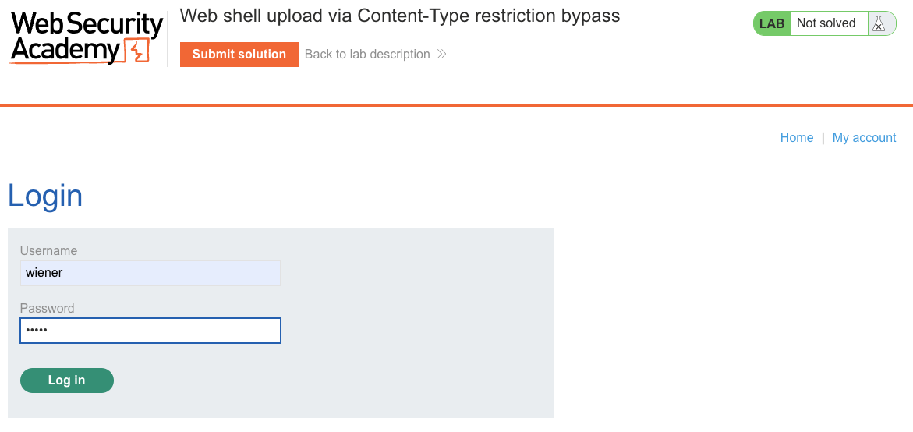
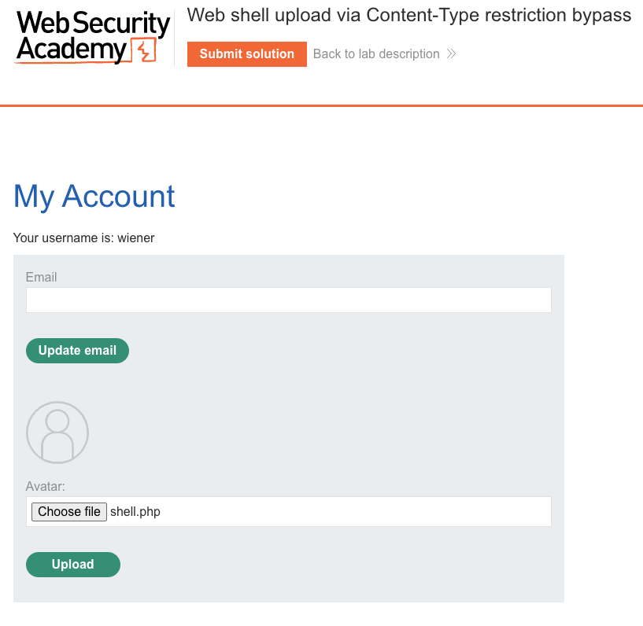
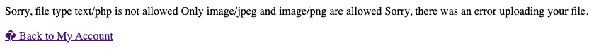
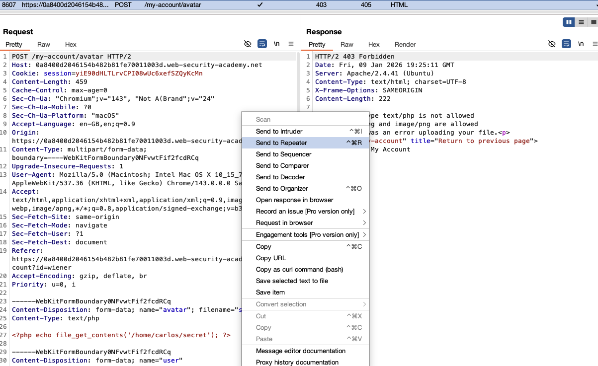
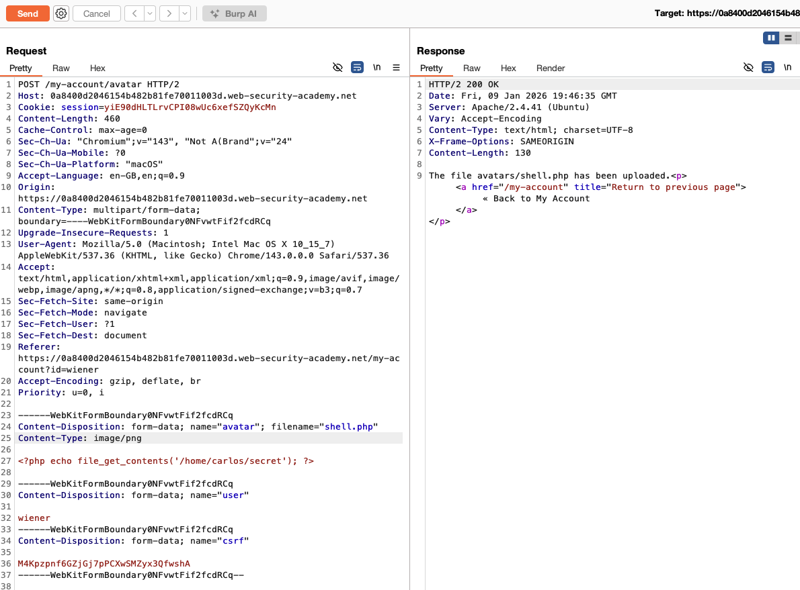
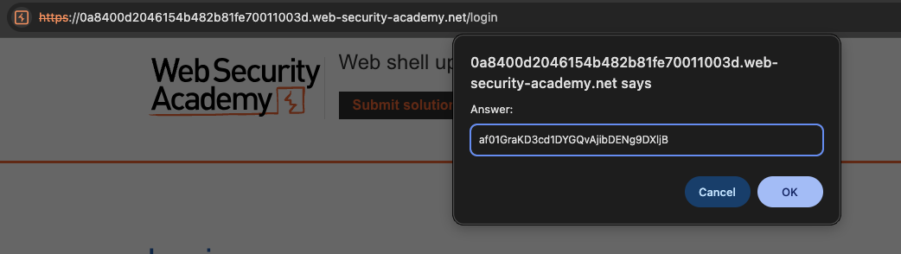
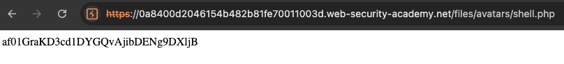
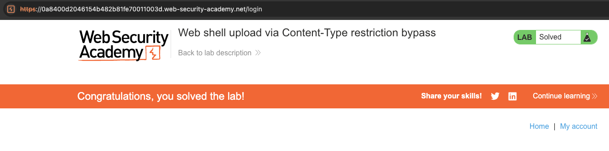

# File Upload Vulnerabilities
**Lab: Web shell upload via Content-Type restriction bypass (Web Security Academy)**

| | |
| --- | --- |
| **Level** | Apprentice |
| **Classification** | [CWE-434: Unrestricted Upload of File with Dangerous Type](https://cwe.mitre.org/data/definitions/434.html) · [CWE-20: Improper Input Validation](https://cwe.mitre.org/data/definitions/20.html) |
| **OWASP** | [A03:2021 - Injection](https://owasp.org/Top10/A03_2021-Injection/) · [OWASP File Upload Cheat Sheet](https://cheatsheetseries.owasp.org/cheatsheets/File_Upload_Cheat_Sheet.html) |
| **Impact** | Remote Code Execution (full server-side compromise) |

---

## Vulnerability Overview

The application tries to restrict avatar uploads to images, but it enforces that restriction on the **`Content-Type` of the upload** rather than on the file's actual bytes. That value is supplied by the client in the request and can be set to anything. An attacker uploads a PHP web shell while declaring `Content-Type: image/png`; the check passes, and the shell is stored and later executed.

This is a failure of **trusting client-controlled input**: the validation runs server-side, but it inspects a value the attacker fully controls (the request-supplied `Content-Type`) instead of the file content it is meant to describe. It is the same RCE outcome as an unvalidated upload, reached by defeating a control that only *looks* like validation.

---

## Impact

Identical to an unrestricted upload: the attacker achieves **Remote Code Execution** with the privileges of the web server process - arbitrary file reads, credential theft, an interactive shell, and lateral movement into the internal network. The `Content-Type` check provides a false sense of security while blocking nothing an attacker with an intercepting proxy cares about.

---

## Steps to Solve the Lab

1. **Log in and attempt a normal upload**
   - Log in as `wiener` and go to **My account → Upload avatar**.
   - Upload `shell.php` directly through the browser. The server rejects it:
     `Sorry, file type text/php is not allowed. Only image/jpeg and image/png are allowed.`
   - This response reveals exactly which control is in place: a `Content-Type` allowlist.

   
   
   

2. **Intercept the upload request in Burp**
   - With Burp Proxy enabled, upload the `shell.php` request and capture it in the proxy history.
   - Send the request to **Repeater**.

   

3. **Modify the request to bypass the check**
   - In Repeater, change the **per-part** `Content-Type` of the file from `text/php` (or `application/x-php`) to `image/png`.
   - Keep the filename as `shell.php` and the body as the PHP payload:
     ```php
     <?php echo file_get_contents('/home/carlos/secret'); ?>
     ```
   - The request now *declares* an image while *carrying* PHP - the allowlist checks the declaration, not the payload.

4. **Send the modified request**
   - The server reads `Content-Type: image/png`, the allowlist passes, and it stores the file as `avatars/shell.php`.
   - The response confirms: `The file avatars/shell.php has been uploaded`.

   

5. **Execute the web shell**
   - Request the stored file directly:
     ```http
     GET /files/avatars/shell.php HTTP/2
     ```
   - The PHP interpreter executes it and returns the contents of `/home/carlos/secret` in the response body.

   

6. **Submit the secret**
   - Paste the secret into the **Submit solution** form.

   

7. **Result**
   - The lab banner changes to **"Congratulations, you solved the lab!"**.

   

---

## Why This Works

A `multipart/form-data` upload carries **two distinct `Content-Type` values**:

- one in the HTTP request **headers**, describing the whole request (`multipart/form-data; boundary=...`);
- one **per part**, inside the request body, next to each part's `Content-Disposition`.

The vulnerable check reads the *per-part* `Content-Type` of the file part - a value that lives in the request body and is fully attacker-controlled once a proxy is in the loop. The browser sets it based on the file's OS extension, but nothing binds it to the actual bytes, and the server never re-derives it. Roughly:

```python
# Vulnerable: trusts the client-declared Content-Type
def upload_avatar(request):
    file = request.files['avatar']
    if file.content_type not in ('image/jpeg', 'image/png', 'image/gif'):
        return error("Only images allowed")
    save(file)  # stores the PHP shell: the declared type was never verified
```

The check passes whenever `Content-Type: image/png` is present - **regardless of what the file actually contains.**

---

## Remediation

The root cause is trusting a client-supplied label instead of the data. Fix that first, then layer the same defenses as for any upload:

1. **Verify the real file type from its content** - read the leading magic bytes and confirm the file is genuinely the image it claims to be. Never trust the request's `Content-Type` or the filename extension as proof of type.
   ```python
   # imghdr was removed in Python 3.13; use python-magic or filetype instead
   import filetype
   kind = filetype.guess(file_stream.read())
   file_stream.seek(0)
   if kind is None or not kind.mime.startswith('image/'):
       return error("Only images allowed")
   ```
2. **Store uploads outside the web root** and serve them through a handler that streams bytes as static content and never executes server-side scripts.
3. **Enforce a strict extension allowlist** on the filename (`.jpg`, `.jpeg`, `.png`, `.gif`, `.webp`), rejecting double extensions and null-byte tricks.
4. **Rename uploaded files** to a server-generated UUID with a safe, allowlisted extension, discarding the client-supplied name entirely.
5. **Disable script execution** (PHP or equivalent) in the upload directory at the web-server level, as a last line of defense.

---

## Real-World Context

Trusting the client-declared `Content-Type` is a classic input-validation failure (CWE-20) that turns a would-be image filter into a no-op. The lesson generalizes far beyond uploads: **any security decision based on a value the client controls is not a control at all.** The same reasoning applies to trusting the `Referer` header for CSRF defense, or a hidden form field for authorization.

---

Link: https://portswigger.net/web-security/file-upload/lab-file-upload-web-shell-upload-via-content-type-restriction-bypass
