# GraphQL API Vulnerabilities

**Lab: Accessing private GraphQL posts (Web Security Academy)**

**Level: Apprentice**

**Link:** https://portswigger.net/web-security/graphql/lab-graphql-reading-private-posts

---

## Vulnerability Overview

GraphQL APIs expose a self-describing schema through **introspection** - a built-in mechanism that lets clients query which types, fields, and operations are available. When introspection is left enabled in production, an attacker can map the entire API surface, including fields and types that the official frontend never requests.

In this lab, the blog frontend only requests a handful of fields for each post (`image`, `title`, `summary`, `id`). Introspection reveals that the `BlogPost` type also exposes an `isPrivate` flag and a `postPassword` field. One blog post is hidden from the public listing, but it can still be fetched directly by its `id`, and its `postPassword` can be read because there is no field-level authorization protecting it.

The goal of the lab is to find the hidden blog post and submit its password.

---

## Steps to Solve the Lab

### 1. Log in and browse the blog

Log in as `wiener` and open the blog. The posts are loaded through a GraphQL request.

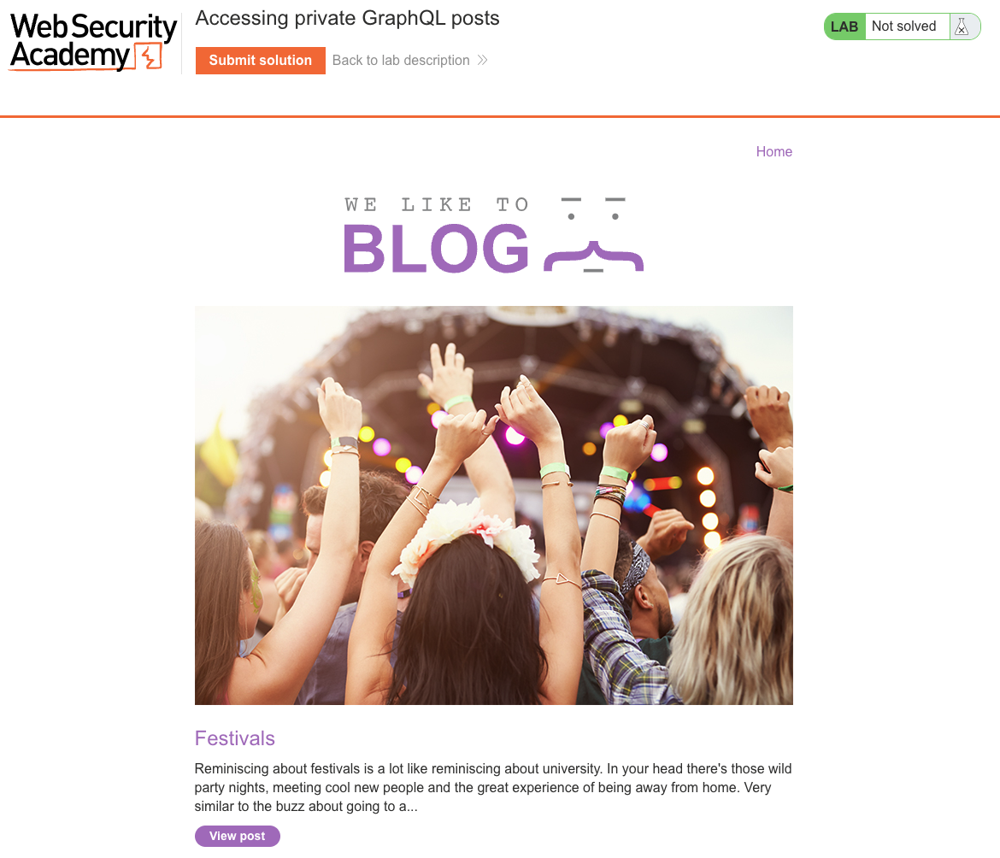

### 2. Locate the GraphQL request in Burp

In Burp Proxy, find the `POST /graphql/v1` request used to load the post summaries. The operation is `getBlogSummaries`, which internally calls `getAllBlogPosts` and requests only `image`, `title`, `summary`, and `id`.

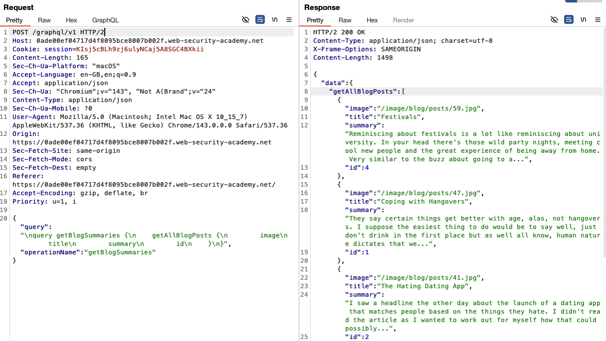

### 3. Send the request to Repeater

Right-click the request and choose **Send to Repeater** so you can edit and replay it.

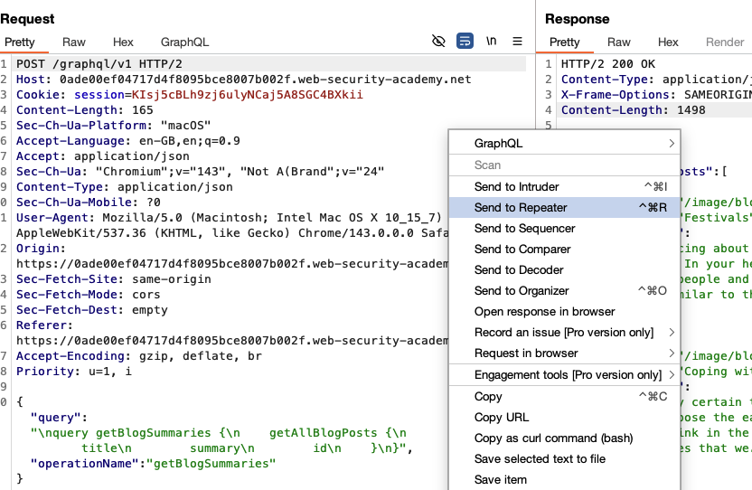

### 4. Set an introspection query

In Repeater, right-click the request, open the **GraphQL** submenu, and select **Set introspection query**. Burp replaces the body with a full introspection query.

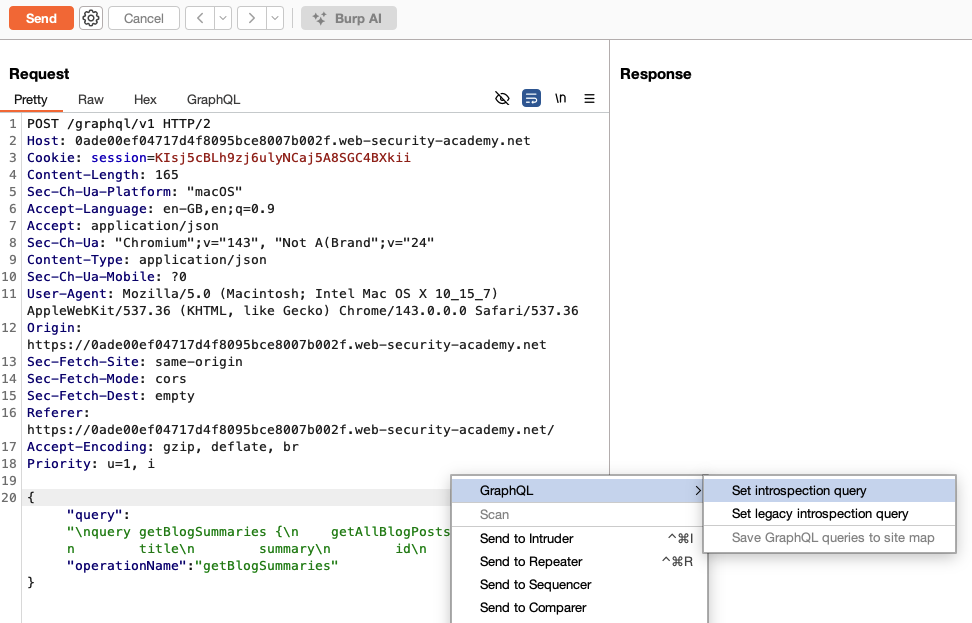

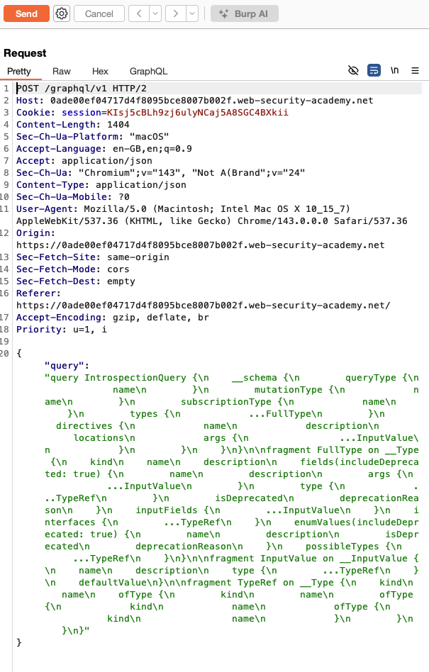

### 5. Read the schema from the introspection response

Send the introspection query. The response describes every type and field. On the `BlogPost` object type you can see the fields the frontend uses (`id`, `image`, `title`, `summary`)...

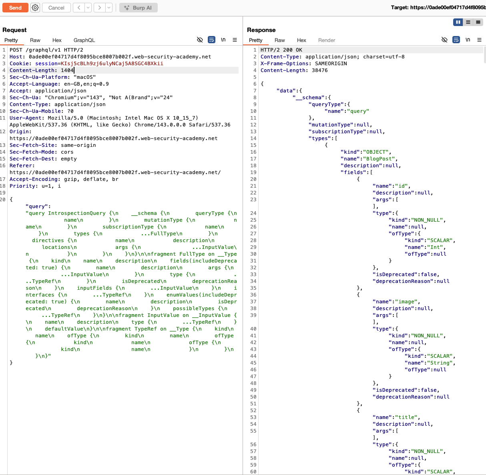

...as well as two fields the frontend never requests: `isPrivate` (Boolean) and `postPassword` (String).

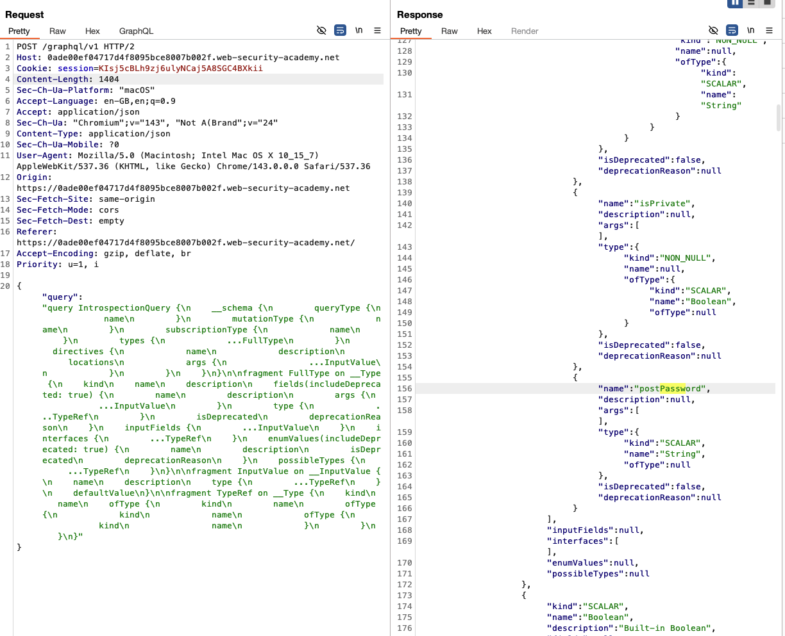

### 6. Add postPassword to the post listing

Go back to the `getBlogSummaries` query and add the `postPassword` field to the `getAllBlogPosts` selection. The response returns the public posts with `postPassword: null`, and shows their IDs: `4`, `1`, `2`, `5`. **Post `id` 3 is missing from the list**, which indicates a hidden post.

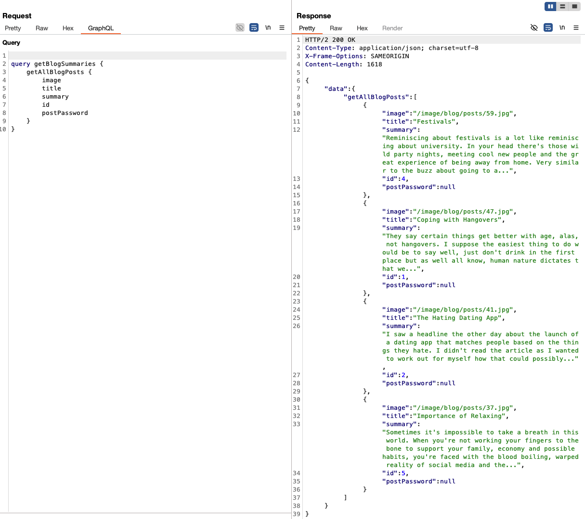

### 7. Fetch the hidden post by ID

Query the missing post directly with `getBlogPost(id: 3)` and request `postPassword`. The response returns the hidden post ("Shopping Woes") and its password.

```graphql
query getBlogSummaries {
  getBlogPost(id: 3) {
    image
    title
    summary
    id
    postPassword
  }
}
```

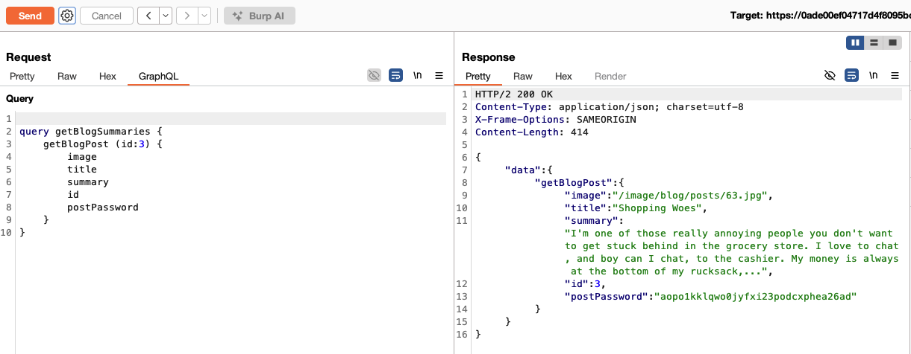

### 8. Submit the solution

Copy the `postPassword` value from the response, click **Submit solution**, and paste it as the answer.

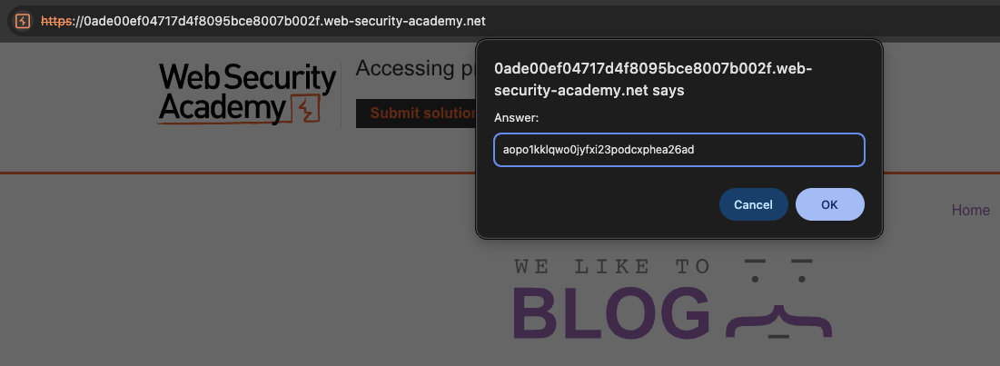

### 9. Result

The lab banner changes to **"Congratulations, you solved the lab!"**.

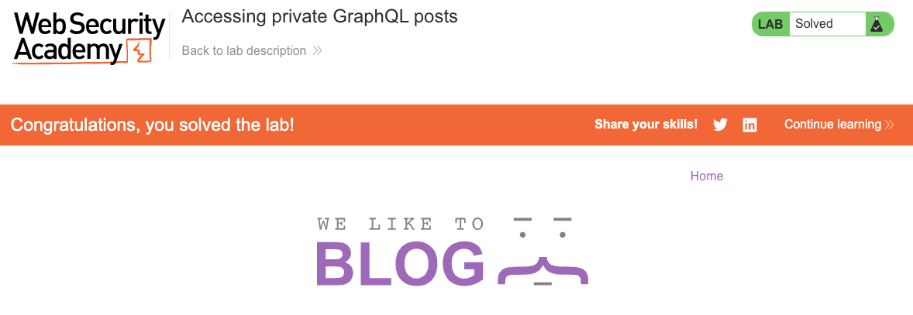

---

## Why This Works

The frontend only requests a subset of the available fields, and developers often assume that if the UI never asks for a field, it is effectively hidden. But GraphQL lets any client request any field the schema exposes. With introspection enabled, an attacker can discover fields the frontend does not use - here `isPrivate` and `postPassword` - and request them directly.

The hidden post is not protected by authorization at the field or object level. It is simply excluded from the public listing, so a gap in the sequential `id` values is enough to reveal that it exists. Fetching it by `id` and requesting `postPassword` returns data that should never be exposed to a client.

---

## Remediation

- **Disable introspection in production.** Introspection is a development tool. Production APIs should disable it for unauthenticated (and often authenticated) users.
  ```js
  // Apollo Server
  introspection: process.env.NODE_ENV !== 'production'
  ```
- **Implement field-level and object-level authorization.** Before resolving a field such as `postPassword`, verify that the requesting user is allowed to access it. Sensitive fields should return `null` or raise an authorization error for non-owners, regardless of whether the object was returned by a listing query.
- **Do not rely on obscurity.** Excluding a record from a listing or omitting a field from the frontend query is not access control. Hidden objects that are still reachable by `id` must be protected server-side.
- **Apply query depth and complexity limits.** These constrain introspection-style reconnaissance and abusive queries.
- **Separate schemas where practical.** Maintain distinct schemas or gateways for public and authenticated clients instead of a single schema guarded by per-field access checks.
