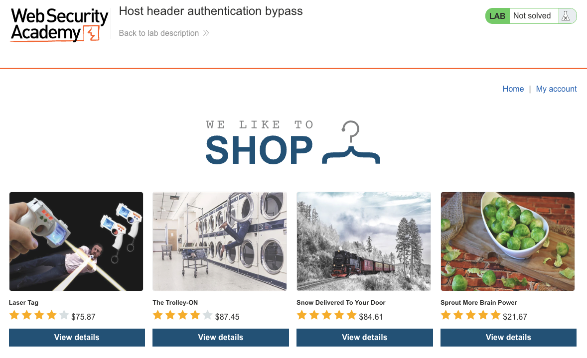
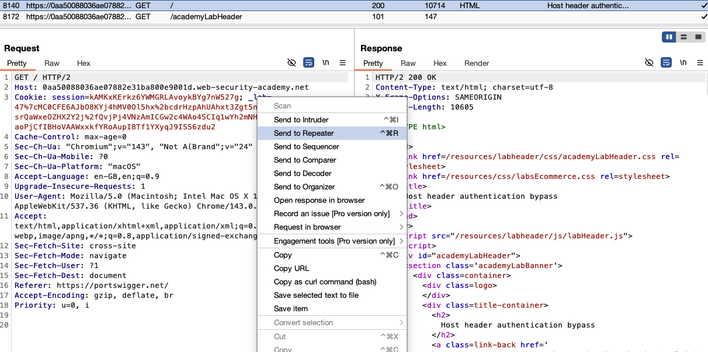
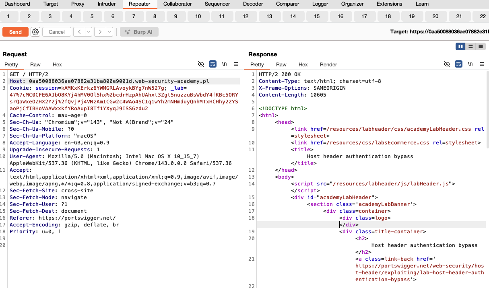
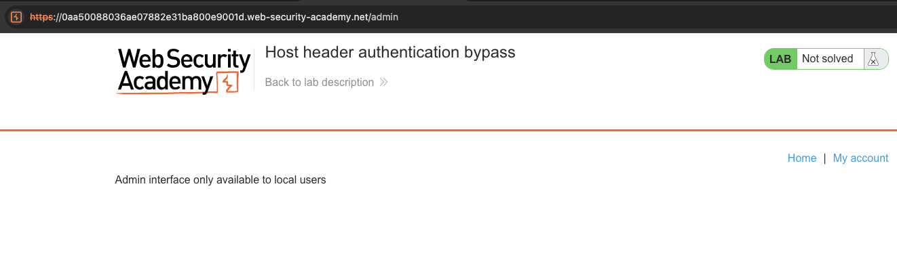
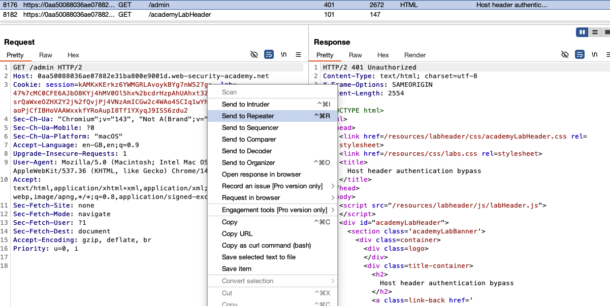
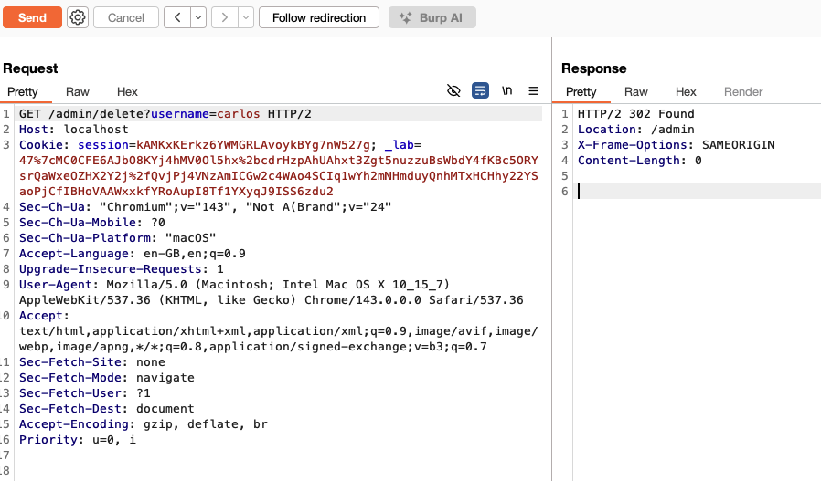
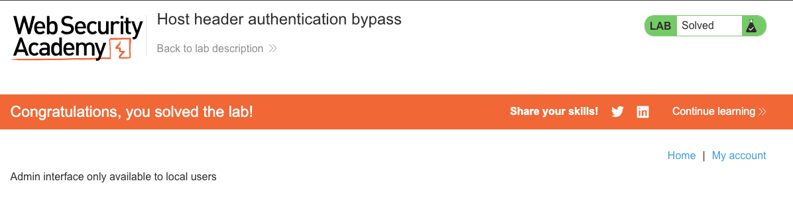

# HTTP Host Header Attacks

**Lab: Host header authentication bypass (Web Security Academy)**

**Level: Apprentice**

**Link:** https://portswigger.net/web-security/host-header/exploiting/lab-host-header-authentication-bypass

---

## Vulnerability Overview

This lab demonstrates an access-control bypass via the `Host` header. The admin panel is restricted to "local users" - the server checks the `Host` header to decide whether the request originates from `localhost` and grants access accordingly. Because the `Host` header is supplied by the client, an attacker can simply set it to `localhost` to impersonate a local request.

This is a case of **relying on client-supplied data for an access-control decision** - the server delegates a trust decision to a value the client fully controls.

**Lab goal:** Access the admin panel and delete the user `carlos`.

---

## Steps to Solve the Lab

### 1. Explore the lab

Open the lab and browse the shop front to get a feel for the application.



### 2. Confirm that arbitrary `Host` values are accepted

Send the `GET /` request to **Burp Repeater**.



Change the `Host` header to an arbitrary value and resend the request. The application still returns `200 OK`, which shows that the back-end does not strictly validate the `Host` header.



### 3. Locate and attempt to reach the admin panel

The admin panel lives at `/admin` (referenced from `/robots.txt`). Browse to `/admin` in the browser. Access is denied with the message:

```
Admin interface only available to local users
```



### 4. Send the `/admin` request to Repeater

Send the `GET /admin` request to **Burp Repeater**. With the original `Host` header, the server responds with `401 Unauthorized`.



### 5. Bypass the check with `Host: localhost`

In Repeater, change the `Host` header to `localhost` and resend. The server now treats the request as local and returns the admin panel, which exposes links to delete users.

### 6. Delete carlos

Change the request line to:

```
GET /admin/delete?username=carlos
```

keeping `Host: localhost`, and send the request. The server responds with `302 Found` (redirecting to `/admin`), confirming that `carlos` has been deleted.



### 7. Result

The lab banner changes to **"Congratulations, you solved the lab!"**.



---

## Why This Works

The server's access-control logic reads the `Host` header to determine the request's origin:

```python
# Vulnerable pseudocode:
def admin_panel(request):
    if request.headers.get("Host") != "localhost":
        abort(401, "Admin interface only available to local users")
    return render_admin()
```

The `Host` header is not a reliable indicator of request origin - it is set by the HTTP client and can be any value. An external attacker can trivially set `Host: localhost` on any request and defeat the check.

---

## Remediation

- **Never use the `Host` header for access-control decisions.** It is client-controlled and cannot be trusted.
- **Derive network origin from the connection, not from a header.** If local-only access is genuinely required, compare the client's IP address taken from the socket (not from any header) against `127.0.0.1` or `::1`. This is hard to spoof from an external attacker.
- **Prefer role-based access control.** Instead of inferring admin rights from network location, enforce them through authenticated user roles stored server-side.
- **Validate the `Host` header against a static allowlist.** Reject requests with unexpected `Host` values at the reverse proxy, before they reach the application.
