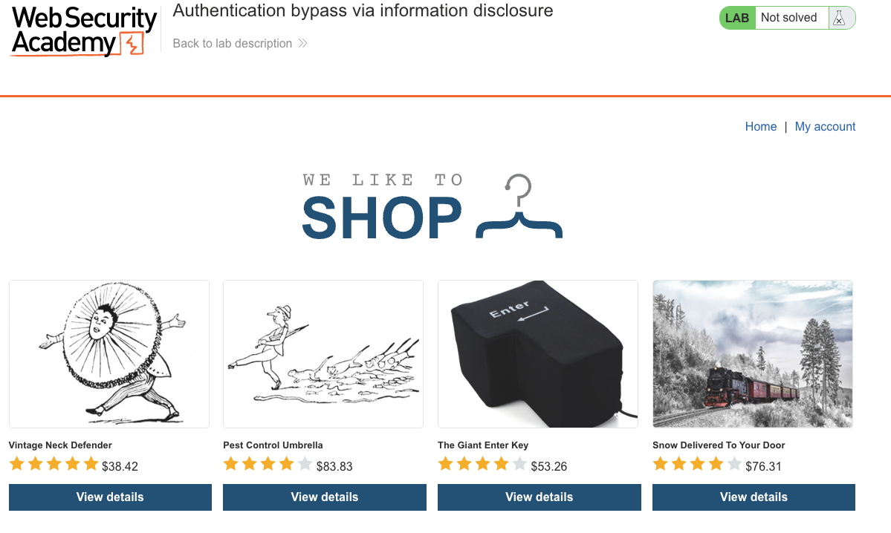
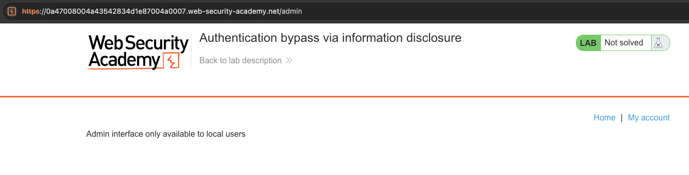
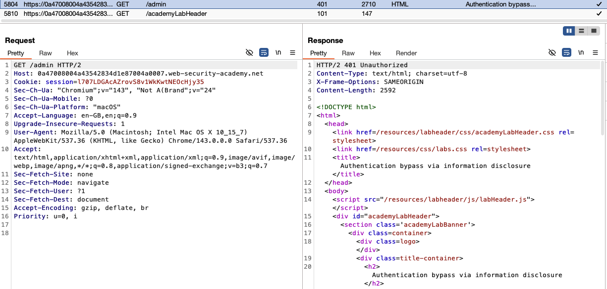
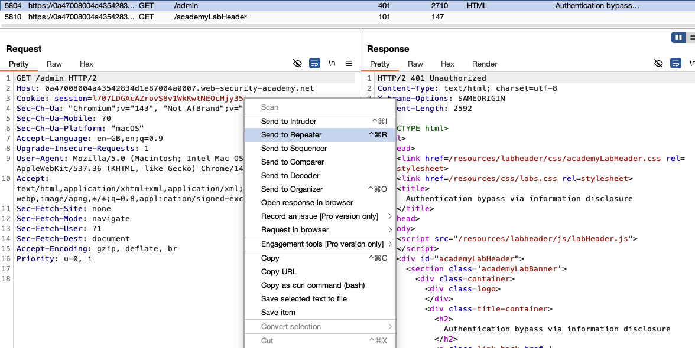
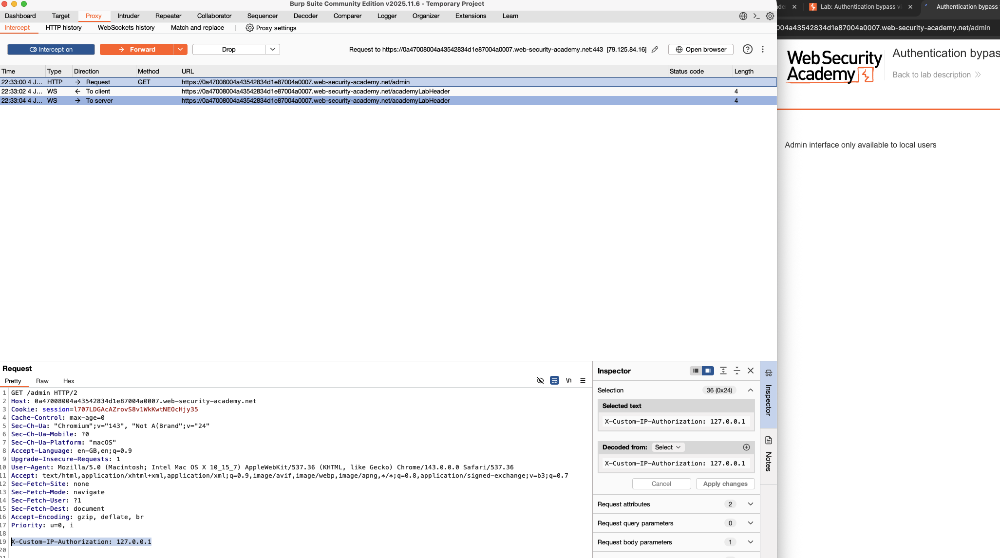
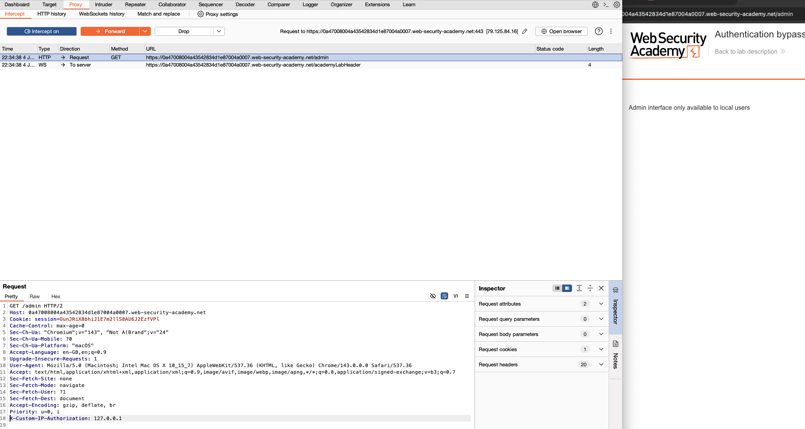
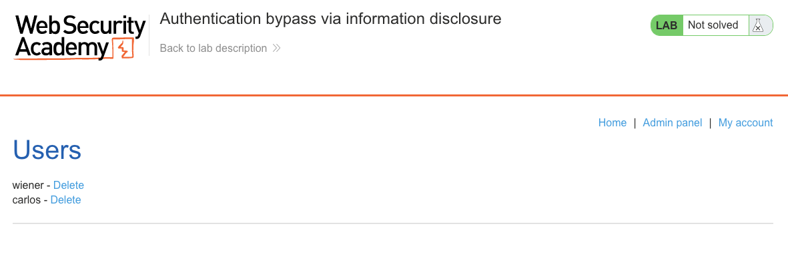
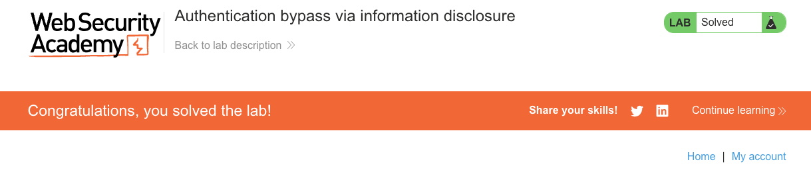

# Information Disclosure

**Lab: Authentication bypass via information disclosure (Web Security Academy)**

**Level: Apprentice**

---

## Vulnerability Overview

This lab chains two issues: **information disclosure** and an **access-control bypass via a client-supplied header**. The admin panel is protected by an IP-based access control that only allows local users, enforced through a custom header, `X-Custom-IP-Authorization`. An HTTP `TRACE` request reveals this header name (information disclosure), and setting the header to `127.0.0.1` then bypasses the access control entirely.

Two things make this possible:

1. The `TRACE` method is enabled on the server and reflects the request headers back to the client.
2. The application trusts a client-supplied header for its IP-based authorization decision.

---

## Steps to Solve the Lab

### 1. Attempt to access the admin panel

Navigate to `/admin`. The server responds with `Admin interface only available to local users`.





### 2. Reproduce the request in Repeater

Send `GET /admin` to **Repeater** (`Ctrl+R` / `Cmd+R`). The server returns `401 Unauthorized`, confirming that access is blocked.





### 3. Discover the custom header with TRACE

Change the request method to `TRACE` and send it:

```http
TRACE /admin HTTP/1.1
Host: <lab-id>.web-security-academy.net
```

The server reflects the request back in the response body. Note that the `X-Custom-IP-Authorization` header, containing your IP address, has been automatically appended to your request. This reveals the header name that the server uses to check the client's IP.

### 4. Bypass the access control with the spoofed header

Add the following header to a `GET /admin` request and set the value to the loopback address:

```http
X-Custom-IP-Authorization: 127.0.0.1
```

The server treats the request as local and returns the admin panel. Adding the header manually in Repeater works; to keep it on every request while you browse, you can instead add a **Proxy → Match and replace** rule (empty match, type "Request header") with the replacement `X-Custom-IP-Authorization: 127.0.0.1`.





### 5. Delete carlos

With the header in place, the admin panel lists the users `wiener` and `carlos`, each with a **Delete** link. Delete `carlos` by sending the corresponding request:

```http
GET /admin/delete?username=carlos HTTP/2
Host: <lab-id>.web-security-academy.net
X-Custom-IP-Authorization: 127.0.0.1
```



### 6. Result

The lab banner changes to **"Congratulations, you solved the lab!"**.



---

## Why This Works

The `TRACE` method is designed to echo the exact request it receives (headers and all) back in the response body, which is useful for debugging proxy chains. Here it exposes the custom header the server adds and then uses for its authorization check. Once the header name is known, setting `X-Custom-IP-Authorization: 127.0.0.1` is trivial.

The underlying access-control failure is that the server trusts a client-supplied value (`X-Custom-IP-Authorization`) to make an authorization decision. Any client can set any header to any value, so this offers no real protection.

---

## Remediation

- **Disable the `TRACE` method.** It serves no legitimate purpose in production and can leak internal request-handling behavior:
  ```nginx
  if ($request_method = TRACE) {
      return 405;
  }
  ```
- **Do not use client-supplied headers for IP-based access control.** Determine the client's IP from the TCP connection. If the application sits behind a trusted reverse proxy, read `X-Forwarded-For` only where the proxy sets it and strips any client-supplied copy, and never trust it when the request can reach the application directly.
- **Use role-based access control for admin functionality.** Network location is not a reliable or safe authorization mechanism.

---

Link: https://portswigger.net/web-security/information-disclosure/exploiting/lab-infoleak-authentication-bypass
