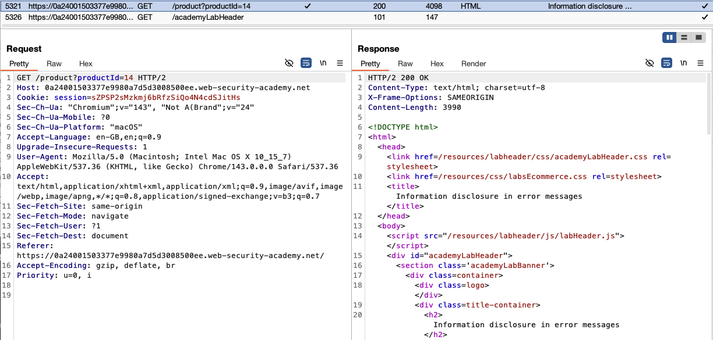
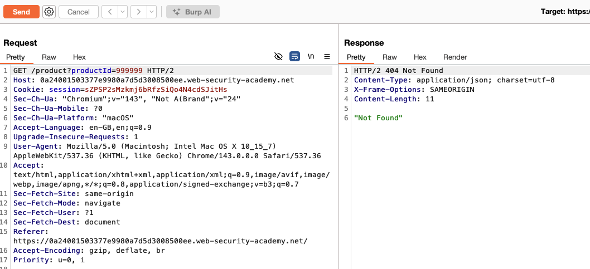
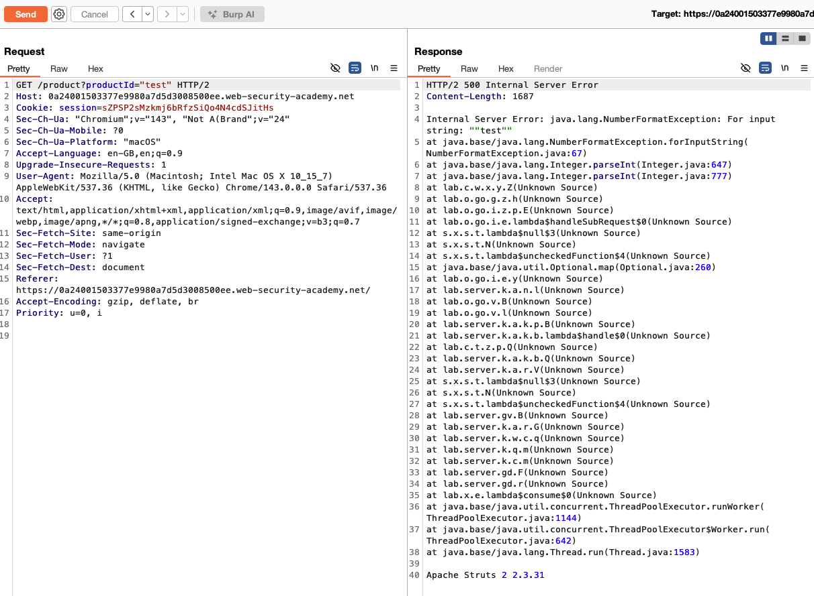
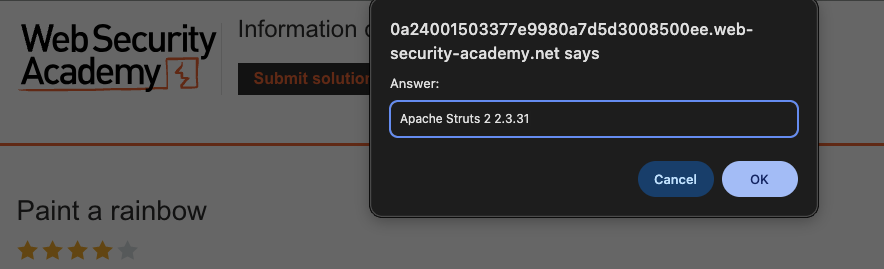

# Information Disclosure

**Lab: Information disclosure in error messages (Web Security Academy)**

**Level: Apprentice**

**Link:** https://portswigger.net/web-security/information-disclosure/exploiting/lab-infoleak-in-error-messages

---

## Vulnerability Overview

Verbose error messages expose internal implementation details to users. In this lab, submitting an unexpected input type triggers a server-side exception, and the application returns the full Java stack trace - including the framework name and version number (`Apache Struts 2 2.3.31`).

This is an **information disclosure** vulnerability. The leaked value is not immediately dangerous on its own, but it enables targeted attacks: a known framework version lets an attacker look up published exploits (CVEs) and use them with high precision. Version disclosure significantly reduces the effort needed for a successful attack.

---

## Steps to Solve the Lab

### 1. Open a product page

Browse to any product and note the URL parameter `productId` (a numeric value such as `productId=14`).


### 2. Send the request to Repeater

Intercept `GET /product?productId=14` in Burp Proxy and send it to **Repeater** (`Ctrl+R` / `Cmd+R`).



### 3. Probe the parameter

Confirm how the endpoint behaves with an out-of-range but still numeric value. Change the parameter to `productId=999999` and send the request - the server returns `404 Not Found` with the JSON body `"Not Found"`. The value is still parsed as an integer, so no exception is thrown.



### 4. Trigger an error with invalid input

Change the parameter to a non-numeric value, `productId="test"` (a string where an integer is expected), and send the request. The server fails to parse the value as an integer and returns `500 Internal Server Error` with a full Java stack trace. At the end of the trace, find the framework version string:

```
Apache Struts 2 2.3.31
```



### 5. Submit the version as the solution

Click **Submit solution** and enter the exact version string, `Apache Struts 2 2.3.31`.



### 6. Result

The lab banner changes to **"Congratulations, you solved the lab!"**.


---

## Why This Works

The application propagates the unhandled `NumberFormatException` directly to the HTTP response without catching it or stripping technical details. The framework's default error handler outputs the full exception class, the stack trace, and environment information - all of which is useful to an attacker.

Apache Struts 2.3.31 is a real version with known critical vulnerabilities, including [CVE-2017-5638](https://nvd.nist.gov/vuln/detail/CVE-2017-5638) - the remote code execution flaw exploited in the 2017 Equifax breach. Version disclosure in an error message tells an attacker exactly which exploit to reach for.

---

## Remediation

- **Implement a global error handler** that returns a generic error page for all unhandled exceptions:
  ```java
  // Spring example:
  @ControllerAdvice
  public class GlobalExceptionHandler {

      private static final Logger log = LoggerFactory.getLogger(GlobalExceptionHandler.class);

      @ExceptionHandler(Exception.class)
      public ResponseEntity<String> handle(Exception e) {
          log.error("Unhandled exception", e);              // log internally
          return ResponseEntity.status(500).body("An error occurred.");  // return nothing useful
      }
  }
  ```
- **Never expose stack traces, framework names, or version strings to users** - log them internally instead.
- **Configure frameworks to suppress debug output in production** (for example, `struts.devMode=false` in Struts, or `server.error.include-stacktrace=never` in Spring Boot).
- **Keep dependencies updated** - version disclosure is far less dangerous when the running version has no known unpatched vulnerabilities.
