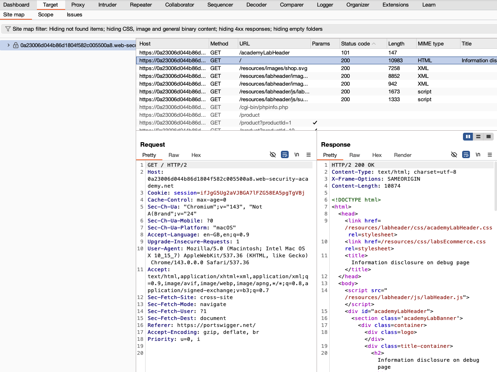
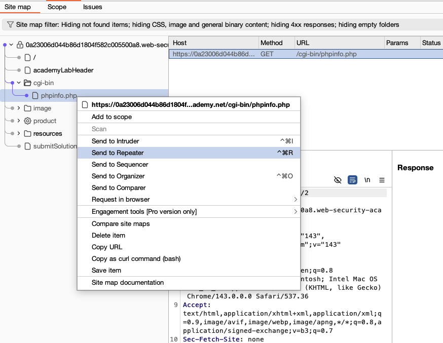
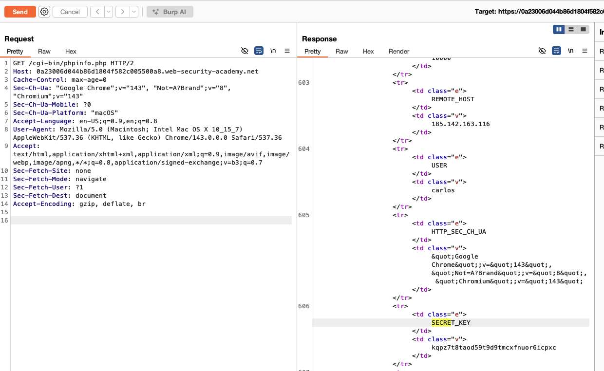
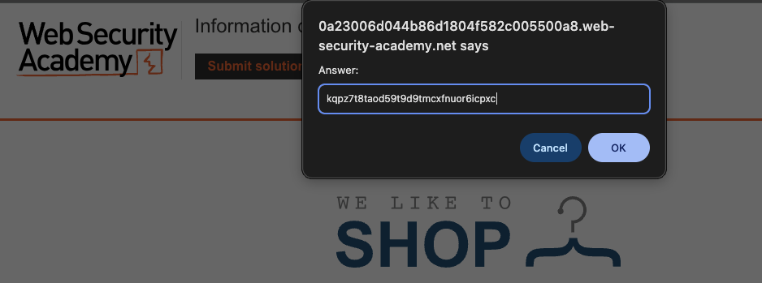
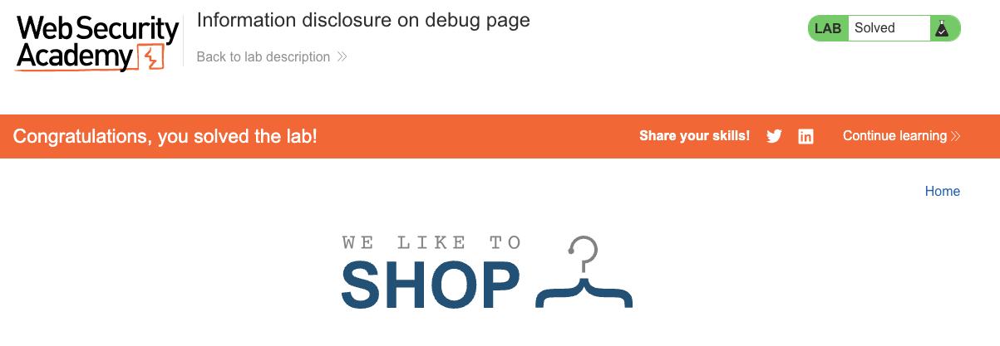

# Information Disclosure

**Lab: Information disclosure on debug page (Web Security Academy)**

**Level: Apprentice**

**Link:** https://portswigger.net/web-security/information-disclosure/exploiting/lab-infoleak-on-debug-page

---

## Vulnerability Overview

Debug and diagnostic pages (`phpinfo`, Spring Boot Actuator, the Django debug page, and similar) are useful during development because they expose environment variables, loaded modules, configuration values, and runtime state. When left enabled in production, they hand an attacker a detailed map of the application's internals, including secrets that should never leave the server.

In this lab, a PHP information page at `/cgi-bin/phpinfo.php` is publicly accessible and exposes a `SECRET_KEY` environment variable - a value that could be used for session signing, token generation, or encryption. With this key, an attacker could forge sessions or tamper with tokens.

---

## Steps to Solve the Lab

### 1. Discover the debug endpoint

Browse the application with Burp running to populate the site map. In Burp, open **Target → Site map** and look for non-standard paths. The endpoint `/cgi-bin/phpinfo.php` is referenced from the site and appears in the site map.

### 2. Send the request to Repeater

Right-click the `/cgi-bin/phpinfo.php` entry and choose **Send to Repeater** (`Ctrl+R` / `Cmd+R`) so you can inspect the full response.

### 3. Find the secret key

Send `GET /cgi-bin/phpinfo.php`. The full PHP information page loads, showing the server configuration, environment variables, loaded extensions, and more. Search the response (`Ctrl+F` / `Cmd+F`) for `SECRET_KEY`; the environment variable is listed in the PHP environment section together with its value.

### 4. Submit the solution

Click **Submit solution** and enter the exact `SECRET_KEY` value.

### 5. Result

The lab banner changes to **"Congratulations, you solved the lab!"**.

---

## Why This Works

The information page was not restricted or removed before deployment. Anyone who knows or guesses the path can access it with no authentication. `phpinfo()` outputs every environment variable the PHP process can see - including application secrets injected into the environment at startup.

> **Note:** The `SECRET_KEY` value is randomized for each lab instance, so the value you see will differ from the one in the screenshots.

---

## Remediation

- **Remove or disable diagnostic pages before production deployment** (for example, `phpinfo.php`, Spring Boot Actuator endpoints, and the Django debug page).
- **Restrict any remaining diagnostic endpoints to internal networks only.** If diagnostic access is needed in staging, block public access with firewall rules or IP allowlists - never with path obscurity alone.
- **Do not expose secrets to diagnostic pages.** Store secrets in a secrets manager (such as AWS Secrets Manager or HashiCorp Vault) where access is controlled and audited, rather than in process environment variables that `phpinfo()` and similar pages can read.
- **Scan for exposed diagnostic paths in CI/CD.** Automated checks should look for common debug and info endpoints on every deployment.
