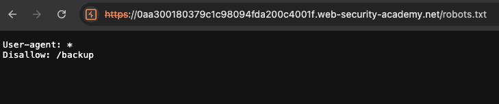
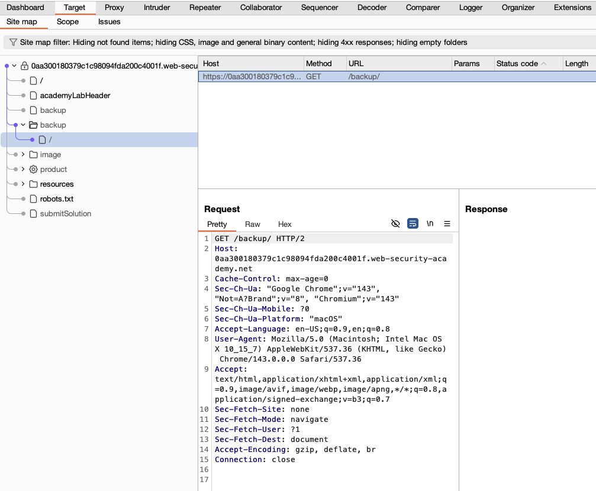
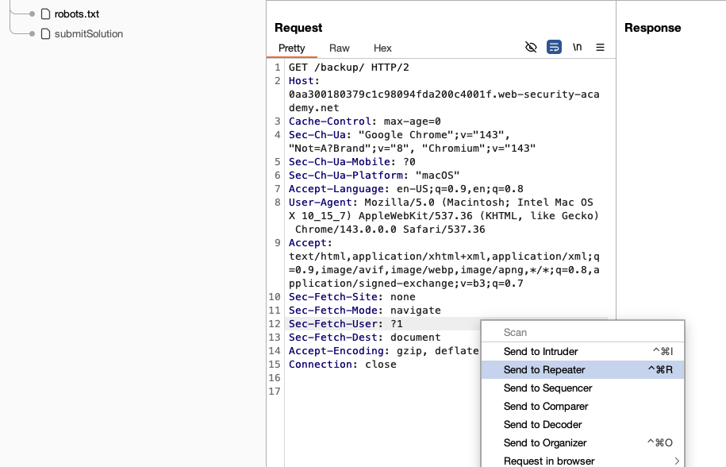
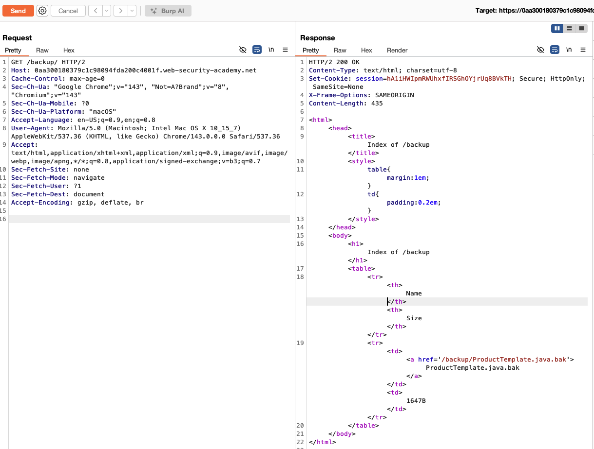
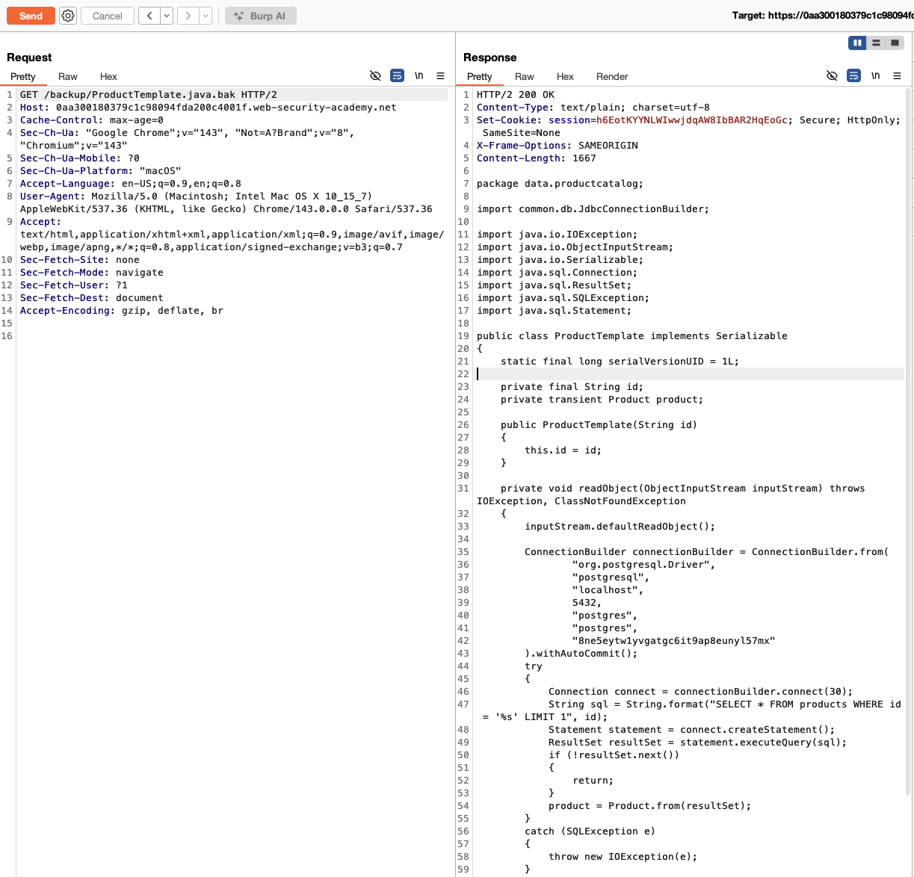
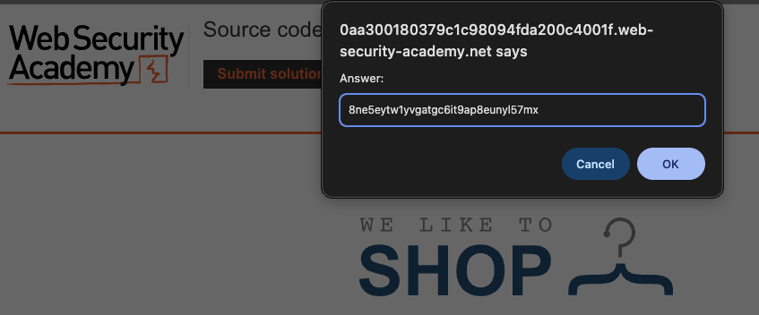
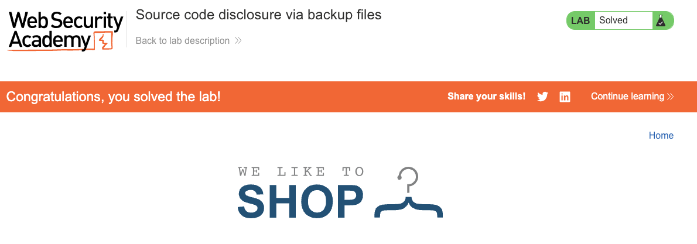

# Information Disclosure

**Lab: Source code disclosure via backup files (Web Security Academy)**

**Level: Apprentice**

**Link:** https://portswigger.net/web-security/information-disclosure/exploiting/lab-infoleak-via-backup-files

---

## Vulnerability Overview

Text editors and IDEs often create automatic backup files when editing (`.bak`, `~`, `.swp`). If these files end up in the web root and the server serves them as static content, an attacker can download the source code of the application - including database credentials, API keys, and business logic.

In this lab, a Java source backup (`ProductTemplate.java.bak`) is accessible from a public `/backup/` directory. The source contains a hard-coded database password in the connection builder - a secret that should never leave the server.

---

## Steps to Solve the Lab

### 1. Discover the exposed backup directory

Browse to `/robots.txt`. It reveals the existence of a `/backup` directory:

```
User-agent: *
Disallow: /backup
```




### 2. Browse to the backup directory

Navigate to `/backup/`. Directory listing is enabled, so the server returns an index of the directory. The site map in Burp shows the `/backup/` path.



### 3. Send the request to Repeater

Send `GET /backup/` to **Repeater** (`Ctrl+R` / `Cmd+R`) to inspect the directory listing.



The response is an HTML directory index that links to `ProductTemplate.java.bak`:



### 4. Download the backup file and read the password

Request `GET /backup/ProductTemplate.java.bak`. The server returns the raw Java source code as `text/plain`. Read through the source to find the database connection builder, which contains the hard-coded password:

```java
ConnectionBuilder connectionBuilder = ConnectionBuilder.from(
        "org.postgresql.Driver",
        "postgresql",
        "localhost",
        5432,
        "postgres",
        "postgres",
        "8ne5eytw1yvgatgc6it9ap8eunyl57mx"   // hard-coded password (randomized per lab instance)
).withAutoCommit();
```



Copy the password value (the seventh argument to `ConnectionBuilder.from`).

### 5. Submit the solution

Click **Submit solution** and enter the database password.



### 6. Result

The lab banner changes to **"Congratulations, you solved the lab!"**.



> **Note:** The database password is randomized for each lab instance, so the value you see will differ from the one in the screenshot above.

---

## Why This Works

The `/backup/` directory was not excluded from web server access. The `.bak` file is a plain text file - the server does not distinguish it from any other static resource and serves it with a `200 OK`. The `Disallow` entry in `robots.txt` is a hint to web crawlers, not a security control; it actively advertises the path's existence to anyone who reads `robots.txt`.

---

## Remediation

- **Never deploy backup or editor temporary files to the web root.** Add patterns such as `.bak`, `.swp`, `.tmp`, `.orig`, and `*~` to `.gitignore` and to web server deny rules.
- **Configure the web server to block backup file extensions.** For example, in nginx:
  ```nginx
  location ~* (\.(bak|swp|tmp|orig|old)$|~$) {
      deny all;
  }
  ```
  (Editor backups that end in `~` have no leading dot, so they are matched by the separate `~$` alternative rather than by the dotted-extension group.)
- **Never hard-code credentials in source code.** Use environment variables or a secrets manager. Even if the file is never exposed over HTTP, hard-coded secrets persist in version control history.
- **Disable directory listing** - `autoindex off;` in nginx, `Options -Indexes` in Apache.
- **Do not rely on `robots.txt` to hide sensitive paths** - it is public and advertises every path it lists.
