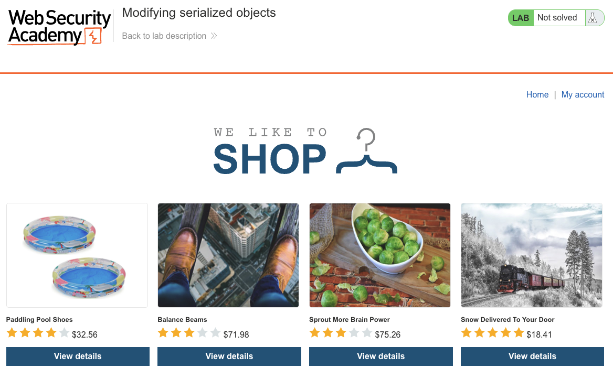
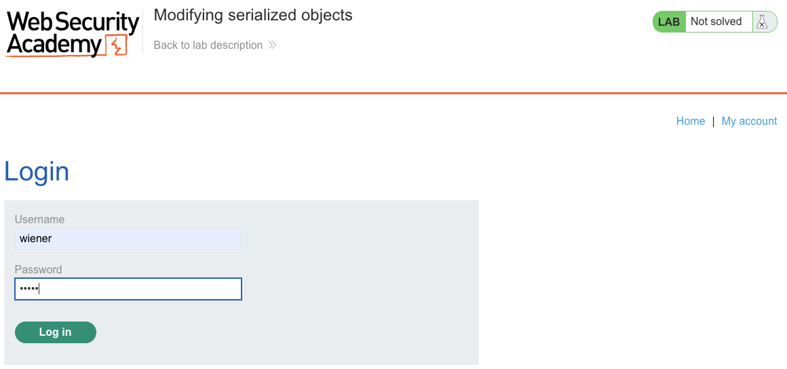
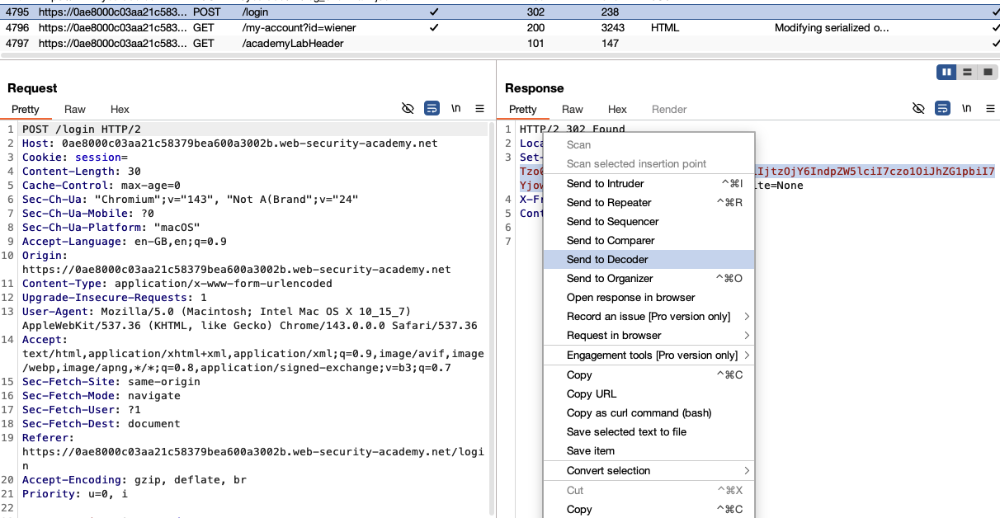
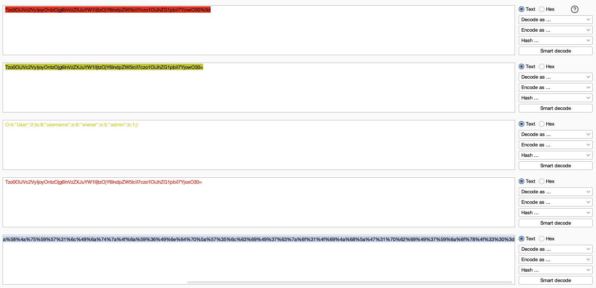
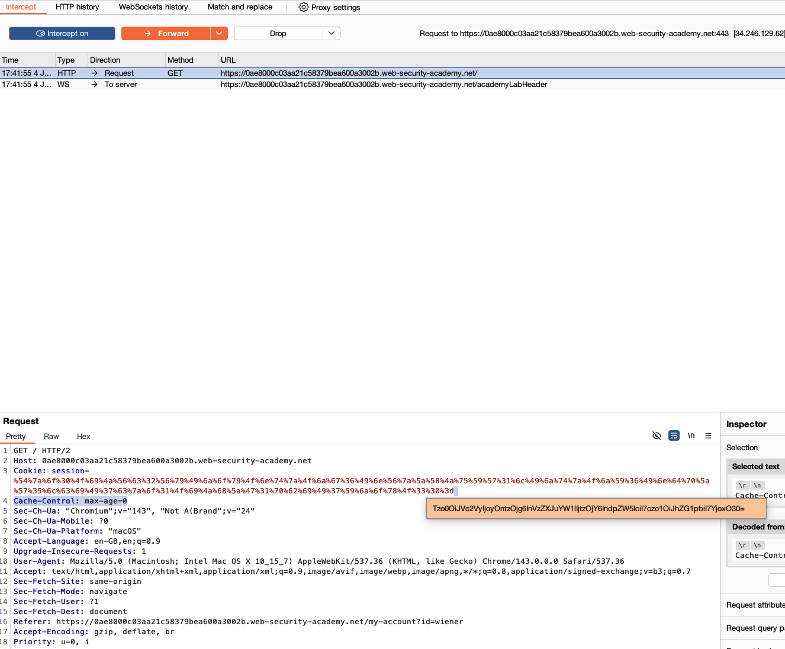
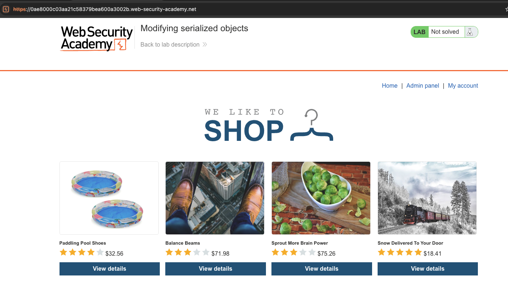
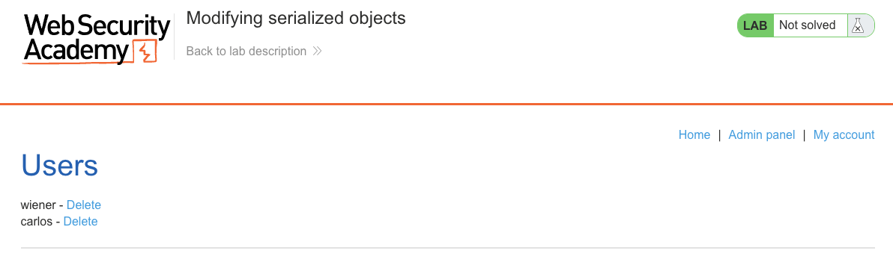
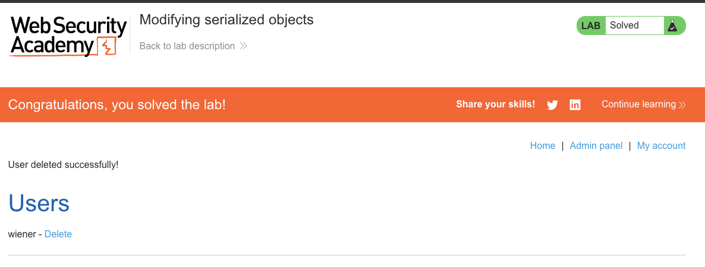

# Insecure Deserialization

**Lab: Modifying serialized objects (Web Security Academy)**

**Level: Apprentice**

---

## Vulnerability Overview

Insecure deserialization occurs when an application deserializes data from an untrusted source without validation. In this lab, the session cookie contains a PHP-serialized object that includes an `admin` boolean flag. The server deserializes this cookie and uses the `admin` field to decide whether to grant admin access - but it never verifies that the deserialized data matches what was originally issued.

An attacker who decodes the cookie, changes `admin` from `false` to `true`, and re-encodes it will receive admin privileges on the next request. The server trusts the cookie contents without any integrity check (no signature, no MAC).

---

## Steps to Solve the Lab

### 1. Open the lab

The lab is a shopping site. It starts in the **Not solved** state.



### 2. Log in and capture the session cookie

Log in as `wiener` with the password `peter`, and intercept the traffic in Burp Suite.



Locate the `session` cookie - it is a long, URL-encoded, base64 string.

### 3. Send the request to Decoder

In Burp's HTTP history, right-click the login request (or any authenticated request that carries the `session` cookie) and choose **Send to Decoder**.



### 4. Decode the serialized object

In **Decoder**, apply the following transformations to the `session` cookie value:

1. **URL-decode**
2. **Base64-decode**

The result is a PHP-serialized `User` object:

```
O:4:"User":2:{s:8:"username";s:6:"wiener";s:5:"admin";b:0;}
```

`b:0` is PHP's boolean `false`; `b:1` is `true`.

### 5. Modify the admin flag

Change `b:0` to `b:1` in the serialized string:

```
O:4:"User":2:{s:8:"username";s:6:"wiener";s:5:"admin";b:1;}
```

Re-encode the modified value by reversing the earlier steps:

1. **Base64-encode**
2. **URL-encode** the result



### 6. Inject the modified cookie

Turn on **Intercept**, request the home page, and replace the `session` cookie value with the modified one before forwarding the request.



### 7. Access the admin panel

Once the modified cookie is accepted, the **Admin panel** link appears in the navigation bar.



Open the admin panel and delete the user `carlos`.



### 8. Result

The lab banner changes to **"Congratulations, you solved the lab!"**.



---

## Why This Works

The server deserializes the cookie directly into a `User` object and reads its `admin` property:

```php
// Vulnerable pseudocode:
$user = unserialize(base64_decode(urldecode($_COOKIE['session'])));
if ($user->admin) {
    show_admin_panel();
}
```

There is no signature or integrity check on the cookie. Anyone who can decode (base64 is encoding, not encryption), modify, and re-encode the value can forge any session state. PHP's serialization format (the `O:` syntax) is trivially readable and writable.

---

## Remediation

- **Never serialize sensitive state into client-side tokens without a cryptographic signature.** Sign the serialized data with an HMAC and verify the signature before deserializing.
- **Prefer opaque session tokens.** Store session state server-side (for example, in a database or Redis), keyed by an opaque, random token. The cookie then contains only the token, not the session data.
- **Treat all client-controlled data as untrusted.** Every cookie, POST body, and HTTP header is attacker-controlled input.
- **PHP-specific: avoid `unserialize()` on untrusted input.** Use `json_encode`/`json_decode` for cookie data instead. JSON decoding does not instantiate arbitrary objects, which also helps prevent gadget-chain attacks.
- **Use framework-provided signed cookies.** Frameworks such as Laravel and Symfony sign session cookies by default; rely on these built-in mechanisms rather than rolling your own.

---

Link: https://portswigger.net/web-security/deserialization/exploiting/lab-deserialization-modifying-serialized-objects
